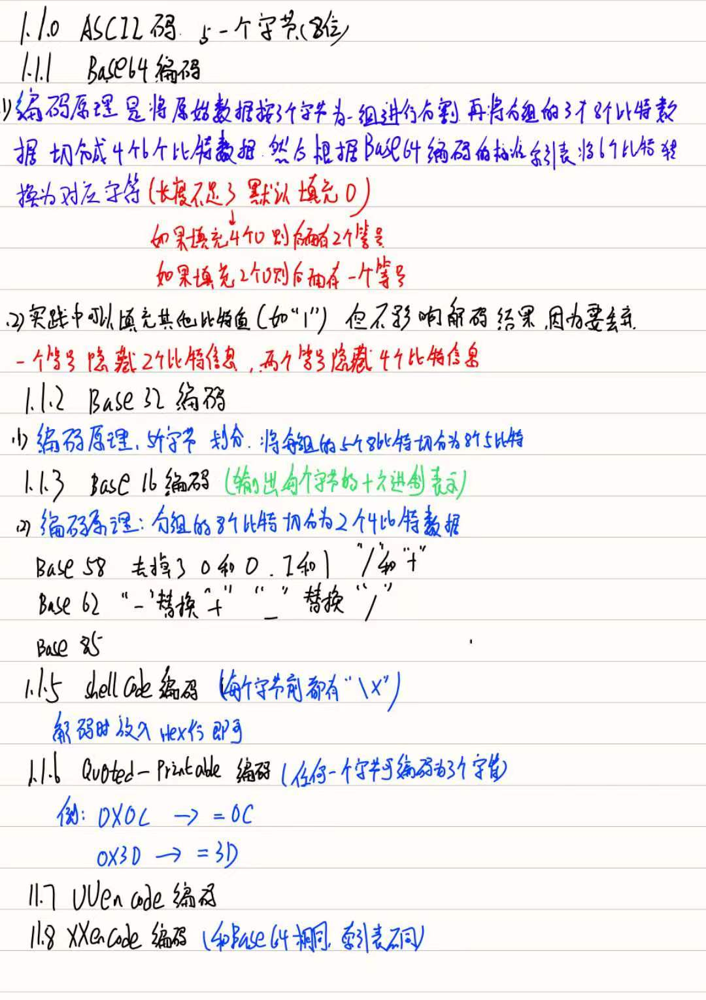
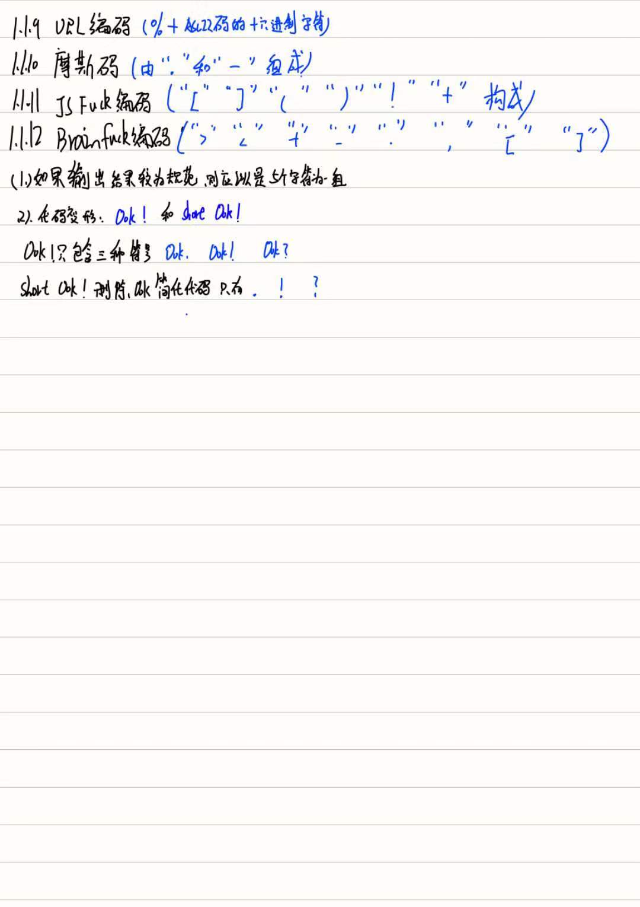
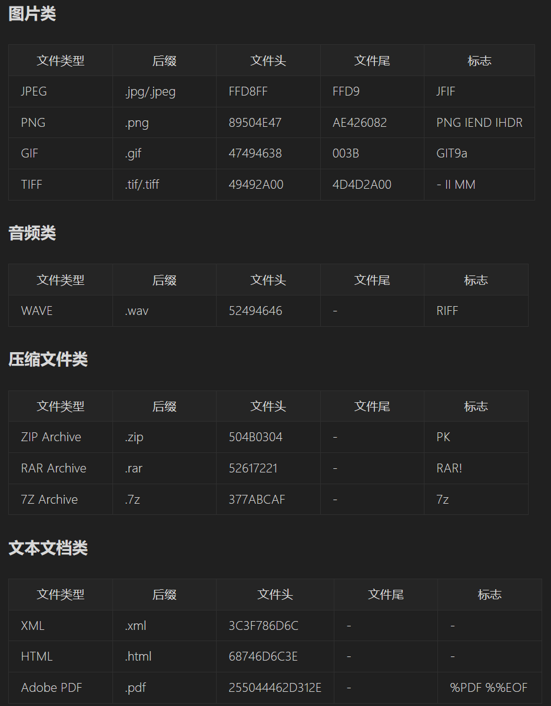

# 编码

## 1.常见的编码与解码（编码规则详见笔记）

>1. ASCII  
2. Base64  
3. Base32  
4. Base16  
5. shellcode  
6. Quoted--printable  
7. UUencode  
8. xxencode  
9. URL编码  
10. 摩斯码  
11. JSfuck编码  
12. Brainfuck编码  




## 2.解码工具

> 1. CyberChef  
2. Koczkatams  
3. Ciphey   
# 3.流量分析

#### （1）.工具（Wireshark)

#### 使用方法：
> 1. 过滤器 过滤不同的协议  
2. 统计功能   
>> （1）协议分级统计：可以查看数据包流量，包括的协议以及各协议占比  
>> （2）端点统计：统计各地址接受或者发送的数据量  
Address：端点地址   Port:端点端口  
Packets：包含改地址的数据包数  Bytes：包含改地址的数据包字节数  
Tx Packete: 发送的数据包数  Txbytes： 发送的字节数  
Rx Packets： 接受的数据包数  Rxbytes：  接受的字节数  
（3）.会话统计：统计两个端点之间发送接受的数据包数量  
（4）.HTTP统计：  
>> 分组计数器：包含HTTP请求类型和相应代码的统计信息  
请求：包含主机和URI完整信息  
负载分配：会展示基于服务器地址和主机的HTTP请求和相应统计信息  
请求序列：使用HTTP的Referer和Location头将捕获的HTTP请求作为树进行展示、分析人员就能够看到一个HTTP请求如何导向下一个HTTP请求

> 3.追踪流：选择数据包，追踪其完整会话
4.提取文件或数据
>> (1)导出对象法：直接在文件中选择导出对象  
(2)导出分组字节流法：在数据包中找到文件，导出分组字节流，默认是*.bin文件，修改后缀为该文件类型即可  
（3）binwalk提取法：  

> 5.导出特点数据包：将数据包过滤后导出特定分组，导出的分组就是过滤后的分组  
#### （2）.协议：
> FTP（文件传输协议） FTP使用TCP端口下的20和21端口，20用于传输数据，21用于传输控制信息
> DNS (域名) 
>
> > 1.将所有可疑域名拼接，解码后得到flag

> HTTP  
> > 1.HTTP头部字段  过滤器中搜索http contains flag/ctf 等字符串
> >
> > 2.菜刀流量分析：  
> >
> > 3.蚁剑流量分析：boundary是蚁剑流量的特征之一
> >
> > 4.冰蝎流量分析：
> >
> > 1. 密钥传递阶段：客户端向服务器发送GET请求，GET请求的URI只带一个参数，pass参数是冰蝎连接时的密码，等号后的数字是随机生成的，秘钥位于服务器返回包的实体部分，一般是16字节的小写字母或数字。
> > 2. 算法协商阶段：冰蝎将一串payload用不同的算法加密，如果服务器解密成功则使用该算法加密，如果解密失败相应为空，再尝试另一种解密方法，
> > 3. 加密通信阶段：通过post请求发送脚本给服务端，服务端解密后执行，并将结果以相同秘钥和加密算法返回给客户端

> USB：键盘和鼠标传输内容就在Leftover Capture Data中，
>
> 键盘：通过USB协议数据中的键盘键码转换成键位。
> 鼠标：一共4个字节，16bit，
>
> 1. 第一个字节代表按键：0x00：没有按键，0x01：左键，0x02：右键
> 2. 第二个字节表示左右：值为正时代表向右多少个像素，负代表向左多少个像素
> 3. 第三个字节表示上下：值为正时代表向上多少个像素，负代表向下多少个像素

> TLS:对HTTP的内容进行加密

> IEEE 802.11(Wi -Fi数据传输使用的协议)
>
> 1.CTF比赛主要考察如何破解出连接热点时的密码
>
> 2.加密类型
>
> > 1.WEP:采用RC4 prng算法，客户端与无线接入点的数据会以一个共享的密钥进行破解，密钥的长度只有40位和256位
> >
> > 2.WPA：采用128位密钥和48位初向量（IV）的RC4算法加密，WPA的主要改进是可以动态改变秘钥的临时秘钥完整性协议
> >
> > 3.WPA-PSK/WPA2-PSK:有AES和TKIP两种加密算法

# 4.日志分析

#### 1.web日志：包括NCSA日志格式和W3C日志格式

#### 2.系统日志：

(1)、Linux常见日志的路径和功能总结

| 日志路径****                            | **功能**                                         |
| --------------------------------------- | ------------------------------------------------ |
| /var/log/secure                         | 记录系统安全、验证及授权信息                     |
| /var/log/faillog                        | 记录用户登录失败信息                             |
| /var/log/btmp                           | 记录所有失败登录信息                             |
| /var/log/lastlog                        | 记录用户最近登录的信息                           |
| /var/log/user.log                       | 记录所有用户的信息                               |
| /var/log/daemon.log                     | 记录系统后台守护进程日志信息                     |
| /var/log/wtmp <br/>/var/log/utmp        | 永久记录每个用户登录、注销及系统启动、停机的事件 |
| /var/log/http   <br />/var/log/httped   | 记录服务器access_log和error_log的信息            |
| /var/log/maillog<br />/var/log/mail.log | 记录电子邮件服务的日志信息                       |
| /var/log/mail                           | 这个子目录包含邮件服务的额外日志                 |
| /var/log/samba                          | 记录有samba存储的信息                            |
| （2）、windows日志                      |                                                  |

> - 系统日志：包含系统组件记录的事件，包括错误、警告、及任何应用程序需要报告的信息
> - 安全日志：包含用户登录情况，用户访问时间以及访问是否授权等，并详细记录了使用者的信息、登录类型、登录失败的账户、失败信息、进程信息、内网信息以及详细身份信息等。
> - 应用进程日志：记录了应用程序的运行情况，包括运行出错，及出错原因

# 5.电子取证

### 1.电子取证的常用技术

#### （1）.文件识别技术

常见的文件头特征：

| 文件类型        | 文件头（16进制）                                             |
| --------------- | ------------------------------------------------------------ |
| .jpg            | FF D8                                                        |
| .png            | 89 50 4E 47 0D 0A 1A 0A                                      |
| .gif            | 47 49 46 38                                                  |
| .bmp            | 42 4D                                                        |
| .zip            | 50 4B 03 04                                                  |
| .rar            | 52 61 72 21                                                  |
| .doc <br > .xls | D0 CF 11 E0                                                  |
|                 |  |

直接使用kali中file命令也可以

#### （2）.strings命令

strings命令可以在对象文件或二进制文件中查找可打印的字符串，字符串是4个或更多可打印字符的任意序列，以换行符或空字符结束。

#### （3）.binwalk命令

（1）binwalk用于识别嵌入固体镜像的文件和代码

（2） 命令中没有任何选项时只能检测对象中有哪些文件

> 检测结果有三列：
>
> 第一列代表10进制，表示检测出的文件距离原文件开头的偏移字节数
>
> 第二列代表16进制
>
> 第三列是对检测出来文件的详细说明

（3）-e 可以从对象中提取文件

### 2.文件恢复

(1)常见文件恢复，修复文件头

(2)Vim中文件恢复

使用vim打开一个文件时，会产生一个.swp隐藏文件，该文件的命令规则是‘.’+文件名+'.swp'，这个文件是一个临时交换文件，可备份缓存区的内容，用于保存数据，当文件不正常关闭时临时文件不会删除，可用来恢复文件 

命令：vim -r

### 3.磁盘取证

文件数据除了文件的实际内容外，还包含**文件权限**（RWX）与**文件属性**（所有者、群组、时间参数）

在Lunix系统下，权限与属性放置到inode中，实际数据则放置到数据块（block）中，另外Superblock会记录文件的整体消息，包括inode与block的总量、使用量、剩余量等、每个indoe和block都有编号。

- Superblock:记录文件的整体信息，包括inode和block的总量、使用量、剩余量、以及文件系统的格式与相关信息
- inode：记录文件的属性，一个文件占用一个inode，同时记录此文件的数据所在的block号
- block：实际记录文件的内容，若文件太大，会占用多个block

常见的磁盘镜像格式：
Windows：FAT12、FAT16、FAT32、NTFS

Lunix：EXT2、EXT3、EXT4

### 4.内存取证

Voilityity用法：

> - imageinfo:显示目标镜像的摘要信息，知道镜像的操作系统后，就可以在 --profile中带上对应的操作系统
> - pslist：该插件列举出系统进程，但它不能检测出隐藏的进程
> - psscan：可以找到先前已终止的进程，以及被rooykit隐藏的进程
> - pstree：以树的形式查看进程列表，和pslist一样，他也无法检测出隐藏的进程
> - mendump：提取出指定的进程
> - filescan：扫描所有文件列表
> - hashdump：查看当前操作系统中的password hash，例如Windows的SAM文件内容。
> - svcscan：扫描Windows服务
> - clipboard：查看系统剪切板中信息
> - connscan：查看网络连接
> - lasdump：从注册表中提取出已解密的LSA秘钥信息，LSA是Windows系统本地安全认证模块，他会储存用户登录其他系统和服务时所使用的用户名和密码
> - procdump：将进程转储为一个可执行文件
> - memdump：转储进程的可寻址内存

# 6.压缩文件

### 1.zip压缩包格式

1. ZIP压缩包包括：压缩源文件数据区，压缩源文件目录区，压缩源文件目录结束标志

- 一个ZIP文件按如下方式分解

  {本地文件头+文件数据+数据描述符}{1，n}+目录区+目录结束标志

> -  {本地文件头+文件数据+数据描述符}构成压缩源文件数据区
>
> - {1，n}表示这部分数据最少出现1次，也可以出现n次
> - 目录区会保存压缩前文件和文件夹的目录信息
> - 目录结束标识存在于整个压缩包的结尾，用于标记压缩的目录数据的结束
>

​	2.通过010编辑器对Zip模板解析，record就是压缩源文件数据区，dirEntry代表压缩源数据目录区，最后的endLocator是压缩源数据目录结束标识

### 2.伪加密

#### （1）ZIP伪加密

recode区frFlags和dirEntry区deFlags同奇数表示加密

伪加密的原理是手工修改frFlags或deFlags使得其中一个变为奇数

#### （2）RAR伪加密

block[0]字段的HEAD_FLAGS字段中，字段PASSWord_ENCRYPTED占1比特，将这个改为1保存文件，1就能实现对RAR文件的伪加密

#### （3）CRC

对给定数据计算校验妈的编码技术，检验传输后可能出现的错误，文件较小时倒推原文内容

#### （4）已知明文攻击

已知一个ZIP压缩包中某个文件的源文件，利用已知文件和其压缩加密后的数据获取到压缩包的解压密码。

### 解密

解密这里也有两个函数**fcrackzip** 和 **john**

**fcrackzip** -b -c 1 -l 4-4 -u [文件名]

-b是暴力破解

-c 1 使用字符集，1指数字集合

-l 4-4 最短长度4，最长长度4 

-u 后面是文件名

**john**

john需要先获得中间hash文件

zip2john passwd.zip > passwd.hash

rar2john passwd.zip > passwd.hash

获得hash文件，破解hash文件

john passwd.hash

得的破解后的密码打开4number.txt即可得到flag


使用字典破解：john -w:password.txt xxx.hash

john --wordlist:password.txt xxx.hash


如果是word文件

office2john ppt.pptx >ppt.hash


# 7.unicode编码

\u4e00/u95ea

# 8.邮件安全

**SPF 和 DKIM 相互配合，可以告诉接收服务器允许和拒绝哪些电子邮件；DMARC 告诉它如何处理未通过身份验证的电子邮件；除此之外，DMARC 记录还会向 DMARC 记录中指定的电子邮件地址发送报告，其中包含域收到的电子邮件的数据。**

查询域名

使用 dig 命令查询 foobar-edu-cn.com 的 TXT 记录:

```
dig +short TXT foobar-edu-cn.com
```

查询 SPF 记录:

使用 dig 命令查询 spf.foobar-edu-cn.com 的 TXT 记录:

```
dig +short TXT spf.foobar-edu-cn.com
```

查询 DKIM 记录:

使用 dig 命令查询 default._domainkey.foobar-edu-cn.com 的 TXT 记录:

```
dig +short TXT default._domainkey.foobar-edu-cn.com
```

查询 DMARC 记录:

使用 dig 命令查询 _dmarc.foobar-edu-cn.com 的 TXT 记录:

```
dig +short TXT _dmarc.foobar-edu-cn.com
```

# 协议分析

## USB流量分析解题

### 鼠标：

#### 1.直接使用现成的脚本 UsbMiceDataHacker.py 

可以恢复击键信息

在wsl下python3运行

#### 2.分步破解，和上述结果相同

1. 将pcap文件中的usbdata数据导出

   tshark在kali中使用

   tshark -r usb.pcap -T fields -e usb.capdata > usbdata.txt
   tshark -r usb.pcap -T fields -e usb.capdata | sed '/^\s*$/d' > usbdata.txt #提取并去除空行

2. 使用脚本将文件加入冒号

   **需要注意的是鼠标流量长度为8，键盘流量长度为16**

   脚本位置[D:\CTF\MISC\USB\Mouse脚本]: 

3. 使用脚本测试信息隐藏位置，导出xy坐标信息

   [D:\CTF\MISC\USB\Mouse脚本]: 

4. 使用pnuplot将坐标转化成图像

   gnuplot
   gnuplot>plot "xy.txt"

   

###  键盘：

#### 1.直接使用现成的脚本UsbKeyboardDataHacker

#### 2.

1. 将pcap文件中的ubsdata数据导出

   tshark -r usb.pcap -T fields -e usb.capdata | sed '/^\s*$/d' > usbdata.txt #提取并去除空行

2. 使用脚本将文件加入冒号

   **需要注意的是鼠标流量长度为8，键盘流量长度为16**

3. 使用脚本还原对应数据信息

   [D:\CTF\MISC\USB\Keyboard脚本]: 


## TLS解题

1.导出密钥文件：TCP协议是文件传输协议，一般导出TCP—data

2.找到对应端口，导入秘钥，让wireshark自动选择相应的TLS流解密：

> 编辑-首选项-RSA keys list edit ‘+’ -选择端口，解密的协议（http），秘钥位置，-过滤http contains "INS"-找到数据包中http解析的flag

## IEEE 802.11解题

1.利用kali找到加密方式，口令

aircrack-ng -w password.txt ctf.pcap

-w 后面是准备好的字典

2.wireshark中导入口令自动解密

keytype:wep、wep-pwd、wpa-psk、tk

key 密码加口令

3.在http中找到flag

# 日志分析

## 一.web日志及分析方法

### 1.NCSA日志

#### (1).SQL注入

时间盲注每次都会利用!=判断当前ascii是否正确，将每个"!="后的ASCII码转换成字符拼接起来 (sqllog.py)

#### (2).日志内容较大

导入wps利用wps的一些统计、排序功能找到可疑流量

## 二.系统设备日志

# 电子取证

## 1.文件恢复

（1）PNG文件格式数据块：IHDR、gAMA、pHsy等

根据数据块判断文件类型，修复文件头

(2)Vim文件修复：利用strings命令或者010editor打开源文件，可以看到flag

## 2.磁盘恢复

## 3.内存取证

Volatility命令改为 vol.py -f .......

1.先查看profile信息 vol.py -f  [文件名] imageinfo

2.查看文件列表，寻找可疑文件导出 vol.py -f [文件名] filescan > file.txt

vol.py -f [文件名] --porfile=[主机信息] dumpfiles -Q 0X0000000001609628 -n --dump-dir

> -Q 表示使用物理偏移量进行转储（不太懂）
>
> -n表示以文件名保存 
>
> --dump-dir=为目标存储位置


提取进程号位PID的进程：vol.py -f 文件 --profile=xxx memdump -p [PID] -D [dump出的文件保存的位置] 

然后使用binwalk、strings等对进程做进一步分析

# 压缩文件

## 1.压缩包密码爆破

1.暴力破解

2.掩码攻击

知道部分破解全部

3.字典攻击

## 2.CRC碰撞破解压缩包

CRC用来检验数据传输后可能出现的错误，利用工具倒推出明文内容，只限制明文内容较短（1-6）

python2 crc32.py reverse 0x+CRC码

crc是十六进制，所以要加0X

## 3.已知明文攻击

ARCHPR导入已知明文压缩包和加密压缩包，很多题目需要使用多个工具（WinRAR，360压缩，7z，好压）


flag.vmdk可用7z解压，lunix下解压命令：7z  x flag.vmdk -o./


# 无线路由器备份文件

routerpassview可通过备份文件查看用户名和密码，备份文件后缀为bin，一般flag为用户名或密码

# 冰蝎流量分析

默认密码reboyond

# 图寻

- **Google [智能镜头](https://zhida.zhihu.com/search?q=智能镜头&zhida_source=entity&is_preview=1)**：[https://lens.google/](https://link.zhihu.com/?target=https%3A//lens.google/)（通过 Chrome 浏览器的右键菜单即可使用）
- **Google 图片**：[https://images.google.com/](https://link.zhihu.com/?target=https%3A//images.google.com/)
- **Bing 图片**：[https://www.bing.com/?scope=images](https://link.zhihu.com/?target=https%3A//www.bing.com/%3Fscope%3Dimages)
- **百度图片**：[https://images.baidu.com/](https://link.zhihu.com/?target=https%3A//images.baidu.com/)
- **搜狗图片**：[https://pic.sogou.com/](https://link.zhihu.com/?target=https%3A//pic.sogou.com/)
- **[Yandex](https://zhida.zhihu.com/search?q=Yandex&zhida_source=entity&is_preview=1) Images**：[https://yandex.com/images/](https://link.zhihu.com/?target=https%3A//yandex.com/images/)
- **TinEye Reverse Image Search**：[https://tineye.com/](https://link.zhihu.com/?target=https%3A//tineye.com/)