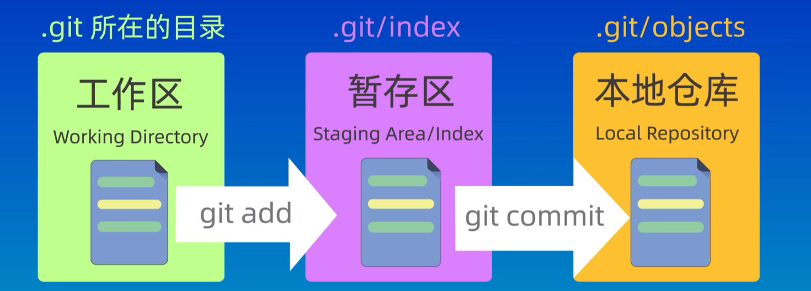
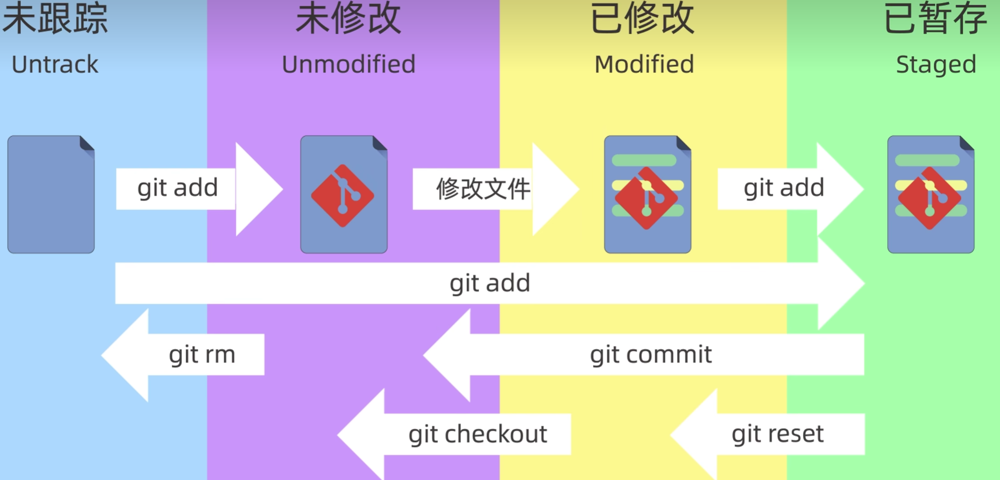

# 1.git config 配置

初始化使用时需要对git进行配置

初始化名称

```powershell
git config --global user.name "Your GitHub name"
```

初始化邮箱p

```powershell
git config --global user.email "your Github email"
```

可以使用该命令对姓名和邮箱进行保存，往后不用每次都输入了

```powershell
git config --global credential.helper store
```

查看当前的配置信息

```powershell
git config --global --list
```

# 2.新建仓库

## 1.新建仓库

```powershell
git init
```

此时会生成隐藏文件.git

# 3.工作区域和文件状态

## 1.工作区域

工作区：自己电脑上的目录

暂存区：用于保存即将提交到仓库的内容

本地仓库：是git init命令新建的仓库，是Git存储代码和版本信息的主要位置



## 2.文件状态

未跟踪：创建的新文件还未被Git管理

未修改：已被Git管理但还未修改

已修改：已被Git管理且已修改

已暂存：已经放入暂存区的文件



# 4.添加和提交文件

## 1.查看git的状态

可以查看当前文件夹中各文件的状态

```powershell
git status
```

## 2.将工作区中的文件提交到暂存区

可以使用linux中的通配符

```powershell
git add 文件名
git add .  //可以提交文件夹中所有内容
```

查看暂存区的文件

```
git ls-files
```


## 3.将暂存区的文件提交到本地仓库

```powershell
git commit -m "提交文件的说明"
```

不输入 -m 参数会进入vim编辑器，可在vim编辑器中输入提交文件的说明

## 4.查看提交记录

```
git log
git log --oneline 显示简介的提交信息
```

# 5.git reset回退版本

## 1.soft

版本id在git log 中查看

```powershell
git reset --soft 回退的版本id
例：git reset --soft 5ef70b8
```

回退到上一个版本，保存工作区和暂存区的修改内容

## 2.hard

```powershell
git reset --hard 回退的版本id
```

回退到上一个版本，丢弃工作区和暂存区的修改内容

## 3.mixed

mixed是reset命令的默认参数

```powershell
git reset --mixed 回退的版本id  
```

回退到上一个版本，保存工作区的修改内容，丢弃暂存区的修改内容

## 4.回溯操作

git中所有操作都是可回溯的

```
git reglog //查看操作记录
git reset --hard 操作id
```

# 6.git diff比较差异

## 1.工作区域之间的差异

默认参数是比较工作区和暂存区的内容的不同

```
git diff 
```

比较暂存区和本地仓库之间的不同

```
git diff HEAD
git diff --cached
```

<font color=red>HEAD指向分支的最新提交节点</font>

<font color=red>HEAD~和HEAD^指向分支的上一个节点</font>

<font color=red>HEAD~2和HEAD^2指向分支的上两个节点</font>

## 2.版本之间的差异

还可以比较特定两个版本之间的差异

git diff后面加上两次版本的ID

可以在后面跟上具体的文件，此时只会显示该文件的差异内容

```powershell
例：git diff b270efb HEAD
git diff b270efb HEAD file3.txt 
```

## 3.分支之间的差异

直接加上两个分支的名称即可

```
例：git diff branch main
```

# 7.git rm删除文件

## 1.删除暂存区文件（一）

在工作区中删除文件

```powershell
rm file1.txt
```

此时暂存区中并没有删除file1.txt

查看暂存区中的文件，并且提交（删除暂存区中的文件）

```powershell
git ls-files
git add .
```

## 2.删除暂存区文件（二）

可以直接使用该命令删除暂存区和工作区的内容

```powershell
git rm file2.txt
```

## 3.提交到本地仓库

此时只是删除了工作区和暂存区的内容，还需要变更本地仓库的内容，所以需要提交一次

```powershell
git commit -m "delete file"
```

## 4.删除本地仓库中的文件

只会删除本地仓库中的文件，不会删除工作区中的文件

```
git rm --cache file1.txt
```


# 8. .gitignore文件

在.gitignore文件中写入要忽略的文件，这些文件就不会提交到仓库中，可以使用通配符

修改.gitignore文件忽略的文件，查看git的状态无法发现被修改

忽略文件夹需要加上路径符号

```
temp/       //表示忽略temp这个文件夹
```

github上提供了一些现成的.gitignore文件，可以直接使用，也可以通过自己的需要进行修改

```
https://github.com/github/gitignore
```

# 9.SSH配置

需要在本地生成ssh秘钥，将ssh公钥保存在github中

秘钥在根目录下的.ssh，如果没有需要创建该文件夹

使用ssh-keygen -t rsa -b 4096生成秘钥，如果是第一次使用一路回车即可，id_rsa就是私钥，id_rsa.pub就是公钥文件，在github中配置公钥

# 10.本地仓库和远程仓库连接

## 1.不存在本地仓库

```
echo "# Hexo-comment" >> README.md
git init
git add README.md
git commit -m "first commit"
git branch -M main
git remote add origin 
https://github.com/Perfect317/Hexo-comment.git
git push -u origin main
```

查看远程仓库git remote -v**

## 2.存在本地仓库，直接和远程仓库连接

```
git remote add origin https://github.com/Perfect317/Hexo-comment.git
git branch -M main
git push -u origin main
```

# 11.分支学习

可以独立存在且有不同的版本，分支的使用场景可在多人协作开发时创建自己的分支，最后再进行合并

查看当前的所有分支

```powershell
git branch
```

新建分支

```
git branch NewBranch
```

切换分支

```
git checkout NewBranch
git switch NewBranch //推荐
```

在并行开发工作中分支也是并行的，将所有测试好的内容最终合并到main分支中；

git merge后的第一个参数是要合并的分支，合并到当前所在分支；

```
git merge NewBranch
```

合并之后分支还是存在的，需要手动删除已经合并的分支

```
git branch -d NewBranch //未合并的分支不能使用-d参数，强制删除需要使用-D参数
```

查看分支图

```powershell
git log --graph --oneline --decorate --all
```

强制删除分支

```
git branch -D NewBranch
```

# 12.解决合并冲突

上一节使用的命令只能合并两个分支没有冲突文件时，如果两个分支都修改了同一个文件，那么就需要手动合并，合并时会报错，需要解决冲突后再提交，此时可以使用

```
git status //查看冲突文件
git diff //查看冲突的具体内容
```

手动合并时将冲突文件中两个分支的内容进行合并即可