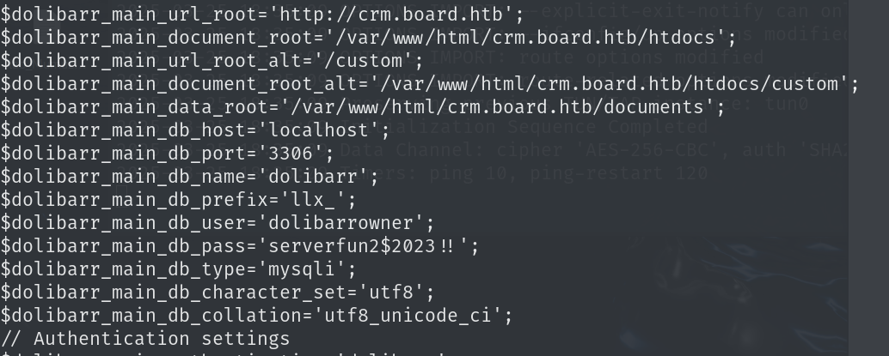
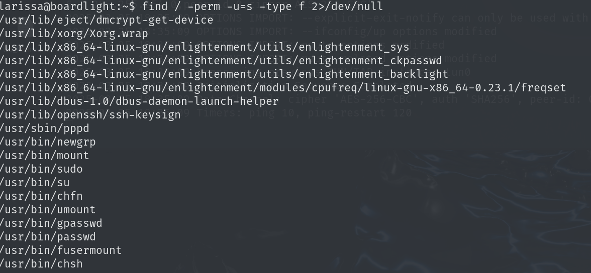

## nmap


## WEB

扫描目录没有什么有用的信息

扫描子域名得到一个crm.board.htb


访问之后是个登录页面，有版本号为Dolibarr 17.0.0


搜索相关漏洞，存在[CVE-2023-30253](https://github.com/nikn0laty/Exploit-for-Dolibarr-17.0.0-CVE-2023-30253),但是是php任意命令执行，要利用还是要先登录


查找[默认账号密码](https://www.dolibarr.org/forum/t/login-after-installation/16088/4)，经过测试默认密码为admin:admin


利用[EXP](https://github.com/nikn0laty/Exploit-for-Dolibarr-17.0.0-CVE-2023-30253)来反弹shell


在home目录下发现另外一个用户，该用户有shell权限


在html/crm.board.htb/htdocs/conf下有网站的配置文件，配置文件中找到了mysql远程登录账号密码



`dolibarrowner:serverfun2$2023!!`

使用账号密码登录到mysql数据库

```
mysql -h127.0.0.1 -P3306 -udolibarrowner -p
```


没有查到什么有用的信息，尝试用连接数据库的密码去登录`larissa`


`larissa`不能运行sudo



查看suid权限的文件，enlightenment_sys存在提权漏洞[CVE-2022-37706](https://github.com/MaherAzzouzi/CVE-2022-37706-LPE-exploit)


将文件下载到本地上传到靶机之后直接运行即可

