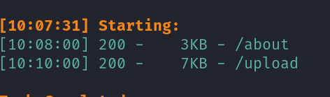

## nmap


## web



### ssrf

本机开放个8000服务，用upload页面的上传图片的URL进行访问，本地会收到请求


所以存在SSRF漏洞，对端口进行爆破，对127.0.0.1端口进行爆破，5000端口时发现各种api，继续使用SSRF访问每个api，只有authors可以访问


```
dev:dev080217_devAPI!@
```

没有登录入口，尝试ssh连接

## 提权

dev用户没有sudo权限

app目录下有.git，git log可以查看git的日志

git show 可显示各种类型对象的 Git 命令，它可以显示提交（commit）的日志消息和文本差异，对于标签（tag），它显示标签消息和引用对象。对于树（tree），它显示的名称，对于简单的 blobs，它显示了普通的内容。，查看每一次提交的记录，找到了prod的密码


```
prod:080217_Producti0n_2023!@
```


登录prod用户，有python的sudo权限和clone_prod_change.py该文件可执行权限

直接使用python提权不行

查看clone_prod_change.py文件内容


导入了gitpython这个库，这个库存在远程代码执行[CVE-2022-24439 ](https://security.snyk.io/vuln/SNYK-PYTHON-GITPYTHON-3113858)利用漏洞可以直接读root.txt，也可以反弹shell


