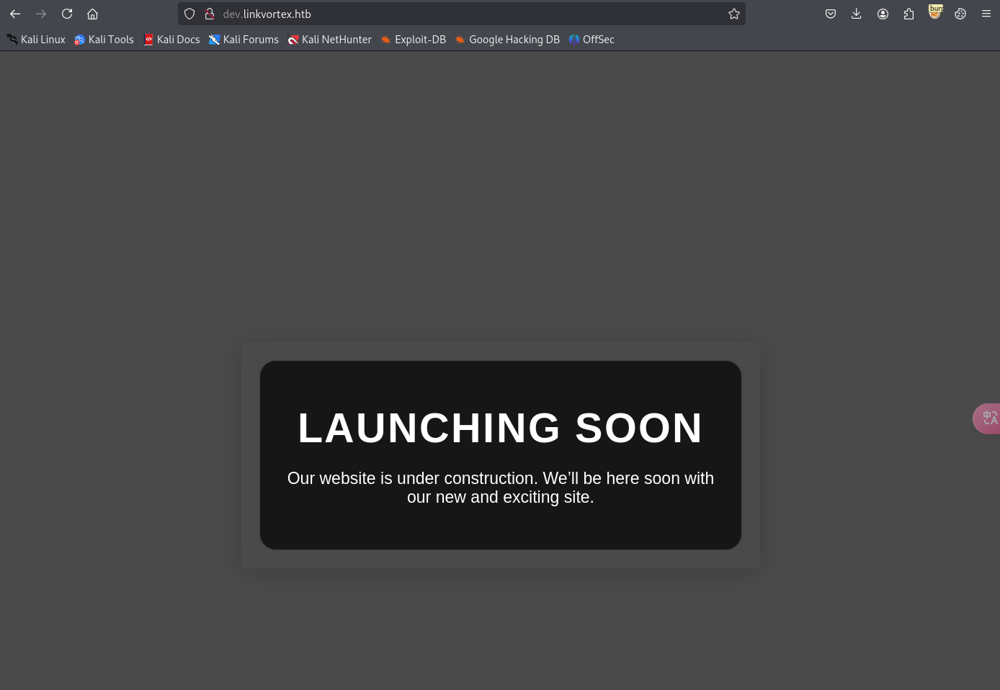

# nmap


# 80端口

## dirsearch


http://linkvortex.htb/ghost下是个登录页面


## 子域名爆破(dev.linkvortex.htb)

### git泄露





### /.git/config

git.config中有Ghost博客的版本号,该版本存在任意文件读取[CVE-2023-40028](https://cve.imfht.com/detail/CVE-2023-40028)，需要登录


### git泄露提取

[Git_Extract: 提取远程 git 泄露或本地 git 的工具](https://github.com/gakki429/Git_Extract)

[WangYihang/GitHacker](https://github.com/WangYihang/GitHacker)

相比之下`GitHacker`好像快一点


#### Dockerfile

git泄露了一个dockerfile:ghost和一个文件夹


dockerfile中有配置文件的默认路径，后面任意文件读取可以尝试读取


#### Authentication.test.js

```
最终在git泄露的目录下发现一个authentication.test.js
GitHack-master/dev.linkvortex.htb/ghost/core/test/regression/api/admin/authentication.test.js
```

该文件下有很多账号密码


```
test@example.com:OctopiFociPilfer45
```


```
test-leo@example.com:thisissupersafe
```


```
test@example.com:thisissupersafe
```


```
not-invited@example.org:lel123456
```

使用上面的账号密码都登录失败，将`example.org`替换为`linkvortex.htb`也登录失败，该文件的目录是在/api/admin下，将用户名换位`admin`尝试登录，登录成功

```
admin@example.com:OctopiFociPilfer45
```

### 任意文件读取

[CVE-2023-40028：EXP](https://github.com/0xDTC/Ghost-5.58-Arbitrary-File-Read-CVE-2023-40028)利用现成exp进行任意文件读取


读取dockerfile中的默认配置文件

```
/var/lib/ghost/config.production.json
```


```
bob@linkvortex.htb:fibber-talented-worth
```

得到bob的账号，尝试ssh登录,可以成功登录

# 提权

sudo -l 查看用户有哪些以sudo权限运行的命令


这个脚本的作用是检查传入的是否是 `.png` 格式的符号链接；

如果是：

- 并且链接指向敏感目录(etc或root)，则删除；
- 否则移动到隔离目录 `/var/quarantined`；
- 如果环境变量 `CHECK_CONTENT` 为 true，则显示被隔离链接的内容。


先设置环境变量`CHECK_CONTENT`为true

创建`Link1.png`放在`/home/bob`下链接到`/root/root.txt`，指向的是敏感目录，这样直接运行这个脚本会删除这张图片，再创建一个`link2.png`链接`Link1.png`，这样运行时该脚本检查`Link2.png`时就会放入`/var/quarantined`目录，并且环境变量中`CHECK_CONTENT`为true，会打印文件内容，打印的是`link1.png`，link1.png又链接到root.txt就会打印root.txt


