## nmap

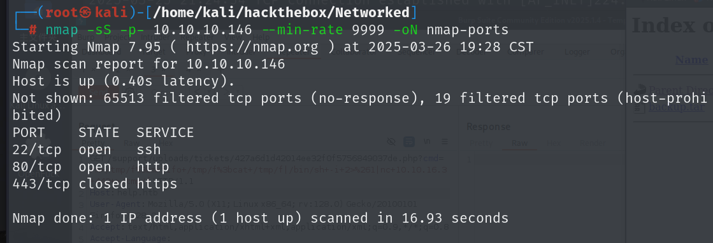

## 80端口

网站中间件为apache

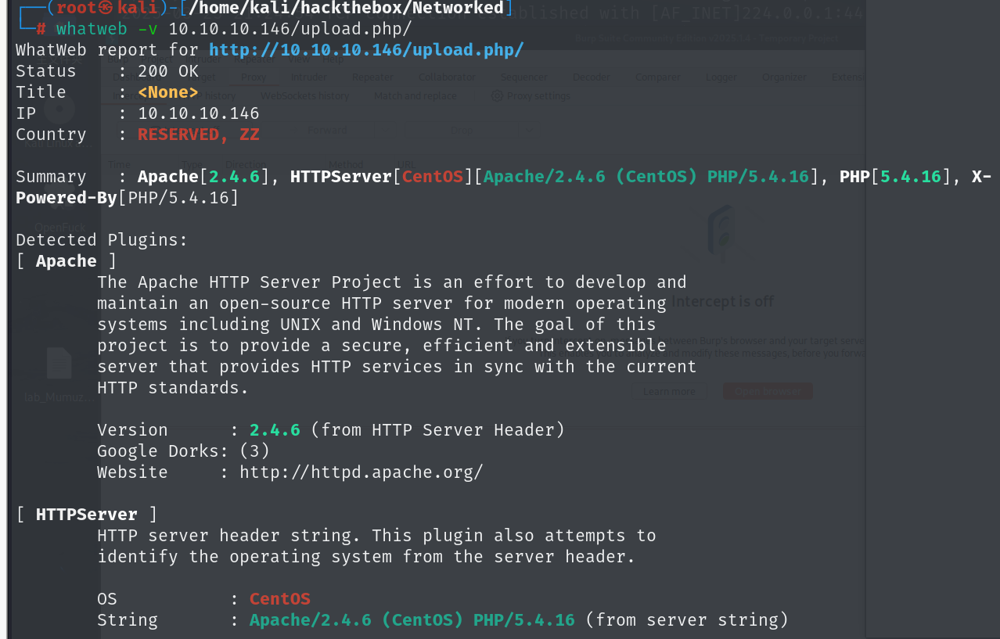

扫目录，在backup有网站源码备份，upload.php是文件上传,photo.php显示了上传之后的文件

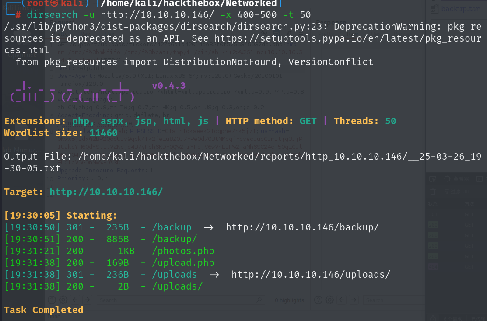

源码中lib.php中是一些检查函数，photo.php和upload.php引用了这些检查函数

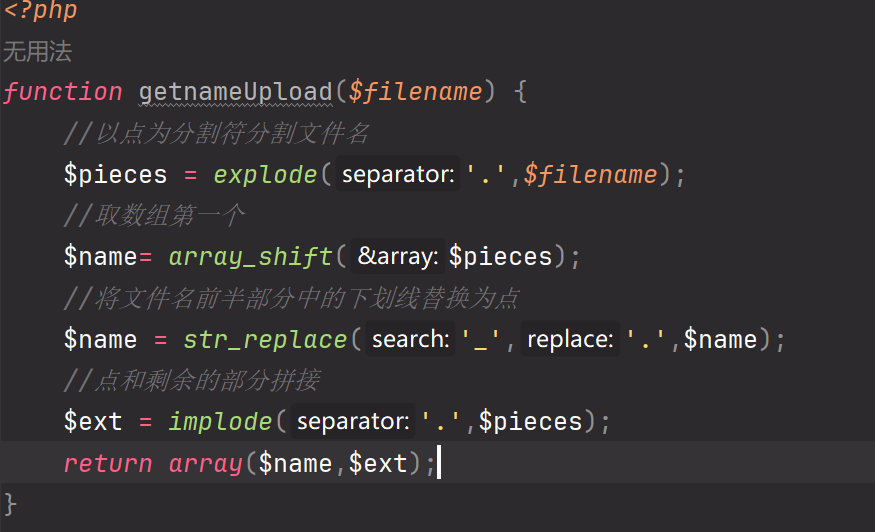

但如果上传的文件为image.php.png，分离时只会把image分离出来，成功上传后的文件名还是image.php.png，如果apache存在解析漏洞，就会将文件解析为php

并且上传时会识别`mime_content_type`，必须为image/开头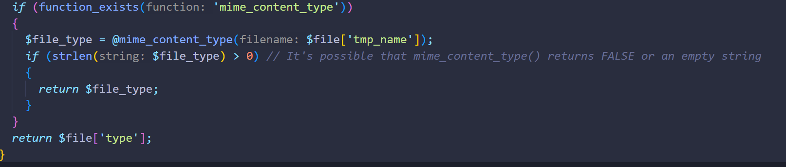

写一句话木马时可以加上GIF文件的16进制文件头即可绕过对`mime_content_type`的检测

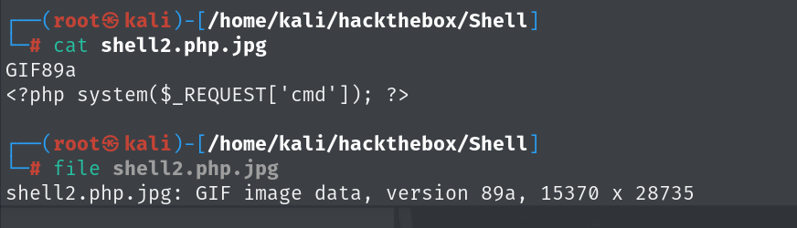

然后将文件上传，访问之后即可命令执行

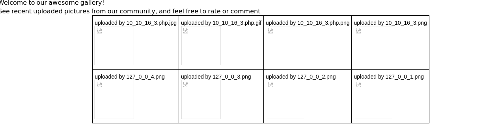

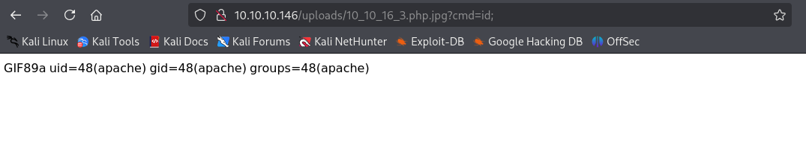

反弹shell到攻击机

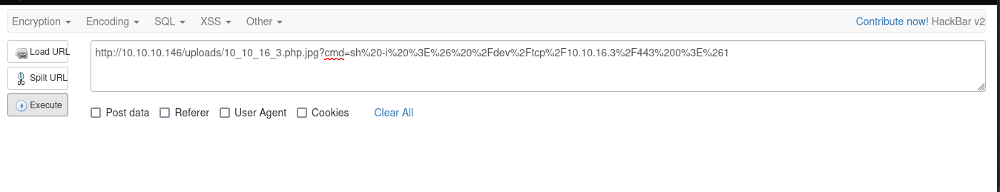

## get shell

有bash的会话只有root和另外一个用户，要尝试得到guly的shell

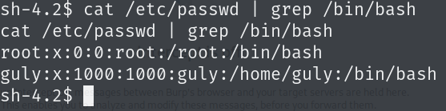

`/home/guly`下user.txt无权读取

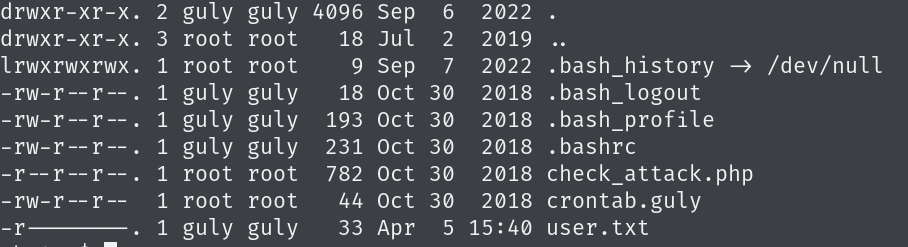

有一个计划任务，每三分钟执行一次check_attack.php

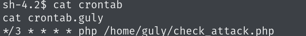

```php
##check_attack.php 

<?php
require '/var/www/html/lib.php';
$path = '/var/www/html/uploads/';
$logpath = '/tmp/attack.log';
$to = 'guly';
$msg= '';
$headers = "X-Mailer: check_attack.php\r\n";

$files = array();
$files = preg_grep('/^([^.])/', scandir($path));

foreach ($files as $key => $value) {
        $msg='';
  if ($value == 'index.html') {
        continue;
  }
  #echo "-------------\n";

  #print "check: $value\n";
  #将下划线改为点，上传的时候是将点转换为下划线，getnamecheck是将名字转化为ip
  list ($name,$ext) = getnameCheck($value);
  #检查ip是否合法
  $check = check_ip($name,$value);

  if (!($check[0])) {
    echo "attack!\n";
    # todo: attach file
    file_put_contents($logpath, $msg, FILE_APPEND | LOCK_EX);

    exec("rm -f $logpath");
    exec("nohup /bin/rm -f $path$value > /dev/null 2>&1 &");
    echo "rm -f $path$value\n";
    mail($to, $msg, $msg, $headers, "-F$value");
  }
}

?>
```

`check_attack.php`检查了`/var/www/html/upload`下文件名中ip的合法性，ip如果不合法就执行删除日志和删除该文件，但是`$value`是可控的，可以使用分号分割命令，分号分割之后的命令会依次执行

```
例如上传a;id;b这样的文件名
exec("nohup /bin/rm -f $path$value > /dev/null 2>&1 &");
到这一句的时候就会执行
exec("nohup /bin/rm -f $path a;id;b > /dev/null 2>&1 &");
分号分割之后会依次执行，等同于
exec("nohup /bin/rm -f $path a)
exec("id")
exec(";b > /dev/null 2>&1 &")

所以将id换为反弹shell的命令。就可以反弹guly的shell
```

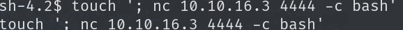

等待一会就可以得到`guly`的shell

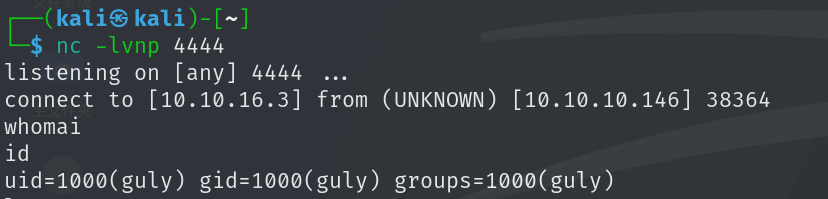

## 提权

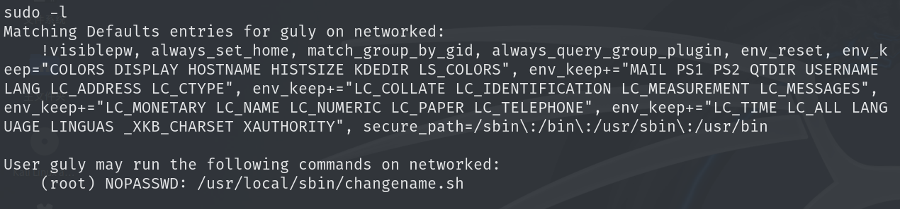

运行这个脚本会生成一个网络配置

根据这篇文章[通过网络脚本获取 Redhat/CentOS root - 漏洞利用 --- Redhat/CentOS root through network-scripts - Exploit](https://vulmon.com/exploitdetails?qidtp=maillist_fulldisclosure&qid=e026a0c5f83df4fd532442e1324ffa4f)

当我输入空格加命令之后会进行命令执行，每个不同的参数都输入不同的命令，看看哪个参数会进行命令执行

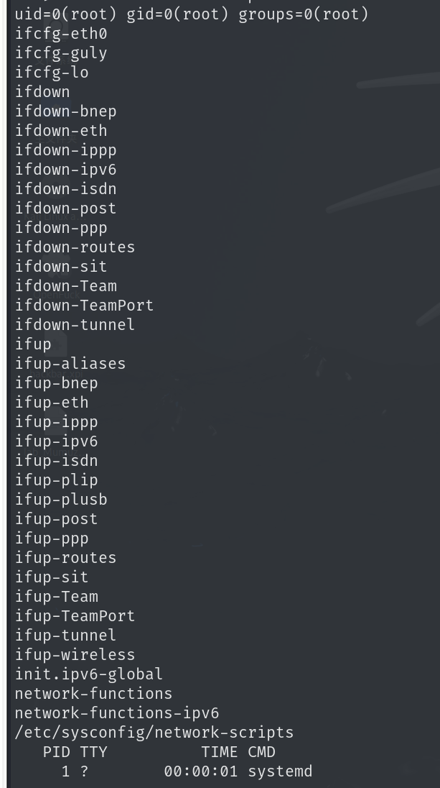

id会执行，我们将name命名为bash会话，即可得到root的shell

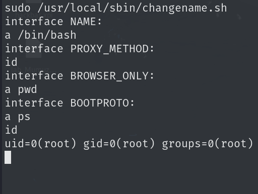